# 常识应用

## 一、 判断题
1. 我国坚持一切行政机关为人民服务、对人民负责、受人民监督、创新行政方式，提高行政效能，建设人民满意的服务型政府。（ ）
2. 党的十九大报告指出，实施乡村振兴战略的总要求是产业兴旺、生态宜居、乡风文明、治理有效、生活富裕。（ ）
3. 为人民群众提供全方位全周期健康服务是民族昌盛和国家富强的重要标志。（ ）
4. 让老百姓过上好日子是中国共产党一切工作的出发点和落脚点。（ ）
5. 深化党和国家机构改革，必须以可持续发展为统领。（ ）
6. 改革开放之后，中国共产党对我国社会主义现代化建设作出战略安排，提出“三步走”战略目标。解决人民温饱问题、人民生活总体上达到小康这两个目标已提前实现。（ ）
7. 到 2020 年底，我国现行标准下脱贫攻坚的目标任务包括贫困发生率从 10.2% 下降到 4% 以下，脱贫县基本摘帽。（ ）
8. 党的十九大报告指出，经济体制改革必须以完善产权制度和要素市场化配置为重点。（ ）
9. 建设人与自然和谐共生的现代化，必须坚持发展优先、治理紧随、人工保护为主的方针。（ ）
10. 增进人民福祉，促进人的全面发展是中国共产党立党为公、执政为民的本质要求。（ ）
11. 党的十八届三中全会首次提出“推进国家治理体系和治理能力现代化”这个重大命题。（ ）
12. 我国要加快完善社会主义市场经济体制，建设高标准市场体系。物价长期固定是高标准市场体系特征之一。（ ）
13. 社会主义市场经济体制是中国特色社会主义的重大理论和实践创新，是社会主义基本经济制度重要组成部分。（ ）
14. “物以稀为贵”这种现象反映了生产力水平对价格的影响。（ ）
15. 《关于支持深圳建设中国特色社会主义先行示范区的意见》对深圳特区精神进行了概括，敢闯敢试、敢为人先、埋头苦干是特区精神的主要内容。（ ）
16. 根据我国《宪法》和《立法法》，广州市人民政府有权制定地方性法规。（ ）
17. 根据《中华人民共和国民法典》，小区电梯广告收益归物业服务企业所有。（ ）
18. 根据《中华人民共和国国家安全法》，维护国家主权、统一和领土完整是包括港澳同胞和台湾同胞在内的全中国人民的共同义务。（ ）
19. 根据《中华人民共和国国旗法》，中小学应当每日升挂国旗。（ ）
20. 根据我国法律规定，赡养、扶助和保护父母是所有子女的义务。（ ）

---

## 二、 单项选择题
21. 习近平总书记提出的“蓄电池理论”体现了（ ）哲学原理。
    A. 量变引起质变
    B. 联系具有普遍性
    C. 矛盾具有特殊性
    D. 新事物代替旧事物

22. 以下做法有助于构建现代环境治理体系的有（ ）。
    (1) 省级党委和政府对本地区环境治理负总体责任
    (2) 完善企业环保信用评价制度
    (3) 鼓励企业参与绿色“一带一路”建设
    (4) 群团组织积极动员广大职工、青年、妇女参与
    A. (1)(2)(3)  B. (1)(3)(4)  C. (2)(3)(4)  D. (1)(2)(3)(4)

23. 与引导劳动力要素合理畅通有序流动最密切相关的是（ ）。
    A. 放开放宽除个别超大城市外的城市落户限制
    B. 建立国家技术转移人才培养体系
    C. 提高劳动报酬在初次分配中的比重
    D. 完善失信联合惩戒机制

24. 坚持和完善人民当家作主制度体系，发展（ ）。
    A. 民族区域自治制度
    B. 社会主义民主政治
    C. 最广泛的爱国统一战线
    D. 中国特色社会主义行政体制

25. 总体国家安全观要求（ ）。
    (1)重视内外安全 (2)重视国土与国民安全 (3)重视传统与非传统安全 (4)重视发展与安全 (5)重视自身与共同安全
    A. (1)(2)(3)  B. (1)(2)(4)(5)  C. (1)(2)(3)(4)  D. (1)(2)(3)(4)(5)

26. 以下属于新型基础设施的是（ ）。
    A. 物联网  B. 大型机场  C. 高速公路  D. 城市轨道交通

27. 不属于针对科技领域防范化解重大风险措施的是（ ）。
    A. 切实解决中小微企业融资难融资贵问题
    B. 加快补短板，建立自主创新的制度机制优势
    C. 抓紧布局国家实验室
    D. 推进人工智能、基因编辑等领域相关立法工作

28. 民事主体从事民事活动应当有利于节约资源、保护生态环境，体现了（ ）。
    A. 平等原则  B. 绿色原则  C. 自愿原则  D. 守法和公序良俗原则

29. 关于粤港澳大湾区，以下说法不正确的是（ ）。
    A. 属于亚热带季风气候
    B. 以客家文化作为核心文化
    C. 以港澳穗深珠五大中心城市为核心引擎
    D. 具有重要战略地位

30. 以下关于应对台风的方法不正确的是（ ）。
    A. 固定门窗玻璃  B. 避免在河边、桥边行走
    C. 红色预警应当停课  D. 驾驶时应立即开到开阔地方避险

31. 疫情防控工作指示体现了基本方略中的（ ）。
    A. 坚持党对一切工作的领导  B. 坚持以人民为中心
    C. 坚持全面依法治国  D. 坚持推动构建人类命运共同体

---

## 三、 多项选择题
32. 我国大规模减税降费有利于（ ）。
    A. 增强经济抗风险能力  B. 激发市场活力
    C. 降低企业负担  D. 促进消费
33. 在乡村治理中实现乡村德治的措施有（ ）。
    A. 培育核心价值观  B. 制定村民道德公约
    C. 加强法治宣传教育  D. 弘扬优秀传统文化
34. 有助于补齐农村基础设施和公共服务短板的有（ ）。
    A. 农村普惠性幼儿园全覆盖  B. 推进村集中供水
    C. 改造农村公路  D. 举办农民丰收节
35. 体现我国深入实施创新驱动发展战略的有（ ）。
    A. 深化科技体制改革  B. 培育增长动力源
    C. 支持基础研究  D. 弘扬科学精神
36. 坚持优先发展教育事业的恰当措施有（ ）。
    A. 立德树人  B. 思想政治课程改革
    C. 改进体育美育  D. 开展劳动教育
37. 民法典中承担民事责任的方式包括（ ）。
    A. 撤销资格  B. 停止侵害  C. 返还财产  D. 赔礼道歉
38. 根据《突发事件应对法》，属于事故灾难的是（ ）。
    A. 大地震  B. 煤矿透水事故  C. 新冠肺炎疫情  D. 槽罐车爆炸事故
39. 环境保护法中严禁破坏的保护区域包括（ ）。
    A. 重要水源涵养区  B. 濒危动植物分布区
    C. 代表性自然生态区  D. 重要地质构造
40. 2020 年夏季防汛沿线湖泊包括（ ）。
    A. 洞庭湖  B. 万绿湖  C. 鄱阳湖  D. 青海湖

# 言语理解与表达
41. 发展与问题总是相伴而生。近代中国面对民族存亡的问题... 归根结底就是要以问题为导向。对上述文段概括准确的是（ ）。
    A. 推动发展需要坚持问题导向
    B. 发展过程就是解决问题的过程
    C. 发展的不同阶段面对的问题也不同
    D. 面对问题的态度决定了发展的方向

42. 积极学习人类文明成果... 但“__________”。学习外国不等于一切照搬。
    A. 画虎不成反类犬  B. 前事不忘，后事之师  C. 依葫芦画瓢  D. 橘生淮南则为橘

43. 领导留言板为普通老百姓反映诉求提供渠道... 折射由人民政府执政为民的精神风貌。文段说明了（ ）。
    A. 内容  B. 意义  C. 形式  D. 背景

44. 受疫情影响，必须采取切实有效举措为市场主体营造良好环境... 创造更多投资机会。说明了（ ）。
    A. 疫情影响  B. 防控措施  C. 激发活力路径  D. 营造环境意义

45. 个人信息保护与产业发展平衡... 求取最大公约数。理解最准确的是（ ）。
    A. 泄露风险  B. 尊重意愿  C. 国家决定作用  D. 不同主体诉求不同

46. “没有买卖，就没有杀戮”... 给人类赖以生存的自然环境带来潜在生态危机。总结最恰当的是（ ）。
    A. 禁贸易势在必行  B. 保护动物即保护人类  C. 威胁生态平衡  D. 物种是重要一环

47. 广府人在政治、经济、文化演进中扮演引领角色... 认识更深。主要内容是（ ）。
    A. 名人遍布  B. 文化传播  C. 影响力  D. 历史地位

48. 传统媒体在疫病中实现“意外破圈”... 大众重新意识到专业新闻素养重要性。符合作者观点的是（ ）。
    A. 生存空间窄  B. 社交媒体无法做优秀报道  C. 判定优秀标准  D. 需要更多关注支持

49. 语句排序：①志向内生动力 ②难以铸就丰功伟业 ③志不强者智不达 ④都江堰福泽人民 ⑤李冰治理水患
    A. ①②③④⑤  B. ②③⑤①④  C. ③①⑤④②  D. ⑤④③②①

50. 语句排序：①文化账 ②传统智慧 ③经济角度 ④传神留魂 ⑤美学意蕴
    A. ③①⑤④②  B. ③⑤②④①  C. ③④⑤②①  D. ③⑤①④②

---

# 数量关系
51. 4, 7, 10, 13, ( ) -> A.15 B.16 C.17 D.18

52. 14, 10, 6, 2, ( ) -> A.-2 B.-1 C.0 D.1

53. 3, 6, 12, 24, ( ) -> A.30 B.36 C.42 D.48

54. 192, 96, 48, 24, ( ) -> A.8 B.12 C.16 D.20

55. 3, 5, 8, 12, ( ) -> A.17 B.22 C.24 D.30

56. 1, 1, 2, 6, 24, ( ) -> A.72 B.96 C.120 D.144

57. 2, 3, 5, 9, 17, ( ) -> A.22 B.33 C.44 D.55

58. 2.0, 0.2, 2.2, 2.4, ( ) -> A.0.5 B.2.5 C.4.6 D.6

59. 2, 9, 28, 65, ( ) -> A.108 B.114 C.120 D.126

60. 21, 33, 45, 57, ( ) -> A.59 B.62 C.65 D.69

61. 7人每人2支剩4支，总数？ A.15 B.18 C.21 D.24

62. 3米一旗，20面旗，周长？ A.15 B.30 C.45 D.60

63. 主食2、肉2、青菜3选2，搭配数？ A.7 B.9 C.12 D.24

64. 小王多对5题，少5分，多错几题？ A.5 B.10 C.15 D.20

65. 长绳对折比短长1.2，三折比短短0.3，短绳长？ A.3.3 B.4.3 C.5.3 D.6.3

66. 5咖3奶450，3咖2奶280，咖价格？ A.60 B.70 C.80 D.90

67. 男女3:2，献血男女7:3（占一半），未献血男女比？ A.1:1 B.2:1 C.3:1 D.4:1

68. 每人24剩8，再买180每人可多4，原有多少？ A.1088 B.1136 C.1184 D.1232

69. 甲单独完工，乙多4天。甲乙合做3天，剩乙负责刚好，规定天数？ A.4 B.8 C.12 D.16

70. 相向而行，头距360公里，1小时头遇，10秒尾离，车长？ A.100 B.200 C.250 D.500

71. 从所给的四个选项中，选择最合适的一个填入问号处，使之呈现一定的规律性（ ）。

    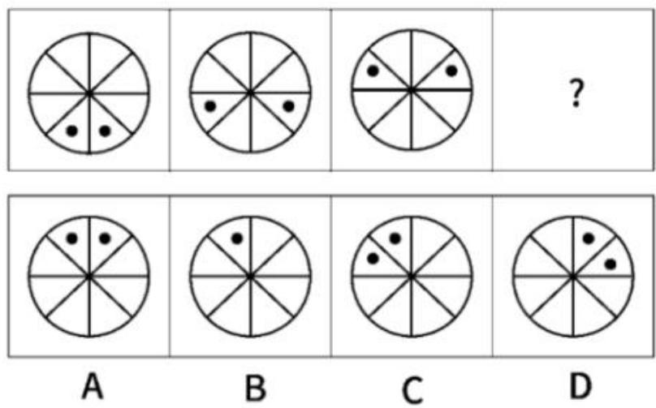

72. 从所给的四个选项中，选择最合适的一个填入问号处，使之呈现一定的规律性（ )。

    

    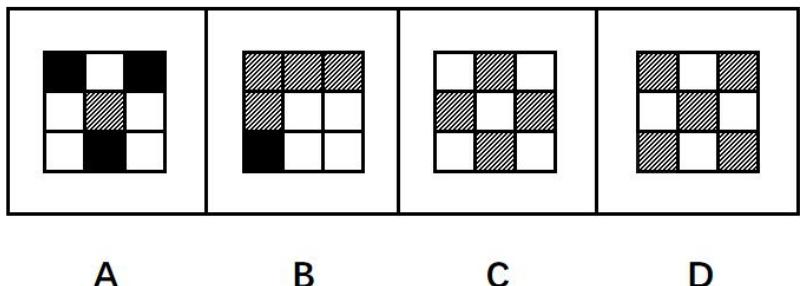

    

73. 从所给的四个选项中，选择最合适的一个填入问号处，使之呈现一定的规律性（ ）。

    

    

    A. 

    B. 

    C. 

    D. 

74. 从所给的四个选项中，选择最合适的一个填入问号处，使之呈现一定的规律性（ ）。

    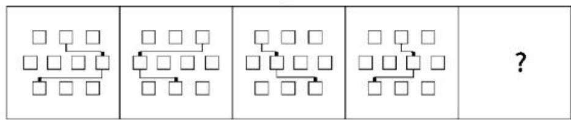

    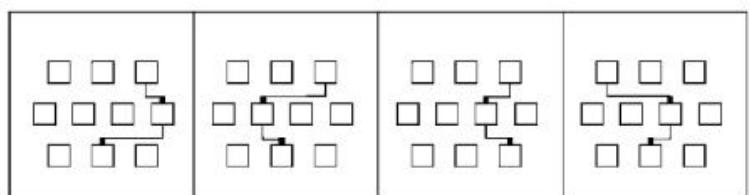

    A         B                C        D

75. 从所给的四个选项中，选择最合适的一个填入空白处，使之呈现一定的规律性（ ）。

    

    A. 

    B. 

    C. 

    D. 

76. 从所给的四个选项中，选择最合适的一个填入问号处，使之呈现一定的规律性（ ）。

    

    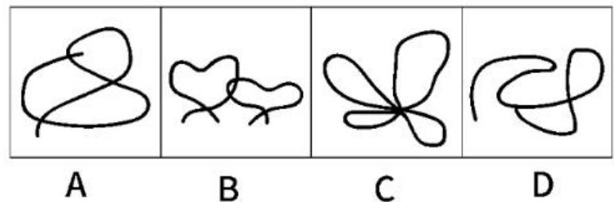

77. 从所给的四个选项中，选择最合适的一个填入问号处，使之呈现一定的规律性（ ）。

    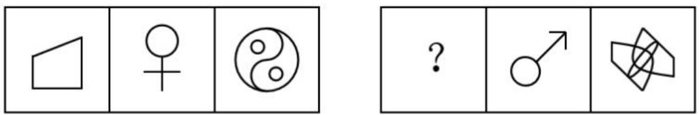

    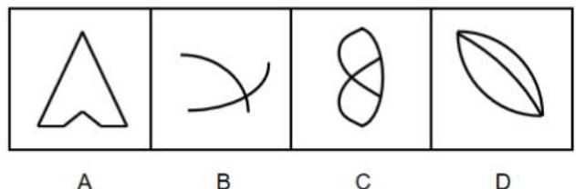

78. 从所给的四个选项中，选择最合适的一个填入问号处，使之呈现一定的规律性（ ）。

    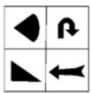

    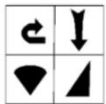

    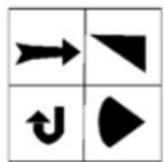

    

    A.  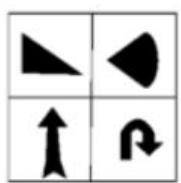

    B. 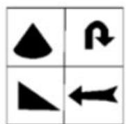

    C. 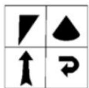

    D. 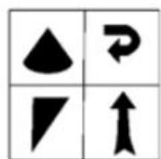

79. 从所给的四个选项中，选择最合适的一个填入问号处，使之呈现一定的规律性（ ）。

    

    

    

    

    A. 

    B. 

    C. 

    D. 

80. 从所给的四个选项中，选择最合适的一个填入问号处，使之呈现一定的规律性（ ）。

    

    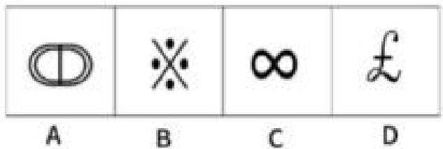

# 判断推理

81. 评论员甲认为“最多顾及一方”，乙不认同。乙的观点最准确表述是（ ）。
    A. 二者兼顾  B. 至少顾及一方  C. 前提基础  D. 推动作用

82. 压力大导致脱发 -> 心情好就能避免脱发。论证缺陷是（ ）。
    A. 默认减压最快  B. 忽视个体差异  C. 忽视情绪不受控  D. 默认无其他原因

83. 除非有人植树，否则没证。李家有证。无法判断真伪的是（ ）。
    (1)小吴家可以领证 (2)李家有人植树 (3)小吴家有人未植树
    A. 仅2  B. 仅3  C. 1和3  D. 123

84. 削弱“恐龙因吃有毒的花而灭绝”：
    A. 肉食植食同时灭绝  B. 发现争斗痕迹  C. 花出现前恐龙已减少  D. 有传染病

85. 旅游消费高的人收入高 -> 消费欲激发工作热情。论证缺陷：
    A. 样本占比小  B. 收入决定消费欲  C. 消费欲强必旅游  D. 热情是必要条件

---

# 资料分析
## (一) A市农业产值与面积分析

A市是全国较早实现城乡一体化的城市，耕地面积较少。近年来，A市大力推进农业产业化，建设“城市菜篮子”，实现农业快速发展。农业总产值由2015年的12.92亿元增加至2019年的42.46亿元。

2015-2019年A市农业产值（单位：万元）  

<table><tr><td>项目</td><td>2015年</td><td>2016年</td><td>2017年</td><td>2018年</td><td>2019年</td></tr><tr><td>农业总产值</td><td>129156</td><td>159115</td><td>190942</td><td>188609</td><td>424606</td></tr><tr><td>其中:种植业</td><td>37842</td><td>32799</td><td>65741</td><td>123414</td><td>117928</td></tr><tr><td>林业</td><td>1307</td><td>1975</td><td>1952</td><td>2379</td><td>1750</td></tr><tr><td>牧业</td><td>26292</td><td>23422</td><td>16201</td><td>29013</td><td>25464</td></tr><tr><td>渔业</td><td>16352</td><td>93487</td><td>98749</td><td>214992</td><td>259541</td></tr><tr><td>农林牧渔服务业</td><td>5363</td><td>6823</td><td>8299</td><td>18811</td><td>19923</td></tr></table>

近年来，A市农作物播种面积不断增加。特别是通过推动规模化蔬菜种植，满足城市需求，实现其他农作物播种面积快速增长。其他作物播种面积达到农作物总播种面积的  $78.8\%$

2015-2019年A市农作物播种面积（单位：亩）  

<table><tr><td>项目</td><td>2015年</td><td>2016年</td><td>2017年</td><td>2018年</td><td>2019年</td></tr><tr><td>农作物总播种面积</td><td>73775</td><td>72358</td><td>86404</td><td>179010</td><td>189272</td></tr><tr><td>其中：粮食作物</td><td>144</td><td>152</td><td>597</td><td>34718</td><td>34813</td></tr><tr><td>经济作物</td><td>513</td><td>6702</td><td>2243</td><td>5169</td><td>5267</td></tr><tr><td>其他作物</td><td>73118</td><td>65504</td><td>83564</td><td>139123</td><td>149192</td></tr></table>

91. 2015-2019 农业总产值年均增长（ ）万元。
    A. 54000  B. 64000  C. 74000  D. 84000
92. 与2015年相比，2019年产值增幅最大的是（ ）。
    A. 种植业  B. 林业  C. 牧业  D. 渔业
93. 其他作物播种面积最大的一年比最少的一年多（ ）亩。
    A. 86074  B. 83688  C. 76074  D. 73688
94. 牧业产值占农业总产值比重最大的年份是（ ）。
    A. 2015  B. 2016  C. 2018  D. 2019
95. 以下说法错误的是：
    A. 2016经济作物面积增长最快  B. 2017渔业占比超50%
    C. 总面积先减后增  D. 粮食面积占比逐年提升

## (二) 财务预决算分析

<table><tr><td>支出项目</td><td>2018年预算数</td><td>2018决算数</td><td>2019年预算数</td></tr><tr><td>一:一般公共服务(大项,下同)</td><td>4708</td><td>5204</td><td>6903</td></tr><tr><td>行政运行(细项,下同)</td><td>1639</td><td></td><td>1737</td></tr><tr><td>一般行政管理事务</td><td>56</td><td></td><td>66</td></tr><tr><td>信息事务</td><td>145</td><td></td><td>145</td></tr><tr><td>专项统计业务</td><td>1134</td><td></td><td>1082</td></tr><tr><td>统计管理</td><td>738</td><td></td><td>716</td></tr><tr><td>专项普查活动</td><td>60</td><td></td><td>2078</td></tr><tr><td>事业运行</td><td>936</td><td></td><td>1049</td></tr><tr><td>其他统计信息事务支出</td><td>0</td><td></td><td>30</td></tr><tr><td>二:教育支出</td><td>423</td><td>256</td><td>798</td></tr><tr><td>培训支出</td><td>423</td><td></td><td>798</td></tr><tr><td>三:社会保险和就业</td><td>565</td><td>1349</td><td>578</td></tr><tr><td>财政对其他社会基金的补助</td><td>2</td><td></td><td>11</td></tr><tr><td>归口管理的行政单位离退休</td><td>126</td><td></td><td>102</td></tr><tr><td>事业单位离退休</td><td>1</td><td></td><td>1</td></tr><tr><td>机关事业单位基本保险与缴费</td><td>315</td><td></td><td>331</td></tr><tr><td>机关事业单位职业年金缴费</td><td>121</td><td></td><td>133</td></tr><tr><td>四:医疗卫生</td><td>67</td><td>70</td><td>80</td></tr><tr><td>行政单位医疗</td><td>49</td><td></td><td>50</td></tr><tr><td>事业单位医疗</td><td>18</td><td></td><td>30</td></tr><tr><td>五:节能环保支出</td><td>20</td><td>99</td><td>99</td></tr><tr><td>其他污染减排支出</td><td>20</td><td></td><td>99</td></tr><tr><td>六:住房保障支出</td><td>292</td><td>941</td><td>471</td></tr><tr><td>住房公积金</td><td>139</td><td></td><td>311</td></tr><tr><td>购房补贴</td><td>153</td><td></td><td>160</td></tr><tr><td>本年支出合计</td><td>6074</td><td>7921</td><td>8928</td></tr></table>

96. 2018年决算较预算增幅最大的是（ ）。
    A. 一般公共服务  B. 社保就业  C. 节能环保  D. 住房保障
    
97. 2019年预算中，多少个细项较上年有所提高？
    A. 15  B. 14  C. 13  D. 12
    
98. 下列选项最可能准确反映该项目情况的是（ ）。

    A.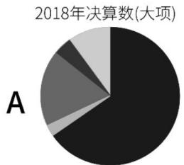

    B. 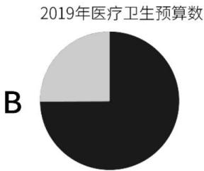
    C. 2018年社会保障和就业支出预算数

    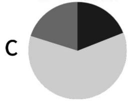

    D. 2019年住房保障支出预算数

      

99. 2018决算较预算增加最多的大项，其2019年预算数同比增长（ )。
    A. 2.3%  B. 61.3%  C. 138.8%  D. 395%

100. 以下说法错误的是：
     A. 增量集中在一般公共服务  B. 教育支出比重提升
     C. 仅两项预算低于决算  D. 住房保障增长在购房补贴