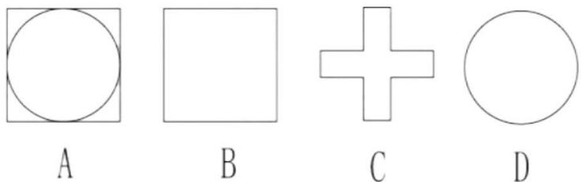
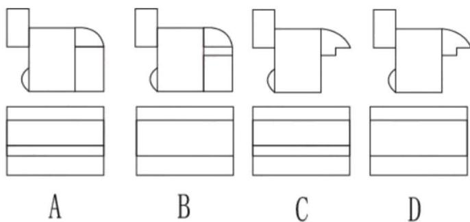
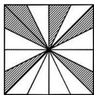
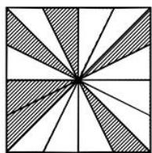
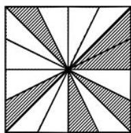
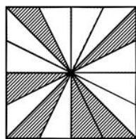
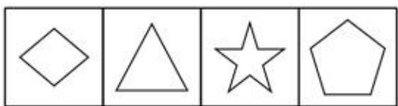
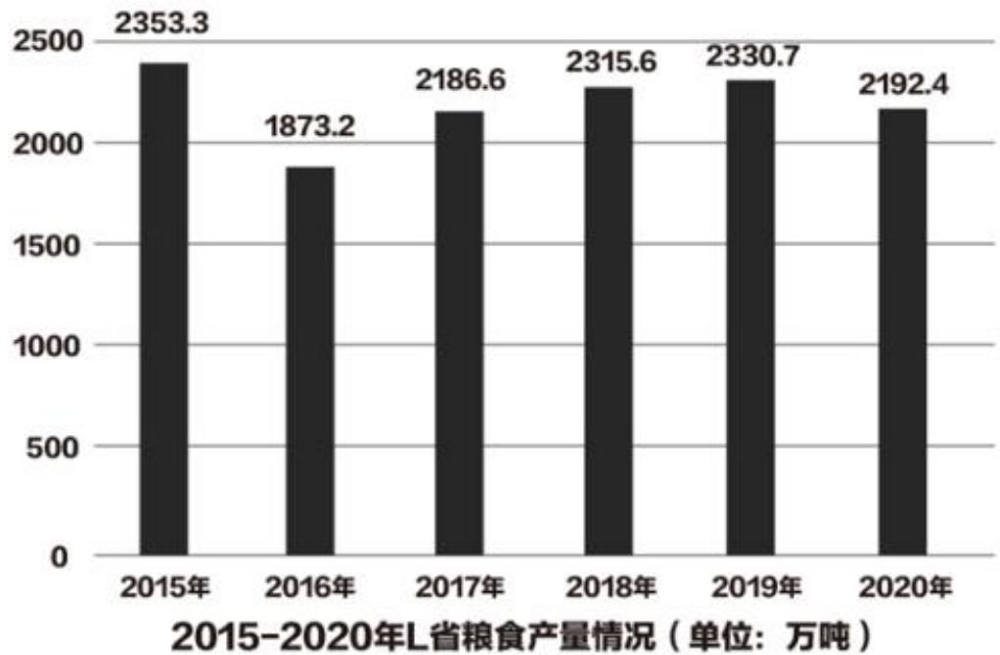
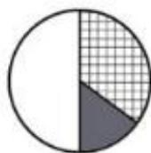
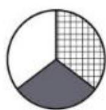

# 常识应用
**该部分含三类题型，分别为判断题，单项选择题，多项选择题。请根据题目要求，选出合适的选项。**

1. 组织路线是我们党的生命线和根本工作路线，是我们党永葆青春活力和战斗力的重要传家宝。（）

2. 全面建成小康社会，全面深化改革，全面依法治国，全面从严治党，“四个全面”战略布局，既有战略目标，又有战略举措。（）

3. 产业兴旺，生态宜居，乡风文明，治理有效，生活富裕是乡村振兴战略的总要求。（ ）

4. 党的十九大报告指出，要强化自上而下的民主监督，改进自下而上的组织监督，发挥同级相互监督作用，加强对党员领导干部的日常管理监督。（）

5. 为人民而生，因人民而兴，始终同人民一起，为人民利益而奋斗，是我们党兴党强党的根本出发点和落脚点。（）

6. 经过全党全国各族人民持续奋斗，我国实现了第一个百年奋斗目标，在中华大地上全面建成小康社会，历史性地解决了相对贫困问题。（）

7. 劳模精神、劳动精神、工匠精神是以爱国主义为核心的民族精神的生动体现。（）

8. 农民阶级是我国的领导阶级，是先进生产力和生产关系的代表，是保持和发展中国特色社会主义的主力军。（ ）

9. 1942年延安整风运动的方针是“长期共存，互相监督”。（ ）

10. 体育是提高人民健康水平的重要途径，是满足人民群众对美好生活向往、促进人的全面发展的重要手段。（）

11. 进一步优化生育政策，实现三孩的政策及配套支持措施，是落实积极应对人口老龄化国家战略的重要措施。（）

12. 历史唯物主义是中国共产党人的世界观和方法论。（）

13. 根据《中华人民共和国宪法》，公民有进行科学研究、文化艺术创作和其他文化活动的自由。（）

14. 根据中华人民共和国选举法，代替他人填写选票的行为无效，要依法给予行政处分或刑事处罚。（）

15. 张某、李某、王某合作投资了一家有限责任公司。一年后，因经营不善，公司申请破产后，债权人要求三人按投资比例对债务当场承担偿还责任。（）

16. 李某乘坐飞机时将电脑遗失，电脑被邻座乘客王某捡到。王某主动归还李某电脑，但要求李某支付50元快递费。王某的行为不符合法律规定。（）

17. 举重比赛中，运动员上场之前在手上抹些白色粉末，其作用是增大手与被握住物体的摩擦力，减少失误。（）

18. 大明律是唐代行政法典，也是我国现存的最早的行政法典。（）

19. 一般认为，甲骨文是目前可考证的中国最早的汉字。（）

20. 根据国家有关规定，免征车辆购置税的新能源汽车是指纯电动汽车、插电式混合动力（含增程式）汽车、燃料电池汽车。（ ）

21. 在中国共产党的历史上，遵义会议是一次具有伟大转折意义的重要会议。下面关于遵义会议说法正确的有（ ）。
    A、在红军第五次围剿失败和长征初期严重受挫的历史关头召开
    B、开启了中国共产党独立自主解决中国革命实际问题的新阶段
    C、确立了以毛泽东为主要代表的马克思主义正确路线，在党中央的领导地位
    D、标志着中国共产党创建人民军队和武装夺取政权的开端

22. 十三五时期，广东省实施一系列重大发展战略和举措，加快形成全面开放新格局。这一时期，广东在加快形成全面开放新格局方面取得的成就有（ ）。
    A、数字政府改革走在全国前列
    B、广东自贸试验区累计形成500余项制度创新成果
    C、跨境电商出口实现快速增长
    D、对一带一路沿线国家进出口总额累计达7.9万亿元

23. 党的19届四中全会着重研究坚持和完善中国特色社会主义制度，推进国家治理体系和治理能力现代化的重大问题。会议确定了坚持和完善中国特色社会主义制度，推进国家治理体系和治理能力现代化的总体目标。这一总体目标是（ ）。
    A、到我们党成立一百年时，在各方面制度更加成熟更加定型上取得明显成效
    B、到2055年，中国特色社会主义制度更加巩固、优越性充分展现
    C、到新中国成立100年时全面实现国家治理体系和治理能力现代化
    D、到2035年，各方面制度更加完善，基本实现国家治理体系和治理能力现代化

24. 习近平总书记在党的十九大报告中提出“实施健康中国战略”，要完善国民健康政策，为人民群众提供全方位全周期健康服务。下列与之有关的措施和做法，正确的有（ ）。
    A、全面取消以药养医
    B、坚持中西医并重
    C、推进医养结合
    D、支持社会办医

25. 根据《中华人民共和国宪法》，下列说法正确的有（ ）。
    A、国家军事委员会决定战争和和平的问题
    B、城市、农村和城市郊区的土地均属于国家所有
    C、县级以上的地方各级人民代表大会设立常务委员会
    D、国家鼓励社会力量依照法律规定举办各种教育事业

26. 国债，又称国家公债，是国家以其信用为基础，按照债券的一般原则，通过向社会筹集资金所形成的债权债务关系。下面关于国债的描述正确的有（ ）。
    A、发行主体是国家
    B、债务人一般只能是国家
    C、债权人只能是本国公民
    D、具有最高的信用度，被公认为是最安全的投资工具

27. 贸易差额可以表明国家对外贸易的收支状况，影响一国贸易差额的因素包括（ ）。
    A、汇率
    B、商品价格
    C、贸易协定
    D、贸易壁垒

28. 借代是古诗词中常用的修辞手法之一，下列诗句中借代解释正确的有（ ）。
    A、“丧车黔首葬，吊客青蝇至”中的“黔首”指的是部族首领
    B、“欲寄彩笺兼尺素，山长水阔知何处”中的“尺素”指的是书信
    C、“朱门酒肉臭，路有冻死骨”中的“朱门”指的是显贵之家
    D、“主人下马客在船，举酒欲饮无管弦”中的“管弦”指的是音乐

29. 下列关于中国传统戏曲的说法正确的有（ ）。
    A、豫剧属于我国五大戏曲剧种之一
    B、《霸王别姬》是一出经典的昆曲曲目
    C、京剧中银色的脸谱多表现的是一些鬼怪或者神仙
    D、粤剧充分体现了广府民系群落的地域文化传统

30. 下列关于自然天气的说法，错误的有（ ）。
    A、我国沿海地区每年冬春之交常出现台风天气
    B、龙卷风常发生在寒带和亚热带地区
    C、要形成冰雹雨，云内必须含水量丰富
    D、冻雨是雨滴和温度低于零度的物体碰撞立即冻结的降水

31. 习近平总书记在庆祝中国共产党成立100周年大会上强调，必须坚持和发展中国特色社会主义。下列有关中国特色社会主义的说法，正确的有（ ）。
    ①中国特色社会主义是党和人民历经千辛万苦、付出巨大代价取得的根本成就
    ②中国特色社会主义是实现中华民族伟大复兴的正确道路
    ③中国特色社会主义为什么好，归根到底是因为马克思主义行
    ④新时代坚持和发展中国特色社会主义要始终确保党的坚强领导核心
    A、①④
    B、①②④
    C、②③④
    D、①②③④

32. 习近平总书记曾说过：“缺氧不缺精神、艰苦不怕吃苦、海拔高境界更高。”这句话中提到的“精神”具体指的是（ ）。
    A、长征精神
    B、老西藏精神
    C、井冈山精神
    D、西柏坡精神

33. 党的十九大报告指出，中国特色社会主义进入新时代，我国社会主要矛盾已经从人民日益增长的物质文化需要同落后的社会生产力之间的矛盾，转化为人民日益增长的美好生活需要和不平衡不充分的发展之间的矛盾。这表明（ ）。
    A、社会主要矛盾的存在和发展，影响着社会非主要矛盾的存在和发展
    B、社会主要矛盾和非主要矛盾相互作用，在一定条件下相互转化
    C、社会主要矛盾不是一成不变的，在一定条件下会发生变化
    D、社会主要矛盾是其他一切社会矛盾的根源

34. 广大政协委员、政协各参加单位和各专门委员会，围绕党和国家中心任务和人民群众普遍关心的民生问题，特别是围绕贯彻新发展理念问题，提出一系列建议。这体现的人民政协的主要职能是（ ）。
    A、发扬社会主义民主
    B、管理国家事务
    C、民主监督
    D、参政议政

35. 毛泽东思想是马克思列宁主义基本原理和中国革命具体实际相结合的产物。是中国共产党人集体智慧的结晶，将其确立为中国共产党的指导思想的会议是（ ）。
    A、古田会议
    B、党的七大
    C、党的六届七中全会
    D、党的十一届六中全会

36. 下列选项体现了绿色发展理念的是（ ）。
    (1)万物各得其和以生
    (2)子钓而不纲，弋不射宿
    (3)甘瓜抱苦蒂，美枣生荆棘
    (4)太山之高, 背而弗见
    (5)草木荣华滋硕之时，则斧斤不入山林
    A、②③
    B、①②⑤
    C、②③④
    D、①②④⑤

37. 为推动对外贸易高质量发展，广东省大力实施粤港澳大湾区国际消费枢纽工程：加快推进国际消费中心城市建设，下列做法中，有利于促进该工程取得成效的是（ ）。
    ①大力发展首店经济、品牌经济
    ②建设全国一体化大数据中心体系
    ③建设一批口岸免税店和市内免税店
    ④打造一批具有国际影响力的新型消费商圈
    A、①②③
    B、①②④
    C、①③④
    D、①②③④

38. 人身安全保护令是一种民事强制措施，是人民法院为了保护家庭暴力受害人及其子女和特定亲属的人身安全、确保婚姻案件诉讼程序的正常进行而作出的民事裁定。下列情形中，可向法院申请人身安全保护令的是（ ）。
    A、小学生小明与徐某是母女，因小明的家庭作业错误较多，徐某打了小明巴掌，为此小明到派出所报警
    B、曾某和谢某是同事，因工作上的纠纷，曾某常在同事面前诋毁谢某
    C、陈某和林某是邻居，因不满林某经常将垃圾堆放在门口，陈某经常谩骂林某
    D、王某和李某是夫妻，因王某向法院提起离婚诉讼，李某经常恐吓威胁王某

39. 我国古代很多写广东风物的是文学作品描写了广东地区的风土人情。以下诗句不属于描写广东风物的是（ ）。
    A、海对羊城阔，山连象郡高
    B、日啖荔枝三百颗，不辞长作岭南人
    C、连天浪静长鲸息，映日帆多宝舶来
    D、孤帆远影碧空尽，唯见长江天际流

40. 以下关于我国传统建筑的描述与建筑名称对应不正确的是（ ）。
    A、一种开敞的小型建筑，平面一般有圆形、方形、六角形等，常设在园林或风景名胜等处——亭
    B、高而平的建筑物——台
    C、两层以上的房屋或建筑物的上层部分或有上层结构的一一楼
    D、底部架空的高层建筑，通常四周设隔扇或栏杆回靡，供远眺、游憩、藏书和供佛之用——榭

# 言语理解与表达
**根据题干，在下列四个选项中，选出一个最恰当的答案。**

41. 深圳的40年是中国经济特区建设的缩影，也是无数党员与人民群众努力的成果，（ ）。每个人的一小步都是建设成功的关键。
    A、厚积薄发
    B、积羽沉舟
    C、万众一心
    D、聚沙成塔

42. 一些技术能力不强、人才储备不足、管理水平不高的制造企业，不注重强根基，反而头脑一热，扎进智能科技的大潮中，投资不小却（ ），这类走偏的发展倾向须警惕。
    A、事倍功半
    B、收效甚微
    C、得不偿失
    D、于事无补

43. 中国古代寓言是一座丰富的文学宝库，（ ）了中国人的智慧和思考，短小精悍，却（ ），让人百读不厌。
    A、包含 耐人寻味
    B、彰显 微言大义
    C、承载 意味深长
    D、囊括 言简意赅

44. 实体书店最红火的年代，恰恰也是信息相对（ ）的年代，人们接收的信息大多都来自书本。而在信息爆炸的今天，人们阅读和接收信息的方式发生了（ ）的改变。所以，我们不能要求书店也必须保持“传统”的味道，还停留在记忆中的样子。
    A、封闭 翻天覆地
    B、单调 参差不齐
    C、阻塞猝不及防
    D、匮乏 前所未有

45. 在网络空间中，消费信息（ ），成为新的“信息污染”，流量造假、夸大宣传等大量存在，（ ）商业规则，（ ）电商平台的良性发展。
    A、林林总总 冲击 约束
    B、纷繁芜杂 挑战 制约
    C、琳琅满目 动摇 掀肘
    D、五花八门 打破 限制

46. 马克思、恩格斯把无产阶级组织成为独立政党作为无产阶级革命的首要条件，强调无产阶级政党必须成为一个统一的整体，必须由最彻底、最坚定的先进分子组成。列宁说：“无产阶级在争取政权的斗争中，除了组织，没有别的武器。”毛泽东同志指出：“一个政党要引导革命到胜利，必须依靠自己政治路线的正确和组织上的巩固。”邓小平同志强调，实现四个现代化，“要有正确的组织路线来保证”。
    这段文字意在强调组织建设（ ）。
    A、需要经历长期探索
    B、是革命胜利的关键
    C、是党的建设的重要基础
    D、要以人才队伍建设为中心

47. 从神经心理学和神经语言学的研究成果看，拼音文字是偏向大脑左半球的“单脑文字”，而汉字是大脑左、右两半球并用的“复脑文字”；拼音文字认知中“语音编码”方式起主要作用，而汉字认知中则是利用“多重编码”方式，语音、字形和语义编码兼用。由此可见，学习汉字可以开发大脑左、右半球的潜力。
    这段文字意在说明（ ）。
    A、汉字学习与大脑半球机能的关系
    B、汉字学习有利于大脑的发展
    C、拼音和汉字认知中的不同编码方式
    D、拼音和汉字在大脑中的存储位置不同

48. ①但这种普遍现象，却往往成为人们在工作中的一大难题，这是由于错误共识效应在起作用。
    ②错误共识效应使人们陷入过度的自我保护与精神亢奋之中，当别人提出不同观点时，不进行客观思考，而是用神态语言等各种表现证明对方是错的。
    ③由此看来，意见不合是一种十分普通而广泛的现象。
    (4) “横看成岭侧成峰, 远近高低各不同”, 没有人会拥有 360 度的广角视角, 而不同的视角会造就不同的观点, 分歧产生在所难免。
    ⑤所谓错误共识效应，就是指人们通常倾向于将自己的观点投射给他人，认为所有人都应当和自己以同一方式思考得出同样结论。
    将以上5个句子重新排列，语序正确的是（ ）。
    A、④③①②⑤
    B、④③①⑤②
    C、⑤②③④①
    D、③①⑤④②

49. 我国要坚决贯彻预防为主的卫生与健康工作方针，坚持常备不懈，将预防关口前移，避免小病酿成大疫。要强化风险意识，完善公共卫生重大风险研判、评估、决策、防控、协同机制。
    作者最可能同意的是（ ）。
    A、我国应改革完善疾病预防控制体系
    B、我国应强化公共卫生法制保障
    C、我国应健全统一的应急物资保障体系
    D、我国公共卫生存在的短板

50. 民法典是我国法律体系中条文最多、体量最大、编章结构最复杂的一部法律。民法典要实施好，就必须让民法典走到群众身边、走进群众心里。要广泛开展民法典普法工作，将其作为“十四五”时期普法工作的重点来抓，引导群众认识到民法典既是保护自身权益的法典，也是全体社会成员都必须遵循的规范，养成自觉守法的意识，形成遇事找法的习惯，培养解决问题靠法的意识和能力。要把民法典纳入国民教育体系，加强对青少年的民法典教育。
    最适合做这段文字标题的是（ ）。
    A、民法典普法教育亟需加强
    B、法律意识人人有
    C、民法典实施再深入
    D、民法典“进”校园

# 数字推理
**每道题给出一个数列，但其中缺少一项，要求你仔细观察这个数列中数字之间的关系，找出其中的规律，然后从4个备选项中选出最合理的1项来填补空缺。**

51. 10、11、13、16、20、（ ）。
    A、25
    B、26
    C、27
    D、28

52. 155、123、107、99、95、（ ）。
    A、91
    B、92
    C、93
    D、94

53. 3、1、8、8、17、19、（ ）。
    A、26
    B、28
    C、30
    D、32

54. 3.5，7，3，9，5，20，（ ），（ ），21，126。
    A、15，75
    B、4，16
    C、2，12
    D、6，18

55. 2、6、12、20、30、（ ）。
    A、42
    B、45
    C、47
    D、49

56. 1、1、2、8、64、（ ）。
    A、1024
    B、960
    C、720
    D、360

57. 6、7、15、13、22、28、35、50、（ ）。
    A、56
    B、63
    C、78
    D、89

58. 2、9、16、23、30、（ ）。
    A、32
    B、37
    C、41
    D、46

59. 0、5、15、35、75、（ ）。
    A、125
    B、135
    C、145
    D、155

60. 1、2、2、4、8、（ ）。
    A、8
    B、10
    C、12
    D、32

# 数学运算
**利用所给条件及基本的数学知识解答以下问题，从4个备选项中选出最符合题干要求的1项。**

61. 某部门有4名男性员工，2名女性员工。因工作分工需要将6名员工平均分为3组，且2名女性员工不在同一组，则分组方法共有（ ）种。
    A、3
    B、6
    C、9
    D、12

62. 某商场正在举行促销活动。顾客消费金额达到一定数量后。可以在5种不同的赠品中随机选取2种。那么，任意两位顾客在选取赠品时，恰有1种赠品相同的概率是（ ）。
    A、10%
    B、30%
    C、40%
    D、60%

63. 某部门共有小郑、小卢、小潘3名工作人员。部门中的一类工作文件要2人签字确认后才能存档。上周整理这类文件时发现（已知上周有文件入档），其中有14份文件小郑未签字，有15份文件小卢未签字，有17份文件小潘未签字，那么上周小郑签字的这类工作文件数量不可能是（ ）。
    A、6
    B、8
    C、9
    D、10

64. 用甲、乙、丙三杯不同浓度的盐水调制成浓度为 $20\%$ 的盐水，已知甲乙丙杯盐水的质量比例为 $1:2:1$ ，丙杯盐水浓度为 $40\%$ ，乙杯盐水浓度是甲杯的一半，则甲杯盐水的浓度是（ ）。
    A、10%
    B、15%
    C、20%
    D、25%

65. A公司第一季度营业收入比B公司低 $20\%$ 。第二季度营业收入比第一季度增长了 $5\%$ ；B公司第二季度营业收入比第一季度减少了 $10\%$ 。那么A、B两家公司第二季度营业收入之比是（ ）。
    A、10：11
    B、14：15
    C、35：36
    D、17：18

66. 某工厂甲乙两个车间共同生产240台实验仪器，甲车间每天生产12台，乙车间每天比甲车间多生产8台。如果先由甲车间生产10天，剩下的由乙车间单独完成，则乙车间完成全部任务还需（ ）天。
    A、2
    B、4
    C、5
    D、6

67. 某水果店批发了若干个哈密瓜。第一天卖出总数的一半，第二天卖出余下的一半后还剩6个。则该水果店共批发了（ ）个哈密瓜。
    A、42
    B、36
    C、30
    D、24

68. 某度假村计划修建一座池底为正方形的水池。如果水池底每平方米的造价为280元，池壁每平方米的造价为250元，在不考虑其他成本的情况下。要建一个深1.8米、容积为45立方米的水池需花费（ ）元。
    A、15400
    B、15800
    C、16000
    D、17200

69. 已知某年的4月有5个星期二和4个星期三，那么可以推出，当年的劳动节是（ ）。
    A、星期三
    B、星期四
    C、星期五
    D、星期六

70. 某中学计划在操场开展心理健康知识宣讲，刚开始在操场上摆放的若干座位成正方形方阵，后因部分学生临时无法参加，于是撤下了三行三列的座位，最终减少了81个座位，则最开始摆放了（ ）个座位。
    A、225
    B、196
    C、169
    D、144

# 判断推理
**本部分包括图形推理、定义判断、类比推理和逻辑判断四种类型的试题，在四个选项中选出一个最恰当的答案。**

71. 

72. 如图所示，所给立体图形的正视图和右视图是（ ）。

73. 
73. A. 
B. 
C. 
D. 

71. 下列选项中，与其他三个选项不同的是（ ）。
    
    A. 
    B. 
    C. 
72. 下列选项中最符合所给图形规律的是（ ）。
    
    D. 

71. 仁：义（ ）
    A、春：夏
    B、恭：让
    C、明：暗
    D、淡：浓
72. 汽车：驾驶（ ）
    A、聆听：音乐
    B、喝茶：饮水
    C、啤酒：聚会
    D、戏剧：观赏
73. 沟通：书面（ ）。
    A、出行：走路
    B、轮船：飞机
    C、做饭：烹饪
    D、通讯：信号
74. 面粉：馒头：蒸锅（ ）。
    A、颜料：纸张：画笔
    B、棉花：布：织布机
    C、铁：菜刀：刀刃
    D、高粱：酒精：发酵
75. 字典：汉字（ ）。
    A、鼠标：键盘
    B、手机：聊天
    C、乐谱：音符
    D、写字：阅读
76. 某单位计划选派若干人员参加党史知识竞赛。经过两轮选拔后，单位计划从小陈、小姜、小曾、小丁4人送出参赛人员。4人对参赛人员进行了猜测。小陈说：“我不会入选。”小姜说：“如果我入选，则小曾会入选。”小曾说：“除非小丁入选，否则小姜不入选。”小丁说：“小姜会入选但小曾不会入选。
    如果4人中只有1人猜对了，则下列判断中必然为真的是（ ）。
    A、小陈、小姜会入选
    B、小陈、小丁会入选
    C、小姜、小曾会入选
    D、小姜、小丁会入选
77. 为了让老年人享受到更加便捷，优质的养老服务，某地政府大力推广“住在家中，服务在社区”的养老模式。然而，与预想不一样，这一模式并没有得到广大居民的积极响应。
    下列最不能解释上述现象的是（ ）。
    A、该地历来就有敬老爱老的传统
    B、该养老模式的宣传推广不到位
    C、社区养老服务价格高昂
    D、社区养老服务存在低质化倾向
78. 甲、乙、丙三人都是运动员，其运动项目是乒乓球、游泳、举重中的一种，已知：（1）甲不会游泳（2）游泳运动员得过两块金牌（3）丙不是举重运动员，且从未拿过第一。
    根据以上表述，下列说法正确的是（ ）。
    A、甲是游泳运动员，乙是举重运动员，丙是乒乓球运动员
    B、甲是乒乓球运动员，乙是举重运动员，丙是游泳运动员
    C、甲是举重运动员, 乙是乒乓球运动员, 丙是游泳运动员
    D、甲是举重运动员，乙是游泳运动员，丙是乒乓球运动员
79. 某单位召开工作总结会议，7位员工从左到右依次坐在一排上。其中，小张、小唐、小赵和小宋来自同一个部门；小林、小贾和小康来自另一个部门，同时还满足以下条件：
    （1）所有座位朝向相同。
    （2）小张所在部门所有员工的座位都不相邻。
    （3）小赵在这排椅子的位置中紧挨着第四个员工的右边坐。
    （4）小贾坐在小赵的右边。
    （5）小张和小林相邻。
    （6）小张和小赵中间间隔了不止一人。
    根据以上表述，下列选项可能为真的是（ ）。
    A、小康坐在小张的左边
    B、小林坐在小张的左边
    C、小唐坐在小张的左边
    D、小宋坐在小赵的左边
80. 太阳系处于银河系中，地球是太阳系中的行星，所以地球处于银河系中。以下与上述推理在逻辑结构上最为相似的是（ ）。
    A、某医疗小组中，所有护士都是女性，甲是男性，所以甲不是该医疗小组的护士
    B、糖尿病人每天的糖摄入量不应超过50克, 乙每天的糖摄入量控制在25克以下, 所以乙是糖尿病人
    C、期末考试成绩在90分以上的学生被记为优秀, 丙的成绩是96分, 所以丙被记为优秀
    D、所有跳水运动员都会游泳，丁不会游泳，所以丁不是跳水运动员
81. 某公司新推出一款耳机，其降低噪音的效果比市面上所有同类产品都要好，因此，该公司管理者认为，这款耳机的销量会远远超过市面上所有其它同类产品的销量。
    以下选项如果为真，最能质疑该公司管理者判断的是（ ）。
    A、这款耳机的耗电量高于其它同类产品
    B、降低噪音功能并不是大部分消费者在选购耳机时的主要关注点
    C、这款耳机的价格略高于其它同类产品
    D、该公司对于产品的宣传力度不如其它同类企业
82. 某企业举办青年职工职业技能大赛，对参赛者的要求是年龄在40周岁以下。结果发现，有些参赛职工不会说英语。
    根据以上信息，下列选项必然为真的是（ ）。
    A、有些40周岁以下的职工会说英语
    B、有些40周岁以下的职工不会说英语
    C、有些会说英语的人年龄超过了40周岁
    D、有些会说英语的人不参赛
83. 维生素C具有抗病毒的作用，因此有专家团队进行了大剂量维生素C治疗某种流感的临床试验。对此，有人认为，大量的服用维生素C可以预防该流感，因此，在该流感高发期，药店和电商平台上的维生素C一度脱销。
    以下选项如果为真，最能质疑上述观点的是（ ）。
    A、维生素C即使不能治疗这种流感，也能增强人体免疫力
    B、临床试验用的维生素C试剂与市面上购买的维生素C不同
    C、食物中的维生素 C 来源丰富，食用新鲜的水果和蔬菜，即可满足一天的需要
    D、临床试验中用来治疗这种流感患者的维生素C，对普通人预防感染并不一定有效
84. 为激发员工的工作积极性、主动性，某企业人力资源部门计划定期发放各种福利，包括超市代金券、生活日用品等，但是一段时间后，发现该企业员工的工作积极性和主动性并没有明显的提升。
    以下选项最能解释这一现象的是（ ）。
    A、该企业每季度发放一次福利
    B、近期该企业所在的行业整体不景气
    C、该企业向所有的员工都发放了福利
    D、有员工反映该企业发放的日用品质量不好
85. 有研究表明，当人们查看完手机再放下之后，肾上腺会分泌皮质醇。少量皮质醇对人体有益，但随着皮质醇升高，人们会变得愈加焦虑。因此，为了缓解焦虑情绪，人们一定会不由自主地想要查看手机，这就解释了现在人们普遍存在的“无手机恐惧症”。
    以下最能总结上述论断缺陷的是（ ）。
    A、假设了查看手机是人们缓解焦虑的唯一方法
    B、忽视了“无手机恐惧症”的其他影响因素
    C、暗含了现在的人们手机使用频率相当高
    D、忽视了人们使用手机处理工作的具体情况

# 资料分析
**针对一段材料有5个问题，你需要根据材料所提供的信息进行分析、比较、计算，从4个备选选项中选出符合题意的1项。**

## （一）
根据材料回答91-95题。

据统计，2020年L省全年粮食总产量2192.4万吨，同比下降 $5.3\%$ ；甜菜产量11.8万吨，增长 $10.4\%$ ；油料产量78.13万吨，下降 $4.09\%$ ；蔬菜产量1852.3万吨，增长 $3.03\%$ ；烟叶产量1.77万吨，下降 $32.74\%$ 。L省全年水产品产量450.7万吨，同比下降 $6.11\%$ 。其中，海洋捕捞80.6万吨，下降 $3.7\%$ ；海水养殖286.3万吨，下降 $7.08\%$ ；淡水捕捞3.9万吨，下降 $15.22\%$ ；淡水养殖79.9万吨，下降 $3.73\%$ 。

91. 2020年L省蔬菜产量比甜菜产量高约（ ）万吨。
    A、1800
    B、1840
    C、1900
    D、2100

92. 2016-2020年，L省粮食年均产量约为（ ）万吨。
    A、1980
    B、2080
    C、2180
    D、2280

93. 2019年，L省海水养殖产业产量占全年水产品产量的比重约为（ ）。
    A、54%
    B、60%
    C、64%
    D、70%

94. 2017-2020年，L省粮食年产量增速最快的一年是（ ）年。
    A、2017
    B、2018
    C、2019
    D、2020

95. 根据上述资料，下列选项正确的是（ ）。
    A、2015- 2020年，L省粮食产量最高的年份是2019年
    B、2019年，L省全年淡水产品产量超过100万吨
    C、2020年，L省甜菜及油料产量合计约90万吨
    D、2016-2020年，L省粮食产量同比下降的年份有3个

## （二）

2020年，对全国6万家规模以上文化及相关产业企业调查结果显示，全年上述企业实现营业收入98514亿元，比上年增长 $2.2\%$ ，其中，前三季度实现营业收入66119亿元，同比下降 $0.6\%$ 。分领域看，文化核心领域营业收入60295亿元，比上年增长 $3.8\%$ ，增速较前三季度提高2.3个百分点；文化相关领域38220亿元，下降 $0.1\%$ ，降幅收窄3.7个百分点。

**2020年全国规模以上文化及相关产业企业营业收入情况**

<table>
  <tr>
    <td rowspan="2"></td>
    <td colspan="2">营业收入(亿元)</td>
    <td colspan="2">同比增速 (%)</td>
  </tr>
  <tr>
    <td>全年</td>
    <td>前三季度</td>
    <td>全年</td>
    <td>前三季度</td>
  </tr>
  <tr>
    <td colspan="5">按行业类别分</td>
  </tr>
  <tr>
    <td>新闻信息服务</td>
    <td>9382</td>
    <td>6434</td>
    <td>18</td>
    <td>17</td>
  </tr>
  <tr>
    <td>内容创作生产</td>
    <td>23275</td>
    <td>15855</td>
    <td>4.7</td>
    <td>4.1</td>
  </tr>
  <tr>
    <td>创意设计服务</td>
    <td>15645</td>
    <td>10276</td>
    <td>11.1</td>
    <td>9</td>
  </tr>
  <tr>
    <td>文化传播渠道</td>
    <td>10428</td>
    <td>6878</td>
    <td>-11.8</td>
    <td>-16.5</td>
  </tr>
  <tr>
    <td>文化投资运营</td>
    <td>451</td>
    <td>298</td>
    <td>2.8</td>
    <td>0.2</td>
  </tr>
  <tr>
    <td>文化娱乐休闲服务</td>
    <td>1115</td>
    <td>683</td>
    <td>-30.2</td>
    <td>-39.9</td>
  </tr>
  <tr>
    <td>文化辅助生产和中介服务</td>
    <td>13519</td>
    <td>9171</td>
    <td>-6.9</td>
    <td>-9.5</td>
  </tr>
  <tr>
    <td>文化装备生产</td>
    <td>5893</td>
    <td>3975</td>
    <td>1.1</td>
    <td>-3.4</td>
  </tr>
  <tr>
    <td>文化消费终端生产</td>
    <td>18808</td>
    <td>12549</td>
    <td>5.1</td>
    <td>0.8</td>
  </tr>
  <tr>
    <td colspan="5">按区域分</td>
  </tr>
  <tr>
    <td>东部地区</td>
    <td>73943</td>
    <td>50305</td>
    <td>2.3</td>
    <td>-0.4</td>
  </tr>
  <tr>
    <td>中部地区</td>
    <td>14656</td>
    <td>9385</td>
    <td>1.4</td>
    <td>-1.5</td>
  </tr>
  <tr>
    <td>西部地区</td>
    <td>9044</td>
    <td>5865</td>
    <td>4.1</td>
    <td>0.9</td>
  </tr>
  <tr>
    <td>东北地区</td>
    <td>872</td>
    <td>564</td>
    <td>-8.6</td>
    <td>-15.9</td>
  </tr>
</table>

注：
（1）表中部分数据存在四舍五入情况；
（2）“文化辅助生产和中介服务”、“文化装备生产”和“文化消费终端生产”为文化相关领域行业，其余为卫华核心领域行业。

96. 2020年第四季度，全国规模以上文化及相关产业企业营业收入比2019年第四季度增加约（ ）亿元。
    A、2500
    B、3500
    C、4500
    D、5500

97. 2020年，文化及相关产业营业收入同比上升的企业，营业收入占全国总营业收入的比重（ ）。
    A、不到 $60\%$
    B、在60%-70%之间
    C、在 $70\% -80\%$ 之间
    D、超过 $80\%$

98. 下列选项最能反映2020年文化辅助生产和中介服务、文化装备生产、文化消费终端生产营业收入占文化相关领域行业营业收入比重关系的是（ ）。
    A. 
    B. 
    C. 
    D. 

99. 全国东部、中部、西部和东北4个地区中，2020年第四季度规模以上文化企业营业收入超过本地区当年季度营业收入平均值的地区有（ ）个。
    A、1
    B、2
    C、3
    D、4

100. 关于全国规模以上文化及相关产业企业营业收入，能够从上述资料推出的是（ ）。

     A、2020年，内容创作生产行业收入占总收入的 $25\%$ 以上
     B、2020年第四季度，东部地区收入占全国总收入的 $90\%$ 以上
     C、2020年收入最低的两个行业，其平均收入低于600亿元
     D、2020年前三季度，收入同比增长的行业数量超过行业总数的一半