# 常识应用

**根据题目要求，选择最恰当的答案。**

1. 党的十八大把生态文明建设纳入中国特色社会主义事业“五位一体”总体布局，使生态文明建设的战略地位更加明确。（ ）

2. 从第一个五年计划到第十四个五年计划，一以贯之的主题是全面建成小康社会。（ ）

3. 保证全党服从中央，坚持党中央权威和集中统一领导，是党的政治建设的首要任务。（ ）

4. 党的十九届四中全会对坚持和完善中国特色社会主义法治体系，提高党依法治国、依法执政能力，推进国家治理体系和治理能力现代化做出重要部署。（ ）

5. 民族区域自治制度是实现我国全过程人民民主的重要制度载体。（ ）

6. 加强社会治理制度建设，打造共商共享共治的社会治理格局，共治是基础，共商是关键，共享是目标。（ ）

7. 全心全意为人民服务是中国共产党的宗旨。（ ）

8. 提高国家文化软实力，关系我国国际地位和中华民族伟大复兴的中国梦的实现。（ ）

9. “8个明确”和“14个坚持”是习近平新时代中国特色社会主义思想的核心内容，偏重于理论层面的高度概括。（ ）

10. 政治安全决定和影响国家经济安全、社会安全、文化安全等其他各个领域的安全。（ ）

11. 中国共产党历史上的第一部党章诞生于中共三大。（ ）

12. 中国共产党第一次独立领导并取得完全胜利的工人斗争是省港大罢工。（ ）

13. 土地改革是中国几千年从未有过的最彻底的改革。（ ）

14. 1938年10月广州失陷后，中共广东党组织积极领导开展游击战争，创建了西江抗日游击根据地和西江纵队。（ ）

15. 新中国第一部宪法诞生于1949年。（ ）

16. 刘某编造本社区出现新冠肺炎疫情的虚假消息，属于扰乱社会秩序的犯罪行为。（ ）

17. 我国商业银行的资本金主要来源于财政拨款。（ ）

18. 我国高铁运营里程世界最长。（ ）

19. 文房四宝指的笔、墨、纸、镇纸。（ ）

20. 我国的二十四节气中，惊蛰是以昆虫习性命名的节气。（ ）

21. 我国提出碳达峰目标及碳中和愿景，加速构建环保领域和行业实施方案的有（ ）。
    A、能源绿色转型行动
    B、工业领域碳达峰行动
    C、交通运输绿色低碳行动
    D、循环经济降碳行动

22. 全面建成小康社会，强调的不仅是“小康”，而且更重要的也是更难做到的是“全面”。下列关于全面小康内涵的说法准确的有（ ）。
    A、全面小康，覆盖的领域要全面，是“五位一体”全面进步
    B、全面小康，覆盖的人口要全面，是惠及全体人民的小康
    C、全面小康，覆盖的区域要全面，是城乡区域共同的小康
    D、全面小康，覆盖的行业要全面，是各行各业发展的小康

23. 下列关于广东省“十三五”时期成就的说法准确的有（ ）。
    A、全省地区生产总值连续32年居全国首位
    B、数字政府改革建设走在全国前列
    C、“一核一带一区”区域发展格局渐次成形
    D、粤港澳大湾区建设上升为国家战略

24. 下列选项中，体现了量变引起质变这一哲学原理的有（ ）。
    A、积羽沉舟，群轻折轴
    B、不积跬步，无以至千里
    C、亡羊补牢，为时不晚
    D、塞翁失马，焉知非福

25. 根据我国消费者权益保护法，网购商品，商品保存完好，以下可以适用7天无理由退货的有（ ）。
    A、甲购买的活鱼
    B、乙购买的衣服
    C、丙购买并下载的数字音乐专辑
    D、丁购买的特价铅笔

26. 根据我国网络安全法，以下说法准确的有（ ）。
    A、网络产品、服务具有收集用户信息功能，但不涉及用户个人信息的，可不必取得用户同意
    B、用户办理网络接入时，可以不向网络运营者提供真实身份信息
    C、网信部门和有关部门在履行网络安全保护职责中获取的信息，只能用于维护网络安全的需要，不得用于其他用途
    D、关键信息基础设施的运营者必须对重要系统和数据库进行容灾备份

27. 下列日常行为符合环保理念的有（ ）。
    A、购物时使用一次性塑料袋
    B、出行时，尽量乘坐公共交通工具
    C、夏季室内空调温度控制在 $26^{\circ} C$ 以上
    D、冰箱放在屋内温度高、空气不流通的位置

28. 下列成语描述的内容及其发生原理，对应正确的有（ ）。
    A、立竿见影——光沿直线传播
    B、瓜沉李浮——密度大于水的物体会沉入水中，密度小于水的物体则会浮在水面上
    C、釜底抽薪——燃烧需要可燃物
    D、近朱者赤，近墨者黑——分子永不停息做无规则运动

29. 航天员在太空执行任务的无重力环境。可能采取的措施包括（ ）。
    A、使用吸管而非敞口杯喝水
    B、在船舱外通过无线电交流而非直接对话
    C、睡眠时使用睡袋而非被子
    D、通过拉力器而非跑步机进行锻炼

30. 我国古代诗人借物抒发自己的情感境界。以下诗词表达了送别之情的有（ ）。
    A、孤帆远影碧空尽，唯见长江天际流
    B、相见时难别亦难，东风无力百花残
    C、劝君更尽一杯酒，西出阳关无故人
    D、桃花潭水深千尺，不及汪伦送我情

# 言语表达与理解

**每小题后的四个备选答案中只有一个最符合题意的答案。**

31. 一百年来，在马克思主义及其中国化创新理论的指导下，中国共产党团结带领人民取得了（ ）的革命战争胜利、开展了热火朝天的社会主义建设、进行了波澜壮阔的改革开放，迈进了中国特色社会主义新时代。
    A、气壮山河
    B、声势浩大
    C、气贯长虹
    D、汹涌澎湃

32. 形成坚定理想信念，既不是（ ）的，也不是一劳永逸的，而是要在斗争实践中不断砥砺、经受考验。
    A、一成不变
    B、一帆风顺
    C、一气呵成
    D、一蹴而就

33. 创新是引领发展的第一动力。无论是完善学科布局、强化基础研究能力，还是提升科技含量、锻造产业国际竞争力，跟在别人后面（ ）是不可能获得突破性成就的。
    A、步履蹒跚
    B、如视薄冰
    C、亦步亦趋
    D、邯郸学步

34. 文化如水，（ ）。它具有极强的渗透力，能够无形的思想、特定的观念、丰富的形式，渗透到社会生活的方方面面。
    A、春风化雨
    B、水滴石穿
    C、润物无声
    D、潜移默化

35. 革命文物（ ）了党的光辉历史、（ ）了革命先烈的伟大精神，是构成红色文化的重要内容。因此，利用好革命文物意义重大。
    A、承载 蕴含
    B、传承 体现
    C、记录 孕育
    D、记载 展现

36. 党的十八大以来，党中央创造性提出“铸牢中华民族共同体意识”，（ ）民族工作在创新发展中迈上新台阶，（ ）了马克思主义民族理论中国化新境界。
    A、领导 创造
    B、引领 开辟
    C、带领探索
    D、指引开创

37. \_\_\_\_\_\_\_\_\_\_风险是防范风险的前提，把握风险走向是\_\_\_\_\_\_\_\_\_\_战略主动的关键。要增强风险意识，下好先手棋、打好主动仗，做好随时应对各种风险挑战的准备。
    A、预判 谋求
    B、规避争夺
    C、警惕占据
    D、化解赢得

38. （ ）红色血脉，牢记初心使命，是为了增长永远奋斗的志气，是为了（ ）勇担重任的底气。
    A、延续 滋养
    B、接续 培养
    C、赓续 厚植
    D、继续培植

39. 近年来，一些地区逐步降低了落户和公共服务的门槛，越来越多的地区为流动人口打开了窗口。要想长期服务好流动人口，（ ）需要大量人力的投入，（ ）需要更多的公共服务设施等支持。
    A、要么 要么
    B、不是而是
    C、不仅还
    D、如果就

40. 在引领新时代全国深化改革开放更为波澜壮阔的航程中，习近平总书记多次强调要发挥好特区精神，激励干部群众勇当新时代“拓荒牛”，努力（ ）更多“春天的故事”，努力创造让世界（ ）的新的更大奇迹。
    A、谱写 另眼相看
    B、撰写 侧目而视
    C、书写 拭目以特
    D、续写 刮目相看

41. 先进制造业是与传统产业相对而言的，它可以由传统产业融入先进技术升级而成，也可以由新技术的颠覆性突破而衍生出，通常具备以下特点：处在全球生产体系的高端，生产流通高度智能化····产品附加值高、技术含量高；吸收计算机、电子信息、材料以及现代管理技术等领域的高新技术成果，在技术和研发方面保持先进水平；采用先进的管理方式和技术手段，有较好的经济收益和市场效果。
    这段文字主要讲了（ ）。
    A、先进制造业与传统制造业的区别
    B、先进制造业的主要特征
    C、先进制造业的突出优势
    D、传统业先进制造业关系

42. 从历史上看，往往是思想革命先于科技革命，科技革命先于产业革命，产业革命先于经济全球化。思想革命上百年甚至几百年爆发一次，科技革命大部分是60-80年爆发一次，产业革命是40-50年爆发一次，经济全球化则是30年至40年一轮更迭。当今世界，新的思想革命、新的科技革命、新的产业革命和新一轮经济全球化正在同步发展，完全交织在一起，这在人类历史上是从来没有过的事情。
    对这段文字，以下理解最准确的是（ ）。
    A、思想革命是经济全球化的先导
    B、产业革命导致了经济全球化的发生
    C、产业革命的爆发周期长于科技革命
    D、思想革命在社会变革中起关键作用

43. 公众对知识视频的热捧意味着这是一个极为广阔的市场，也是一片蔚蓝的海洋，值得院士、专家学者和科学传播者去开拓、去耕耘、去创造。但是，从现在的情况看，院士、专家做视频做主播也还只是一种“副业”。如被百万粉丝亲切地称为“吴姥姥”的同济大学退休教授吴於人也只是在退休后做科普，汪品先院士同样如此。即使有在职的院士、专家做主播，也只是其研究工作之外的一种业余行为。
    根据上述文段，接下来作者最有可能说的是（ ）。
    A、科普视频的主要类别及代表作品
    B、现在主要有哪人参与制作科普视频
    C、公众对知识视频的热捧将引发这一领域的投资热潮
    D、在职院士、专家做科普视频主播较少的主要原因

44. 疫情期间，许多图书馆、美术馆、剧场、公园等文化场馆暂时关闭。坐在电脑前，看一场歌剧的高清实况录像；打开电视，点播一部经典曲艺节目。各类丰富多样的线上文化活动依然为人们的居家生活带来多种打开方式。
    这段文字的主旨是（ ）。
    A、线上文化活动比线下文化活动更为丰富
    B、线上文化活动已经能满足人们的精神文化需求
    C、线上线下有机结合可以更好地提供公共文化服务
    D、线上文化活动可以丰富人们居家期间的精神生活

45. 压力可分为急性压力和慢性压力。在适度的急性压力下学习，高度集中的注意力能够让我们的学习效率更高。但如果我们每天都过着被压力驱使的生活，就会感受到慢性压力。而慢性压力如果不能合理释放，就会对身体造成伤害。
    下列对上述文段的理解最准确的是（ ）。
    A、压力越大，我们的学习效率越高
    B、急性压力有利于激发身体的潜能
    C、压力的分类是依据对身体的影响
    D、慢性压力对身体的影响都是消极的

46. 知识产权是科技成果向现实生产力转化的桥梁和纽带，一头连着创新，一头连着市场。从政策制度上强化对科技成果转化应用的引导和激励，建立完善高标准、高效率的知识产权运营管理平台，打造一支高水平、专业化的知识产权队伍，\_\_\_\_\_\_\_\_\_\_。
    下列句子填入画横线处，最恰当的是（ ）。
    A、为原始创新提供智力依托
    B、为科技自立自强提供强大动力
    C、为我国版权企业走向国际市场保驾护航
    D、更好地促进知识产权保护和科技创新成果转化应用

47. 文化多样性可以说是人类历史上普遍恒久的特征。文化多样性，是我们所倡导的理念。在一般意义上说，文化多样性主要指人类文化在其表现形式上的丰富多样，如文化内容上的差异、文化地域上的特色等。多样性是世界文化拥有魅力的前提，无论对于世界还是一个国家，只有保持文化的多样性，其发展与进步才是真正富有意义的。
    以下对上述文段的理解最不准确的是（ ）。
    A、文化多样性在历史上广泛存在
    B、各具特色的地域文化体现了文化多样性
    C、守护文化多样性使得世界更加精彩
    D、文化多样性离不开世界的发展和进步

48. 观看网络直播，其实也是观众寻找自我认同的一部分。在这个意义上来说，直播的具体内容并不是十分重要，重要的是，这种直播所激发的认同性想象。这也意味着，人们在消费感官娱乐的同时，也在认同直播者所传递出来的行为标准和模式。比如，观看购物直播，我们最后买到的往往不是最初想买的东西，而是被推销的东西，但事后想想其实根本用不着。
    最适合做这段文字标题的是（ ）。
    A、网络主播的自我修炼
    B、方兴未艾的网络购物新模式
    C、当我们看直播时到底在看什么
    D、为什么我们买不到自己想要的东西

49. 基础研究是科技创新的源头，也是应用研究的基础。我国面临的很多“卡脖子”技术问题，根子是基础研究跟不上，源头和底层的东西没有搞清楚。科技评价体系需要向基础研究领域适当倾斜，为那些“甘坐冷板凳”的科研人员提供支持和保障；鼓励原创性研究，鼓励科研人员开展符合国家战略需要和长远需求的课题研究；对积极投身基础研究并取得成效的科研单位和企业，在财政、金融、税收等方面给予必要政策支持，引导创造有利于基础研究的良好科研生态。
    这段文字主要说的是（ ）。
    A、推进我国基础研究的途径和方法
    B、解决“卡脖子”技术问题是科技创新的关键
    C、我国基础研究面临的主要问题
    D、构建良好科研生态的必要性

50. 将下列句子组成一段逻辑严谨、语言流畅的文字，排列顺序最合理的是（ ）。
    ①有人讲“孝道”即“笑道”，精神上的愉悦也是孝顺的重要内容。
    ②孝老爱亲是中华民族的传统美德。
    ③想方设法博老人一笑，也是用心行孝。
    ④敬亲养亲，很重要的一点是愉亲悦亲，让父母、祖父母从精神上感到高兴。
    A、①②③④
    B、②④①③
    C、③④②①
    D、④③①②

# 数字推理

**在这部分试题中，每道题呈现一段表述数字关系的文字，要求你迅速、准确地计算出答案。**

51. 18，30，（ ），54，66
    A、39
    B、42
    C、45
    D、48

52. 49，510，611，712，（ ）
    A、810
    B、811
    C、812
    D、813

53. 12，22，24，28，（ ）
    A、46
    B、47
    C、48
    D、49

54. 1，0，0，2，1，2，1，3，2，（ ）
    A、3
    B、4
    C、5
    D、6

55. $\frac{1}{3}, 1, \frac{9}{5}, \frac{8}{3}$
    A、 $\frac{29}{11}$
    B、 $\frac{29}{9}$
    C、 $\frac{25}{8}$
    D、 $\frac{25}{7}$

# 数学运算

**在这部分试题中，每道题呈现一段表述数字关系的文字，要求你迅速、准确地计算出答案。**

56. ABC三辆车应该装载108箱货物，A车比B车多装6箱，C车比B车少装6箱，那么B车装了（ ）箱。
    A、33
    B、34
    C、35
    D、36

57. 某地计划围绕周长2000米的环湖绿道，每50米安装一个路灯，共需设置路灯（ ）盏。
    A、40
    B、41
    C、80
    D、81

58. 某部门组织乒乓球比赛，五人参与比赛，每两人都互比赛一场，则共需要安排（ ）场比赛。
    A、10
    B、15
    C、20
    D、25

59. 将 120 克酒精和 40 克水相融合, 要想使得溶液的酒精浓度达到 $80 \%$ , 则需要再添加酒精 ( ) 克。
    A、20
    B、40
    C、60
    D、80

60. 某村计划安排甲、乙两支施工队开展一项工程，甲完成需要15天，乙完成需要30天，最后甲和乙一起完成了这项工程，根据工作量甲获得了15000元，则乙施工队应获得（ ）元。
    A、5000
    B、7500
    C、15000
    D、30000

61. 图书阅览室里有2台电脑，甲乙丙丁四人9点开始查阅资料，若预览分别需要15、19、26、30分钟，则最早在（ ），4人都能查阅完资料。
    A、9点34分
    B、9点41分
    C、9点45分
    D、9点49分

62. 由A地发往B地的火车共有甲乙两趟，甲的时速为300千米，乙的时速为200千米，甲乙两车所经历路程相同，甲乙同时从A地发往B地，快车所花费的时间比慢车少40分钟，则该路线车程为（ ）千米。
    A、200
    B、300
    C、400
    D、500

63. 某企业开展趣味运动会，将下属员工分成若干小组，获奖物资分为A、B、C三份分别为106份，88份，70份，平均分给每个员工小组，最后剩余A物资4份，B物资3份，C物资2份。则这次趣味运动会分为了（）个小组。
    A、12
    B、17
    C、34
    D、68

64. 老张每个月1号都会往银行卡里存入1500元，每个月不定时取1000元作为生活费，在某个月末，达到了8万元，不考虑其他因素，则在之后的第（ ）个月，老张的银行卡里将第一次有10万元。
    A、37
    B、38
    C、39
    D、40

65. 如图所示，一块正方形土地阴影部分为草地，草地的总面积为800平方米，那么土地的边长（ ）。
  
    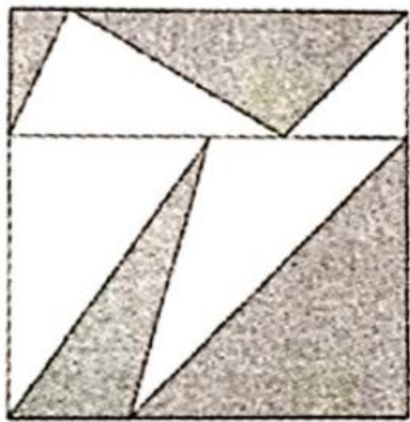

    A、是40米
    B、是60米
    C、是80米
    D、不能确定

# 判断推理

**本部分包括图形推理、定义判断、类比推理和逻辑判断四种类型的试题，在四个选项中选出一个最恰当的答案。**

66. 下列选项中最符合所给图形规律的是（ ）。
  
    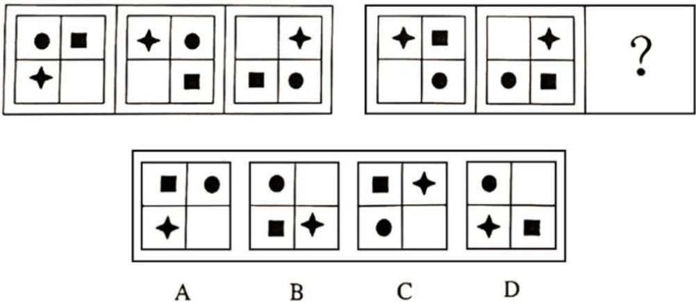

67. 下列选项中最符合所给图形规律的是（ ）。
  
    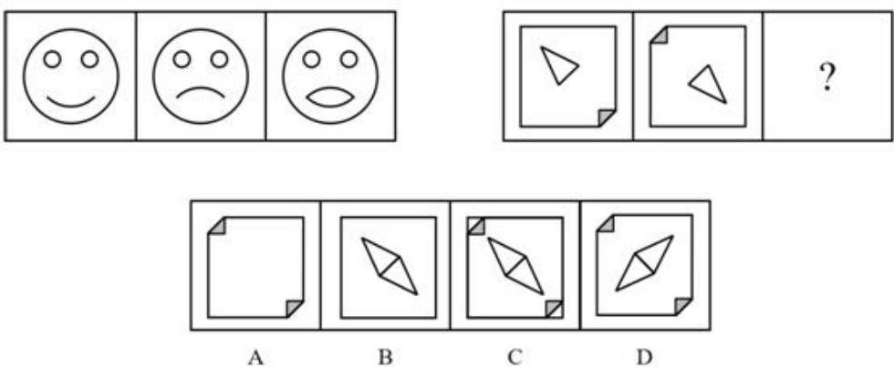

68. 下列选项中最符合所给图形规律的是（ ）。
  
    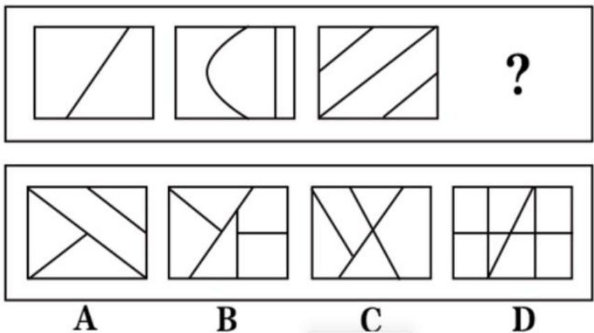

69. 下列选项中最符合所给图形规律的是（ ）。
  
    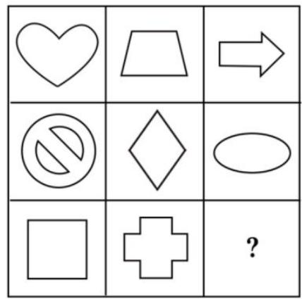
  
    
  
    A、A
    B、B
    C、C
    D、D

70. 下列选项中最符合所给图形规律的是（ ）。
  
    
  
    
  
    A、A
    B、B
    C、C
    D、D

71. 下列选项中最符合所给图形规律的是（ ）。
  
    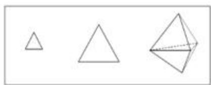
  
    
  
    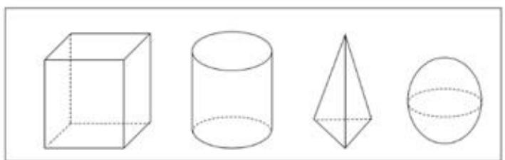
  
    A、A
    B、B
    C、C
    D、D

72. 如图所示是某立体图形的两个视图，那么该立体图形是（ ）。
  
    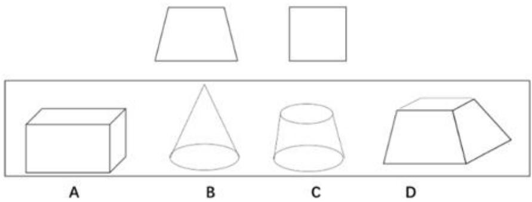

73. 以下平行图形可以折叠成左图所示立方体的是（ ）。
  
    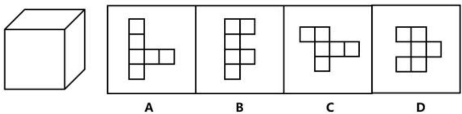

74. 下图最左边的立体图形由12个白色和3个灰色的小正方体组成缺失的立体图形最有可能是（ ）。
  
    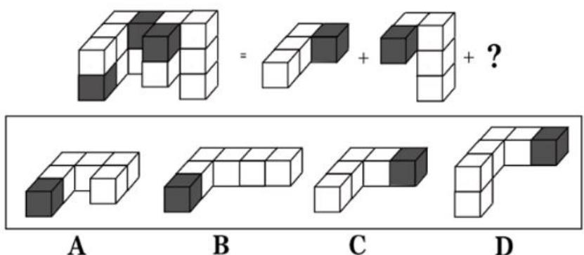

75. 下图中的三棱柱均有2个面是正三角形。如图所示，一根柱子穿过三角形的中心，将3个相同的三棱柱串在一起，每个三棱柱均可以绕柱腰旋转，则该图形的正面轮廓（忽略柱子）最不可能是（ ）。
  
    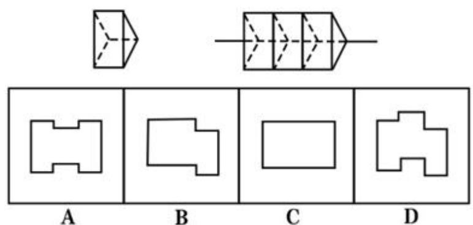

76. 风扇：风
    A、开关：电流
    B、钢铁：轨道
    C、堤坝：水库
    D、灯泡：光线

77. 运送：到达
    A、演出：落幕
    B、书写：创造
    C、加工：制作
    D、歌唱：伴奏

78. 渔民：撒网：鱼
    A、病人：生病：医院
    B、学生：作业：考试
    C、工人：生产：产品
    D、网民：上网：电脑

79. 音乐：艺术：欣赏
    A、毛笔：文具：写作
    B、足球：运动：健身
    C、杂志：书刊：阅读
    D、汽车：火车：运输

80. 量体裁衣：闭门造车
    A、只争朝夕：朝令夕改
    B、高瞻远瞩：鼠目寸光
    C、画龙点睛：雪上加霜
    D、乐极生悲：悲喜交加

81. 如果你不爱笑，就不容易开心，如果你不容易开心，别人就不喜欢和你交往；如果别人不喜欢和你交往，你就没有知心朋友；而只有拥有知心朋友，你才会感觉生活很幸福。
    如果以上描述为真，下列推断必然正确的是（ ）。
    A、爱笑的人会感觉生活很幸福
    B、不爱笑的人不会感觉生活很幸福
    C、如果你感觉生活不幸福，说明你不容易感到开心
    D、你感觉生活很幸福，说明你喜欢和别人交往

82. 如今是一个大数据技术收集个人信息数据的时代，所以，个人信息安全将受到越来越严重的威胁。以下最能削弱上述推论的是（ ）。
    A、现代商业模式高度依赖对消费者数据的分析
    B、我国正逐步完善有关个人信息安全的法律法规
    C、某大型企业建立了能够储存海量个人信息的大型数据库
    D、某医药公司通过大数据技术获取了上百万客户的健康数据

83. 当人们摄入高度加工的碳水化合物会导致人体内分泌胰高血糖素，缺乏胰高血糖素使得人体不能取得足够能量，从而使人产生饥饿感。某研究者据此认为，摄入高度加工的碳水化合物会导致人肥胖。
    要使研究者的推论成立，需要补充的前提是（ ）。
    A、摄入未高度加工的碳水化合物不会导致人肥胖
    B、人体缺乏胰高血糖素时会感到饥饿
    C、饥饿感会导致人体摄入超过其所需的能量
    D、碳水化合物是为人体提供能量的主要物质

84. 今年春季，有一家馒头店购买了专门制作馒头的机器进行生产馒头，该机器的馒头制作速度相比手工馒头速度大大加快了。然而过了几个月，该馒头店的馒头销量反而下降了。
    以下选项如果为真，最不能解释这一现象的是（ ）。
    A、该机器制作的馒头口感明显不如手工馒头
    B、当气温升高时，当地人通常不会选择馒头作为早餐
    C、该早餐店附近新开了许多家早餐店
    D、机器价格较高，大幅增加了早餐店的经营成本

85. 甲、乙、丙、丁4人参加象棋排位赛，赛前小王、小张和小李对4人的排名情况预测如下：
    小王：乙会是第一名，丙会是第三名。
    小张：甲会是第二名，乙会是第四名。
    小李：丙会是第二名，丁会是第三名。
    比赛结束后发现，小王、小张和小李都只预测对了一半。如果4人未出现名次并列，那么此次比赛中获得第四名的是（ ）。
    A、甲
    B、乙
    C、丙
    D、丁

86. 经常有海龟因为吞食漂浮在海里的塑料袋而死亡，有人发现，海里的霉菌，藻类会附着在塑料袋上，而塑料袋会沾染上来自这些生物的气味。因此有研究者认为，气味很可能是海龟吃塑料袋的原因。
    以下各项如果为真，最能支持上述推测的是（ ）。
    A、海鱼会将在水膨胀起来的塑料袋看作水母进食
    B、海鱼尤其喜欢进食外表绿色的塑料袋
    C、绝大多数海鱼根据气味来判断食物是否可以食用
    D、塑料袋在微生物分解作用下会生成特定气味

87. 在传统的市场经济中，商品的市场价格往往与其价值相对应，有人发现某国的小麦价格低于国际市场价格，因此该国的小麦商品不属于传统的市场经济。
    要使上述推论成立，需要补充的前提是（ ）。
    A、小麦的国际市场价格是小麦价值的准确反映
    B、该国国内小麦的价值与国际小麦的价值相同
    C、该国商品价格与国际市场价格不同的商品中，小麦最具代表性
    D、商品的价格在一定程度上背离其价值是合理的

88. 某商家在节日庆祝活动中举行了一项活动，如果有顾客购买了一款洗发水，那么会获得该品牌的一款沐浴露，但是推出这项活动后，该品牌洗发水的销量并没有明显增加。
    以下选项如果为真，最能够解释这一现象的是（ ）。
    A、促销赠送的沐浴露并不是最受消费者喜爱的沐浴露品牌
    B、在没有促销活动时，不少顾客会同时购买该品牌的洗发水和沐浴露
    C、在人们的日常生活中，洗发水的用量一般低于沐浴露的用量
    D、商家经常推出该品牌洗发水和沐浴露的优惠促销活动

89. 某市为解决市民住房问题，向社会提供多种公共住房，如仅供租赁的公租房、具有自有性质的安居房以及定向租赁给企业人才的人才房等。但申请公共住房有以下规定：
    ①拥有该市户籍才能申请租赁公租房和购买安居房。
    ②租赁公租房、人才房期间可以申请购买安居房。
    ③已有房产者不得申请租赁公租房、人才房和购买安居房。
    ④租赁公租房、人才房期间，若购买安居房或商品房的，则必须退租公租房、人才房。
    ⑤不得买卖公租房或人才房。
    则下列情形符合该市规定的是（ ）。
    A、小王没有该市户籍且没有房产，成功申请租赁人才房
    B、小周在当地购买了商品房，并成功申请租赁了公租房
    C、小李拥有该市户籍且没有房产，成功申请购买公租房
    D、小陆在当地购买安居房后，没有退租原来租赁的人才房

90. 定都易、建城难，建大都城更难，北京、南京、西安都是经历磨难才能成为著名大都城，因此，著名大都城是经历过自然和战争的洗礼才凝结出的社会文明结晶。
    以下与上述逻辑结构最为相似的是（ ）。
    A、成为全国冠军难，成为世界徭军吏是难上加难。顶级运动员必须付出巨大努力才能获得冠军，因此，马龙，王嘉男等世界冠军无不付出了巨大努力
    B、天将降大任于斯人也，必先苦其心智，劳其筋骨，饿其体肤，空乏其身，行拂乱其所为，所以动心忍性，增益其所不能
    C、人才兴则乡村兴、人才旺则乡村旺。因此，要更好地推动乡村振兴。就要为乡村人才发展营造良好环境，更大程度地激发人才的活力
    D、正是强大的爱国主义精神，支撑着董存瑞、黄继光、邱少云等革命先列为我们的国家前赴后继。因此，革命先烈都具有爱国主义精神

# 资料分析

**所给出的图、表、文字或综合性资料均有若干个问题要你回答。你应根据资料提供的信息进行分析、比较、计算和判断处理。**

## (一)

2021年12月，全国天然气产量达192亿立方米，与2019年同期相比，两年平均增长 $7.9\%$ 。2021年全国共生产天然气2053亿立方米，同比增长 $8.2\%$ 。比2019年增长 $18.8\%$ ，两年平均增长 $9.0\%$ 。

2021年12月，全国进口天然气1165万吨，同比增长 $3.8\%$ ，增速比上月回落140个百分点。2021年全国共进口天然气超1.2亿吨，同比增长 $19.9\%$ 。（天然气1亿立方米=7.174万吨）

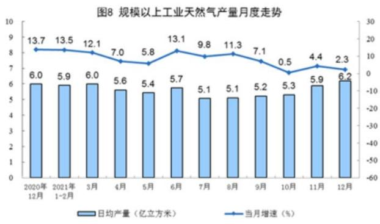

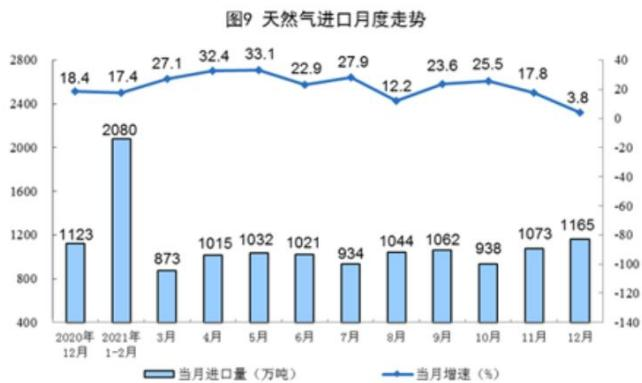

91. 与2019年同期相比，2021年12月全国天然气产量的增长量（ ）。
    A、小于10亿立方米
    B、在10-20亿立方米之间
    C、在20-30亿立方米之间
    D、大于30亿立方米

92. 2021年3-12月，全国天然气日均产量增速最高的月份，当月的天然气产量比进口量约（ ）。
    A、低了20个百分点
    B、高了20个百分点
    C、低了2个百分点
    D、高了2个百分点

93. 2020年各季度中，全国天然气产量最高的是（ ），最低的是（ ）。
    A、第一季度，第二季度
    B、第二季度，第四季度
    C、第三季度，第一季度
    D、第四季度，第三季度

94. 下列折线图中，最有可能准确反映2021年7-12月全国天然气进口量环比增量变化趋势的是（ ）。
  
    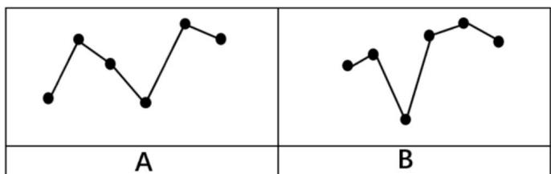
  
    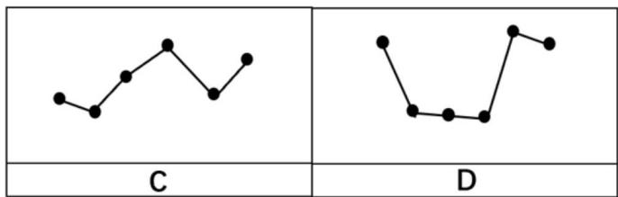

95. 根据资料，下列说法错误的是（ ）。
    A、2021年我国天然气产量大于进口量
    B、2019年我国天然气产量不足1500亿立方米
    C、2020年我国天然气进口量超过了1亿吨
    D、2021年9-12月，我国天然气日均产量逐月增加

## （二）

2020年，A国消费电子新机出货量为5.38亿台，平板电脑、笔记本电脑及其他消费电子新机出货量同比上升 $17.1\%$ ，智能手机出货量同比下降 $9.3\%$ ，致使整体出货量较2019年小幅下滑。

**2015-2020年A国消费电子新机出货量（单位：亿台）**

| 年份 | 智能手机 | 平板电脑 | 笔记本电脑 | 其他 |
| :--- | :--- | :--- | :--- | :--- |
| 2015年 | 4.27 | 0.26 | 0.38 | 0.35 |
| 2016年 | 4.65 | 0.26 | 0.36 | 0.46 |
| 2017年 | 4.44 | 0.22 | 0.36 | 0.66 |
| 2018年 | 3.96 | 0.22 | 0.35 | 0.79 |
| 2019年 | 3.67 | 0.22 | 0.36 | 1.17 |
| 2020年 | 3.33 | 0.23 | 0.39 | 1.43 |

96. 2020年，A国消费电子新机出货量量比2019年（ ）。
    A、少不到 1000 万台
    B、少1000万台以上
    C、多不到1000万台
    D、多1000万台以上

97. 2016-2020年，表中所列各种消费电子新机出货量均不低于上年水平的年份有（ ）个。
    A、0
    B、1
    C、2
    D、3

98. 2016-2020年，A国智能手机新机出货量约是平板电脑的（ ）倍。
    A、13.4
    B、15.4
    C、17.4
    D、19.4

99. 以下折线图最有可能反映2016-2020年A国（ ）电子新机出货量同比增长量的变化趋势。
  
    

    A、智能手机
    B、平板电脑
    C、笔记本电脑
    D、其他

100. 关于A国消费电子新机出货量，能够从上述资料中推出的是（ ）。

	A、2018-2020年，平板电脑总出货量高于2015-2017年的总出货量
	B、2017-2020年，笔记本电脑年均出货量超0.36亿台
	C、2016-2020年，其他电子产品出货量同比增速超过 $50\%$ 的年份有2个
	D、2015-2020年，智能手机和笔记本电脑出货量最高的年份是同一年
