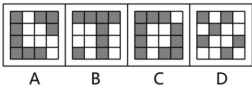
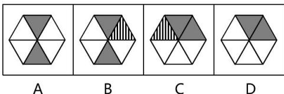
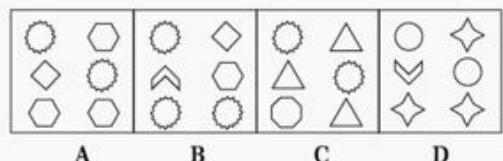
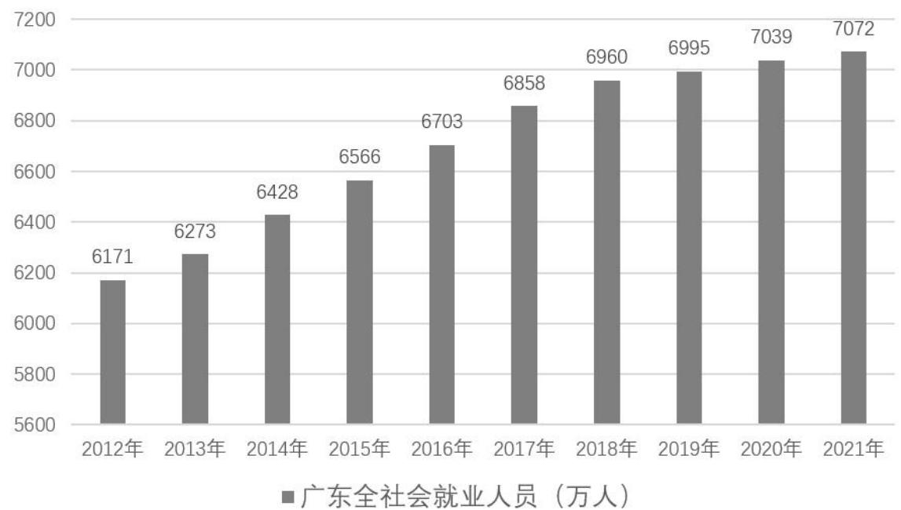
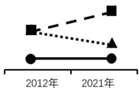
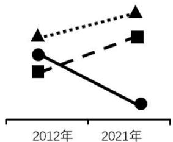
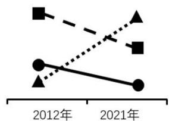
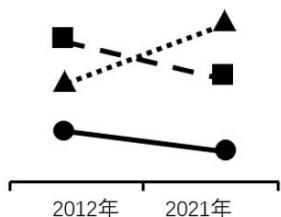
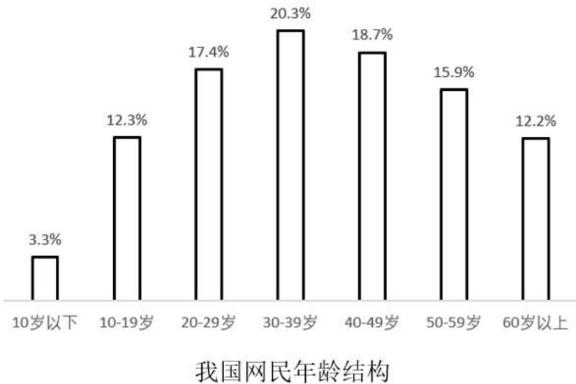

# 常识判断

根据题目要求，在选项中选出恰当的答案。

1. 一百年来，中国共产党团结带领人民进行的一切奋斗、一切牺牲、一切创造，归结起来就是一个主题：实现中华民族伟大复兴。（ ）

2. 政治协商制度是中国特色社会主义的特征，是中国特色社会主义制度的最大优势。（ ）

3. 腐败是危害党的生命力和战斗力的最大毒瘤，反腐败是最彻底的自我革命。（ ）

4. 中国式现代化不能走脱实向虚的路子，必须加快建设以实体经济为支撑的现代化产业体系。（ ）

5. 中国的各项生产技术都必须实现自主研发，自给自足。（ ）

6. 中国改革开放政策将长久不变，永远不会自己关上开放的大门。（ ）

7. 衡量一个社会制度是否科学、是否先进，主要看是否符合国情、是否有效管用、是否得到人民拥护。（ ）

8. 根据马克思主义，实现共产主义后，劳动不再是“生活的第一需要”。（ ）

9. 三元里人民的抗英斗争，是中国近代史上中国人民第一次大规模的反侵略武装斗争。（ ）

10. 把建设社会主义市场经济体制确立为我国经济体制改革目标，是党的十六大作出的一项具有深远意义的重大决定。（ ）

11. 中国共产党成立后，致力于组织领导工人运动。（ ）

12. 行政机关公开政府信息，应当坚持以不公开为常态，以公开为例外，遵循公正、公平、合法的原则。（ ）

13. 必须牢牢把握社会公平正义这一法治价值追求，努力让人民群众在每一项法律制度、每一个执法决定、每一宗司法案件中都感受到公平正义。（ ）

14. 监督宪法的实施、解释宪法，是宪法赋予最高人民法院的重要职责。（ ）

15. 某房地产开发公司与乔某签订了商品房预售合同，该公司可在一年后以建材价格上涨、建房成本提高为由，要求乔某额外支付一笔费用。（ ）

16. 广东是我国大陆海岸线最长的省份。（ ）

17. 广东徐闻作为古代海上丝绸之路的重要港口，东滨南海，西濒北部湾，南临台湾海峡，与台湾岛隔海相望。（ ）

18. 东汉时期，我国开始出现大件青铜器。（ ）

19. “爱其子，择师而教之；于其身也，则耻师焉，惑矣。”出自韩愈的《师说》，批判了当时社会上的耻学于师的陋习。（ ）

20. 在同等浓度的雾霾和沙尘暴的天气下，由于雾霾会使空气中的氧气浓度显著下降，雾霾比沙尘暴对人体健康的危害更大。（ ）

21. 在党的二十大报告中，“人民”二字出现了上百次，直抵人心，激发共鸣。下列目标任务直接体现了“以人民为中心”的有（ ）。
    A、居民收入增长和经济增长基本同步
    B、基本公共服务均等化水平明显提升
    C、多层次社会保障体系更加健全
    D、城乡人居环境明显改善

22. 党的二十大报告指出，坚持全面依法治国，推进法制中国建设。下列有关表述正确的有（ ）。
    A、全面依法治国是国家治理的一场深刻革命
    B、坚持依法治国首先要坚持依宪治国
    C、转变政府职能是全面依法治国的重点任务和主体工程
    D、推进多层次多领域依法治理，提升社会治理法治化水平

23. 党的二十大报告指出，积极稳妥推进碳达峰碳中和。下列对双碳工作理解正确的有（ ）。
    A、目标是努力争取 2030 年前实现碳中和, 力争 2050 年前二氧化碳排放达到峰值
    B、必须立足我国富煤贫油少气的基本国情
    C、处理好发展和减排、整体和局部、长远目标和短期目标、政府和市场4对关系
    D、降碳、减污是做减法，扩绿、增长是做加法

24. 党的二十大报告明确指出，于二〇三五年基本实现社会主义现代化，属于2035年我国发展总体目标的有（ ）。
    A、人均国内生产总值达到中等发达国家水平
    B、实现高水平科技自立自强，进入创新型国家前列
    C、基本实现新型工业化、信息化、城镇化、农业现代化
    D、国家安全体系和能力全面加强，基本实现国防和军队现代化

25. 习近平总书记指出，世界上的问题错综复杂，解决问题的出路是维护和践行多边主义，推动构建人类命运共同体。关于21世纪的多边主义精神，下列说法正确的有（ ）。
    A、要立足世界格局变化，着眼应对全球性挑战需要
    B、在广泛协商、凝聚共识基础上改革和完善全球治理体系
    C、坚持开放包容，坚持以国际法则为基础
    D、维护全球意识形态安全，打造针对部分国家的价值观同盟

26. 劳动者素质对一个国家、一个民族发展至关重要，以下举措有助于建设高素质劳动大军的有（ ）。
    A、弘扬劳模精神和工匠精神，营造劳动光荣的社会风尚和精益求精的敬业风气
    B、优化职业教育类型定位，倡导产教分离，减少校企合作
    C、激励更多劳动者特别是青年一代走技能成才、技能报国之路
    D、提高技能人才待遇水平，畅通技能人才职业发展通道

27. 2023年4月，习近平总书记广东考察时说：广东是改革开放中的（ ），在中国式现代化建设的大局中地位重要、作用突出。
    A、排头兵
    B、先行地
    C、实验区
    D、压舱石

28. 下列行为不符合我国法律规定的有（ ）。
    A、小陈在回家的路上被两名身穿警服的民警叫住，要求其配合查验身份证
    B、某村因丢失一台电脑紧急召开村委会会议，会议决定挨家挨户开展搜查
    C、李先生出超市时店门口警报器一直鸣叫，该超市保安立即用电子探测仪对其全身检查，并要求其打开背包接受检查
    D、某公司招聘项目经理，凌小姐综合测评第一，贾先生第二，但该公司以男士优先为由录用了贾先生

29. 自古以来，我国形成了世界法制史上独树一帜的中华法系，积淀了深厚的法律文化。以下中国传统法律观念与其所蕴含的法治思想，对应准确的有（ ）。
    A、天下无讼、以和为贵——公正
    B、德主刑辅、明德慎罚——慎刑
    C、援法断罪、罚当其罪——民本
    D、保护鳏寡孤独、老幼妇残——恤刑

30. 以下关于广东地理和自然环境的说法准确的有（ ）。
    A、是个国内人多地少的省份之一，人地关系矛盾突出
    B、地理环境优越，地势南高北低，以丘陵地形为主
    C、地处太平洋板块与印度洋板块交接处，地震频发
    D、水资源时空分布不均，夏秋易旱涝，冬春常干旱

# 言语理解与表达

本部分包括表达与理解两方面的内容。请根据题目要求，在四个选项中选出一个最恰当的答案。

31. 各地将技能大赛融入推动产业工人队伍建设改革的进程中。广大职工踊跃参与，一批具有劳动热情和创造潜能的技术人才破土冒尖、__________，展现出工人阶段的时代风采。
    A、鹤立鸡群
    B、一枝独秀
    C、所向披靡
    D、脱颖而出

32. 中国空间站在轨建设分为关键技术验证和建造两个阶段实施，神舟十三号任务是空间站关键技术验证阶段的决胜之战、收官之战，也是空间站在轨建设过程中__________的关键之战。
    A、起承转合
    B、承前启后
    C、继往开来
    D、峰回路转

33. 我国是世界第一大能源消费国，原油对外依存度超过 $70\%$ ，能源安全问题愈发严峻，加大国内油气勘探开发力度可谓__________。
    A、大势所趋
    B、正当其时
    C、迫在眉睫
    D、应时而生

34. 建设好中国特色世界一流文学，必须毫不动摇的坚持党的全面领导这个政治原则，使党的领导________办学治校各领域，________教育教学各环节、融入人才培养各方面、在高校各项工作中全面发挥作用。
    A、覆盖 贯穿
    B、涵盖 联系
    C、遍及 连贯
    D、包含 贯通

35. 文化兴则国运兴，任何一个国家都必须以先进的思想为__________，以先进文化为__________。
    A、指南 依托
    B、指引 支撑
    C、向导 根基
    D、引领 支柱

36. 经济特区作为“试验田”，__________当时计划经济带来的僵局，同时也向世界__________了中国的制度自信。
    A、打破 展示
    B、破除 展现
    C、解除 表现
    D、破解 表示

37. 人工智能正在__________一场新的工业革命，其影响范围小则涉及个人生活，大则影响国家安全，让人们在期待的同时，也带着些许__________。
    A、推进 担忧
    B、引发 焦虑
    C、推动 志忑
    D、引导 茫然

38. 每个城市的特色不同，城市更新“改什么”“怎么改”，需要________、分类施策，而其中一个共同的原则，就是要________城市发展规律，尊重人民群众意愿，聚焦居民急难愁盼问题。
    A、统筹兼顾 发现
    B、高屋建瓴 符合
    C、与时俱进 遵循
    D、因地制宜 顺应

39. 夕阳映照下，__________的梯田与种田人幸福的笑脸__________，哈尼人世代守护的“绿水青山”转化为“幸福靠山”。
    A、五光十色 相映成趣
    B、纵横交错 相得益彰
    C、鳞次栉比 相辅相成
    D、五彩斑斓 交相辉映

40. “有家的地方就是年，有家人的地方就有团圆”，________是一家人围炉夜话、诉说衷肠，享受天伦之乐、生活之美，________打点行囊、踏上旅途，收获异乡风情、崭新美景，________心在一起、家人在一起，春节的情感内涵________不会变，我们代代相传的文化基因就会得以赓续。
    A、无论 还 只要 就
    B、不仅 更 只有 才
    C、首先 其次 倘若 便
    D、要么 要么 因为 所以

41. 中国特色社会主义文明是人类文明的新形态。它不但注重其所包含的物质文明、政治文明、精神文明、社会文明、生态文明之间的协调发展、同步推进，更注重其创造的文明成果，是由无产阶级和全体劳动人民所享有。从本质上说，中国特色社会主义文明是马克思恩格斯创立的共产主义思想实践成果，是努力实现人的自由全面发展，致力于构建人与自然、人与人、人与社会和谐关系的新文明形态，致力于建立人与自然的生命共同体及构建人与人、民族与民族、国家与国家之间的命运共同体的新文明形态。
    这段文字意在强调（ ）。
    A、中国特色社会主义所创造的文明是一种综合型的人类文明新形态
    B、中国特色社会主义所创造的文明是人类历史上最先进的文明形态
    C、中国特色社会主义建设五大领域的文明彼此不可分割、相辅相成
    D、中国特色社会主义建设五大领域的文明注重统筹兼顾、齐头并进

42. 提升城市治理的水平，下好绣花功夫，提升治理精度。__________。城市治理中，杂物占道、无序设摊、施工扰民、道路保洁、井盖伤人等投诉逐年增多，这些城市治理的细节问题能否解决直接关系到百姓的切身利益能否维护。老百姓诉求最集中之处，往往都是一些看似微不足道的小事，但这每一件“小事”，都是我们需要尽心尽力办好的“大事”。城市治理应从细处着手，打通堵点、理顺机制，要以绣花般的精心、细心和巧心，把城市治理的成果落实到群众切身感受上，唯此才能不断提升城市治理的精细化水平。
    填入画线部分最恰当的一项是（ ）。
    A、民为邦本，本固邦宁
    B、为之于未有，治之于未乱
    C、不积跬步，无以至千里
    D、天下大事，必作于细

43. 制度型开放是更高层次、更高水平的开放。这一战略部署，强调在经济发展和对外开放的过程中，不断对标国际通行规则，进而实现进一步的制度创新。重点关注发达国家的高标准规则，通过在贸易规则和规制、投资规则和规制、生产中的管理和标准等方面进行对接与协调，有效促进中国与世界经济安全有序的融合。开放方式创新，坚持引进来与走出去更好结合，创新跨境资本流动及投资合作的制度标准。
    本文段主要阐述了（ ）。
    A、制度型开放的背景和目的
    B、制度型开放的内涵和路径
    C、制度型开放与发达国家的关系
    D、制度型开放的深远影响与重要意义

44. 首先，我们要认识到双循环新发展格局是包括了国内和国际两个循环，两者缺一不可、相得益彰。双循环不是不要国外市场，更不是封闭起来搞自己的经济循环，而是要在继续参与国际竞争的前提下，让国内市场在资源配置和经济成长中起决定性作用，不仅要以国内大市场体系循环代替“两头在外、大进大出”的单循环格局，而且要让国内市场与国际市场连接起来，以国内市场发展和壮大，促进和带动国内企业参与国际市场循环。
    下列说法不准确的是（ ）。
    A、双循环新发展格局需要国内国际市场相连接
    B、双循环新发展格局应以国内市场循环为主体
    C、双循环新发展格局下应当弱化国际市场循环
    D、双循环新发展格局是开放的国内国际双循环

45. 当今世界正经历百年未有之大变局，虽然我国已转向高质量发展阶段，但发展不平衡不充分问题仍然突出，重点领域关键环节改革任务依然艰巨，城乡区域发展和收入分配差距较大，社会治理还有弱项。船到中流浪更急，人到半山路更陡，越是接近民族复兴越不会一帆风顺，越充满风险挑战。征途漫漫，惟有奋斗。面向未来，前进征途上许多“雪山”“草地”需要跨越，许多“娄山关”“腊子口”需要征服，尤其需要发扬越是艰险越向前的艰苦奋斗精神。
    这段文字主要说明了（ ）。
    A、发扬艰苦奋斗精神的着力点
    B、发扬艰苦奋斗精神的必要性
    C、现阶段我国发展面临的问题
    D、现阶段我国改革发展的任务

46. 当下，疫情为正处于成长期的咖啡产业带来了诸多挑战，尤其是抗风险能力较弱的一些独立咖啡门店，面临着客流量不足等挑战。在这种状况下，一些咖啡店品牌拓展的咖啡豆电商销售、咖啡外卖、咖啡网课培训等线上经营业务，一定程度上为品牌分担了经营风险，为恢复正常营业保存了体力。
    根据这段文字，作者最有可能赞同（ ）。
    A、拓展业务是咖啡门店在今后一个时期内的主要任务
    B、产品和服务多样化是咖啡产业对抗风险挑战的法宝
    C、独立咖啡门店应适当拓展发展思路和经营业务范围
    D、受经济环境影响，独立咖啡门店线下经营状况堪忧

47. 古树是指经依法认定、树龄100年以上的树木：名木是指经依法认定的稀有珍贵树木和具有历史价值、重要纪念意义的树木。古树不仅以其年代久远、景观独特见长，也因其蕴含的丰富历史意义而受到广泛关注。它们是活着的历史，连接着过去、现在和未来。其中一些历经世事变迁及岁月洗礼，在跨朝历代中成为“名木”，化作社会历史不可分割的一部分。
    这段文字主要讲了（ ）。
    A、古树的独特景观和历史意义
    B、认定古树及名木的主要标准
    C、古树名木具有社会历史价值
    D、做好古树名木保护的重要性

48. 长期以来，人们习惯用癌细胞出现的位置来定义癌症，例如胃癌、肺癌、肝癌等。但这样的定义却无法体现出癌症的“脾气秉性”。《细胞》杂志刊登的美国癌症基因组图谱（TCGA）的研究显示，科学家通过对33种癌症类型、1万多个肿瘤病例进行研究，发现在不同器官上的一些癌症却具有很强的分子相似性，而有些癌症虽然发生在同一器官，但却拥有完全不同的分子亚型。不同分子亚型的癌症可能需要采取不同的治疗方法，否则有可能适得其反。“有文章甚至报告了超进展病例，患者在接受抗PD-1/PD-L1等免疫检查点抑制剂的治疗后，肿瘤发生了非同寻常的快速恶化。”北京大学肿瘤医院副院长沈琳教授表示，要甄别采取某一疗法哪些患者能够获益、哪些患者可能受损，需要有效的生物标志物。以下理解不准确的是（ ）。
    A、同一种疗法可能适用于不同器官上的癌症
    B、找到生物标志物就能够有效治疗癌症
    C、癌症的“脾气秉性”并非由其出现的位置决定
    D、不同分子亚型的癌症可能不宜采取同样的疗法

49. 将以下句子重新排列，正确的选项是（ ）。
    (1)对新发现的“大棚房”问题，要发现一起、处置一起，坚决做到“零容忍”
    (2)一方面，各地区和有关部门要建立更加严格的常态长效监督机制，形成齐抓共管的工作合力
    (3)另一方面，压实地方责任，全面落实粮食安全党政同责、严格粮食安全责任制考核”
    (4)要采取“长牙齿”的硬措施，严格监管执法，做到逢棚必查，眼见为实，对违规使用耕地行为露头就打
    (5)整治“大棚房”关键在于主管部门要多些“较真精神”
    A、(1)(2)(3)(4)(5)
    B、(1)(5)(4)(2)(3)
    C、(5)(2)(3)(1)(4)
    D、(5)(2)(4)(1)(3)

50. 如果把“新市民”这个群体按照生命周期来划分，金融服务应贯穿新市民的整个生命周期，从最前端的到城市找工作，到后面的生活消费，再到结婚生子，以及未来孩子的教育和医疗保险。具体的金融产品应服务到每一个重要阶段：进城、落户期间租房买房需要的购房和装修贷款；安置生活购买家电产品需要的消费和车辆贷款就业创业的启动和周转资金贷款；孩子助学贷款、自我提升的就业培训贷款；提升生活品质的消费分期贷款；赡养老人所需的医疗险等。
    根据这段文字，作者最有可能赞同（ ）。
    A、应根据新市民生活工作阶段设计针对性强的金融服务产品
    B、金融服务应当在现阶段基础上进一步根据生命周期来细分
    C、就业生活、医疗教育应当成为当前阶段金融产品设计的重点
    D、应当进一步细分适用场景不同的新市民群体的金融服务产品

# 数量关系

在这部分试题中，每道题呈现一段表述数字关系的文字，要求你迅速、准确地计算出答案。

51. 98，86，74，62，（ ）。
    A、49
    B、50
    C、51
    D、52

52. $\frac{1}{5}, \frac{1}{5}, \frac{3}{17}, \frac{2}{13}$ , ( )。
    A、 $\frac{2}{13}$
    B、 $\frac{1}{11}$
    C、 $\frac{4}{35}$
    D、 $\frac{5}{37}$

53. 1，9，25，57，（ ）。
    A、121
    B、122
    C、123
    D、124

54. 3.14，9.20，12.23，21.32，33.44，（ ）。
    A、44.55
    B、49.61
    C、54.65
    D、60.66

55. 10，6，10，12，30，48，150，（ ）。
    A、266
    B、277
    C、288
    D、299

56. 五一节期间，某商场开展促销活动，将一款冰箱的价格下调 $20\%$ 销售。促销结束后，这款冰箱计划恢复原价销售，那么此时该商品的价格应上调（ ）。
    A、10%
    B、 $15\%$
    C、 $20\%$
    D、25%

57. 某市组织了80名学生前往外地参加科技创新大赛，入住的酒店价格标准是双人间每间200元，三人间每间270元。如果最终住宿花费了7700元，且房间都住满，则住在三人间的学生有（ ）名。
    A、30
    B、33
    C、36
    D、39

58. 老张步行上班的途中，会路过一家距离单位路程1200米的书店。从单位匀速步行回家时，他走了20分钟到达了这家书店，又走了10分钟回到家。则他家到单位的步行路程一共是（ ）米。
    A、1800
    B、2400
    C、3000
    D、3600

59. 某单位共有40名职工，其中有25名职工参加了乒乓球队，15名职工参加了羽毛球队。如果有10名职工同时参加了乒乓球队和羽毛球队，则两个球队都没有参加的职工有（ ）名。
    A、0
    B、5
    C、10
    D、15

60. 某单位工会组织全体员工测量血压，如果只使用仪器甲，需要90分钟才能完成；如果同时使用仪器甲和仪器乙，则只需要50分钟。已知仪器甲每5分钟比仪器乙多检测一人，则这个单位共有职工（ ）人。
    A、45
    B、60
    C、75
    D、90

61. 某单位有志愿者6名，其中男性和女性各3名。现有2个社区需要安排志愿服务，如果每个社区都安排3名志愿者，且每个社区至少安排1名女性，则人员组合共有（ ）种。
    A、18
    B、24
    C、32
    D、38

62. 某公司计划在年终庆典上用若干无人机进行方阵表演。活动当天突然有41台无人机发生故障无法使用，剩下的无人机恰好仍能组成方阵，但比原计划少了一行和一列。则原计划方阵表演使用的无人机数量可能是（ ）台。
    A、400
    B、441
    C、484
    D、529

63. 如图所示，圆柱形的容器内放着一块实心圆柱体，容器的底面直径为 $20\mathrm{cm}$ ，实心圆柱体的直径为 $10\mathrm{cm}$ 、高为 $8\mathrm{cm}$ 。往容器内装满水后，再将完全浸没的实心圆柱体取出，此时容器内的水面将会下降（ ）cm。
    
    A、1
    B、2
    C、3
    D、4

64. 某产品的加工环节包含了三道工序，其中第一道工序每位工人每小时可以处理5件产品；第二道工序每位工人每小时能处理4件产品；第三道工序每位工人每小时能处理8件产品。如果要使每道工序每小时加工的产品数量一致，则至少需要安排（ ）名工人加工该产品。
    A、17
    B、20
    C、23
    D、40

65. 某地计划选择甲、乙、丙、丁工程队中的1支，修建一段长度为18千米的公路。如果4支工程队平均每天分别能完成90、80、75、72米的公路施工，但甲工程队要求每施工4天休整1天，乙每施工15天休整1天，丙每施工30天休整1天，丁无休整要求。则为了尽早完成施工，应选择（ ）工程队。
    A、甲
    B、乙
    C、丙
    D、丁

# 判断推理

本部分包括图形推理、定义判断、类比推理和逻辑判断四种类型的试题，在四个选项中选出一个最恰当的答案。

66. 请从所给的四个选项中，选择最合适的一个填入问号处，使之呈现一定的规律性（ ）。
    
    
    A
    B
    C
    D

67. 请从所给的四个选项中，选择最合适的一个填入问号处，使之呈现一定的规律性（ ）。
    
    
    A
    B
    C
    D

68. 请从所给的四个选项中，选择最合适的一个填入问号处，使之呈现一定的规律性（ ）。
    
    

69. 请从所给的四个选项中，选择最合适的一个填入问号处，使之呈现一定的规律性（ ）。
    
    

70. 请从所给的四个选项中，选择最合适的一个填入问号处，使之呈现一定的规律性（ ）。
    
    

71. 请从所给的四个选项中，选择最合适的一个填入问号处，使之呈现一定的规律性（ ）。
    
    

72. 下列所给选项中，哪一项不可能是该立体图形的视图？（ ）
    
    A、
    B、
    C、
    D、

73. 以下哪项能与题干中图形组成一个长方体？（ ）
    
    A、
    B、
    C、
    D、

74. 以下哪项是由题干中正方体展开图折叠而成的？（ ）
    
    A、
    B、
    C、
    D、

75. 以下四个选项中，哪项立体图形中不包含题干中的图形？（ ）
    
    A、
    B、
    C、
    D

76. 汽车：汽油
    A、碗：筷
    B、毛笔：墨汁
    C、猪肉：饲料
    D、镜框：镜片

77. 股票：股市
    A、储户：银行
    B、价格：市场
    C、篮球：球筐
    D、数据：互联网

78. 闻鸡：起舞
    A、走马：观花
    B、对牛：弹琴
    C、谈虎：色变
    D、弃暗：投明

79. 人：船只：河流
    A、鸟：翅膀：天空
    B、工匠：房子：居住
    C、钢笔：墨水：纸张
    D、汽车：防滑链：雪地

80. 手绘：打印：国画
    A、清蒸：凉拌：菜肴
    B、书写：记录：文明
    C、驾驶：导航：货车
    D、唱片：音响：音乐

81. 无论是手洗还是使用洗衣机，洗衣服的程序一般由多次的漂洗和脱水组成。在许多人看来，只清洗少量衣物时，并不需要太多次的漂洗，此时手洗不仅更快，而且用水量也会显著少于洗衣机。但事实并非如此，在清洗效果基本一致的情况下，即使是清洗2-3件衣物，使用洗衣机仍然更能节约用水。
    下列选项如果为真，最不能解释这一现象的是（ ）。
    A、在每次漂洗衣物的时候，手洗的用水量往往高于洗衣机
    B、要达到相同的清洗效果，洗衣机所需的漂洗次数少于手洗
    C、衣物减少时，洗衣机相应减少洗涤剂用量及用水量
    D、许多人没有形成循环利用洗衣服的水的习惯

82. 某位鸟类爱好者连续多个上下午都观察到了翠鸟的踪影，并记录了翠鸟每天的捕食情况：
    (1) 翠鸟每天都会在上午、下午各捕食一次；
    (2) 翠鸟只捕食小鱼或螃蟹, 且每次只捕食一种食物;
    (3) 当上午捕食小鱼时, 下午就捕食螃蟹;
    (4) 一共有 3 个上午、3 个下午捕食小鱼；
    (5) 一共有4个下午捕食螃蟹。
    则该鸟类爱好者一共观察了（ ）天？
    A、6
    B、7
    C、8
    D、9

83. 细粒物指数是空气污染程度测控的重要指标之一，环境评估报告显示，某市去年的细颗粒物指数比十年前翻了两番，由此可见，该城市污染比十年前严重了，以下选项如果为真，最能有效削弱上述推论的是（ ）。
    A、该市的常住人口数量是十年前的5倍
    B、调查表明，该市居民对城市环境的满意度比十年前显著提高
    C、该市的空气碳化物含量及地表水污染指数等指标均较十年前显著下降
    D、受高气压影响，近期该市的大气污染物比较集中，难以散去

84. 某天文学研究团队对金星光谱进行研究时发现，有一条微弱的吸收线与磷化氢的特征相符，表明金星浓密的硫酸云大气中存在磷化氢分子，而在地球上，磷化氢分子来自某些大肠杆菌菌株或动物的肠道。该研究团队由此推测，金星上曾经存在生命活动。
    要使上述推论成立，必须补充的前提是（ ）。
    A、其他研究团队在对金星光谱分析后也发现了相同的吸收线
    B、某些生物能够在地球上类似金星环境的地方生存
    C、如今金星的环境已经不适宜生命活动
    D、磷化氢这一物质只能由生命活动产生

85. 所有的灌木植物都很矮小，冬青植株很矮小，所以冬青属于灌木植物。下列选项的逻辑结构，与题干最相似的是（ ）。
    A、落叶乔本的叶子会在秋冬脱落，柏树不会落叶，所以柏树不是落叶乔本
    B、水果往往含水量很高，山楂含水量极低，所以有的山楂不是水果
    C、沙漠植物的叶子都呈针状，雪松有针状的叶子，所以雪松属于沙漠植物
    D、几乎所有的有毒植物颜色都很鲜艳，断肠草有毒，所以断肠草颜色鲜艳

86. 普通牛奶中通常含有 $3 \%$ 左右的脂肪，而脱脂牛奶借助脱脂加工工艺能够将牛奶中的脂肪含量降低至 $0.5 \%$ 以下，由于过度摄入脂肪是人体肥胖的原因之一，因此，对于每天喝牛奶的人而言，相较于饮用普通牛奶，饮用脱脂牛奶的人更不容易肥胖。要使上述推论成立，可以补充的前提是（ ）。
    A、脱脂牛奶与普通牛奶的口感差别不大
    B、脱脂加工工艺不会显著增加牛奶的生产成本
    C、不管选择哪种牛奶，人们每天的牛奶摄入量基本一致
    D、脱脂牛奶在希望控制体重的人群中广受欢迎

87. 为了提高司机的安全意识，某地在高速公路安装了动态警示牌，并在警示牌儿上流动播放附近路段的车祸发生率等相关数据。有研究机构对比了警示牌安装前后高速公路的车祸发生率，结果发现，警示牌附近路段的车祸发生率反而增加了。下列选项如果为真，最能解释这一现象的是（ ）。
    A、该段高速公路仅在道路的一侧安装了动态警示牌
    B、滚动播放的数据会在一定程度上导致司机驾驶时分心
    C、多数司机无法在短时间内理解车祸发生率等数据的含义
    D、警示牌附近路段转弯较多，车祸发生率始终高于其他路段

88. 根据有关规定，保健产品外包装上必须标注“不具有疾病治疗功能”“不能代替药物治疗”等警示语。由于印在香烟外包装上的“吸烟有害健康”标语具有警示效果，因此，保健产品外包装上的警示语也能起到类似的效果——让人们看到保健品并不像一些商家宣传的那样神奇，对防范虚假宣传和防止保健品滥用都有积极意义。
    以下选项中最能支持上述论断的是（ ）。
    A、消费者看到警示语后会显著降低购买欲望
    B、一些消费者会为了治疗疾病而购买保健品
    C、吸烟对身体有害是商家和消费者都认同的
    D、绝大多数保健品不是医药企业生产的

89. 某企业计划组织员工参观文化馆、档案馆和博物馆，但由于时间有限，这三个场馆不能都去。因此，有3名员工提出了以下建议：
    甲：文化馆和档案馆之间距离很远，最多只去其中一个。
    乙：档案馆和博物馆都有主题展览，两个都应该参观。
    丙：去年已经组织参观过文化馆，今年就不去了。
    结果发现，只有1名员工的建议被采纳，则下列判断必然正确的是（ ）。
    A、该企业一定去了档案馆
    B、该企业一定没去档案馆
    C、该企业一定去了博物馆
    D、该企业一定没去博物馆

90. 只有当家政服务的社会认可度显著提高或社会需求明显上升，才能说明员工制的推行对家政服务的高质量发展起到了促进作用，所以，如果家政服务的社会认可度和社会需求都下降，说明员工制的推行没有促进家政服务的高质量发展。以下与上述推论结构最为相似的是（ ）。
    A、只有家政服务行业推行员工制，才能让从业者对行业更有归属感，所以，如果家政服务行业没有推行员工制，那么从业者一定对行业没有归属感
    B、如果消费者对家政服务不满，要么是实际服务水平和宣传不符，要么就是服务人员素质良莠不齐，某消费者对家政服务满意，说明不存在虚假宣传且服务人员素质较高
    C、员工制度让经营管理更加便捷高效，而高效的经营管理能培育出优质的家政服务品牌，所以员工制有助于培育优质的家政服务品牌
    D、家政服务领域的专业化、规范化水平不断提高，能在一定程度上促进服务业转型升级，因此，服务业转型升级离不开家政服务水平的提升

# 资料分析

所给出的图、表、文字或综合性资料均有若干个问题要你回答。你应根据资料提供的信息进行分析、比较、计算和判断处理。

**(一)**

党的十八大以来，广东着力促进经济平稳较快增长，经济实力显著增强，经济总量逐年攀升，促进就业创造了有利条件。

2021年末，广东全社会就业人员7072万人，比2012年末增加901万人，增长 $14.6\%$ 。年均增长率为 $1.5\%$ 。其中，城镇就业人员从2012年末的4305.70万人增加到2021年末的5473.00万人，年均增长率高于全社会就业人员年均增长率1.2个百分点。珠三角核心区城镇就业人员增长尤为明显，从2012年来的3236.78万人增加到2021年末的4400.97万人。

在就业总量稳步提升的同时，广东三次产业的就业结构也在不断优化。2021年，第一产业就业人员753万人，比2012年减少490万人；第二产业就业人员2565万人，比2012年减少63万人；第三产业就业人员3754万人，比2012年增加1454万人。

91. 2012-2021年，广东全社会就业人员平均每年增长约（ ）万人。
    A、90
    B、100
    C、110
    D、120

92. 2012-2021年，广东城镇就业人员平均增长率（ ）。
    A、小于 $1\%$
    B、在 $1\% -2\%$ 之间
    C、在 $2\% -3\%$ 之间
    D、大于 $3\%$

93. 与2012年末相比，2021年末珠三角核心区域城镇就业人员在全省城镇就业人员中的占比增加了约（ ）个百分点。
    A、5.2
    B、5.7
    C、6.4
    D、6.9

94. 以下年份中，广东全社会就业人员同比增长率最高的年份是（ ）年。
    A、2014
    B、2015
    C、2016
    D、2017

95. 下列选项最有可能反映了2012和2021年，广东三次产业就业人员在全社会就业人员中占比情况的是（ ）。
    A、
    B、
    C、
    D、

**(二)**

**2020年12月-2021年6月各类互联网应用用户规模和增长率情况**

| 大类 | 应用类别 | 2020年12月用户规模(万) | 2021年6月用户规模(万) | 增长率 |
|---|---|---|---|---|
| 基础应用类 | 即时通信 | 98111 | 98330 | 0.2% |
| 基础应用类 | 搜索引擎 | 76977 | 79544 | 3.3% |
| 基础应用类 | 网络新闻 | 74274 | 75997 | 2.3% |
| 基础应用类 | 在线办公 | 34560 | 38065 | 10.1% |
| 商务交易类 | 网络支付 | 85434 | 87221 | 2.1% |
| 商务交易类 | 网络购物 | 78241 | 81206 | 3.8% |
| 商务交易类 | 网上外卖 | 41883 | 46859 | 11.9% |
| 商务交易类 | 在线旅行预定 | 34244 | 36655 | 7.0% |
| 网络娱乐类 | 网络视频(含短视频) | 92677 | 94384 | 1.8% |
| 网络娱乐类 | 网络直播 | 61685 | 63769 | 3.4% |
| 网络娱乐类 | 网络游戏 | 51793 | 50925 | -1.7% |
| 网络娱乐类 | 网络音乐 | 65825 | 68098 | 3.5% |
| 公共服务类 | 网约车 | 36528 | 39651 | 8.5% |
| 公共服务类 | 在线教育 | 34171 | 32493 | -4.9% |
| 公共服务类 | 在线医疗 | 21480 | 23933 | 11.4% |

我国个人互联网应用用户规模呈持续稳定增长态势。截至2021年6月，我国网民规模为10.11亿，较2020年12月增长 $2.2\%$ ，互联网普及率达 $71.6\%$ ，较2020年12月提升1.2个百分点。

在所有类别中，即时通信应用的网民使用率（该类应用的用户规模在网民中的占比）最高，约为 $97.3\%$ 。其次为网络视频（含短视频）应用，网民使用率约为 $93.4\%$ ；其中短视频用户规模达8.88亿，较2020年12月增长 $1.6\%$ 。

截至2021年6月，20-29岁年龄段网民对网络音乐、网络视频、网络直播等应用的使用率在各年龄段中最高，分别达 $84.1\%$ 、 $97.0\%$ 和 $73.5\%$ 。30-39岁年龄段网民对网络新闻应用的使用率在各年龄段中最高，达 $83.4\%$ 。10-19岁年龄段网民对在线教育应用的使用率在各年龄段中最高，达 $48.5\%$

注：网民指过去半年内使用过互联网的6周岁及以上我国居民

96. 相比2020年12月，2021年6月，下列应用类别1中，用户规模增长最多的是（ ）。
    A、即时通信
    B、搜索引擎
    C、网络新闻
    D、在线办公

97. 相比2020年12月，2021年6月，表中所示应用类别中，网民使用率有所提升的有（ ）项。
    A、10
    B、11
    C、12
    D、13

98. 截止2021年6月，我国 $6\sim 19$ 岁网民比60岁以上网民多约（ ）亿。
    A、0.01
    B、0.34
    C、1.01
    D、3.44

99. 截至2021年6月，关于不同年龄段网民中各类互联网应用用户规模，以下排序正确的是（ ）。
    A、20-29岁年龄段网民中网络音乐应用用户规模 $>10 - 19$ 岁年龄段网民中在线教育应用用户规模 $>30 - 39$ 岁年龄段网民中网络新闻应用用户规模
    B、20-29岁年龄段网民中网络音乐应用用户规模 $>30 - 39$ 岁年龄段网民中网络新闻应用用户规模 $>10 - 19$ 岁年龄段网民中在线教育应用用户规模
    C、30-39岁年龄段网民中网络新闻应用用户规模 $>10 - 19$ 岁年龄段网民中在线教育应用用户规模 $>20 - 29$ 岁年龄段网民中网络音乐应用用户规模
    D、30-39岁年龄段网民中网络新闻应用用户规模 $>20 - 29$ 岁年龄段网民中网络音乐应用用户规模 $>10 - 19$ 岁年龄段网民中在线教育应用用户规模

100. 根据材料，以下说法正确的是（ ）。

	A、与2020年12月相比，2021年6月网络视频（含短视频）应用的用户中，短视频用户的增长率高于非短视频的用户增长率
	B、与2020年12月相比，2021年6月网络游戏应用用户减少不到一百万
	C、截至2021年6月，50-59岁年龄段网络直播应用用户规模在我国网民中的占比小于 $13\%$
	D、2021年6月，40岁以上网民的数量比40岁以下网民多
