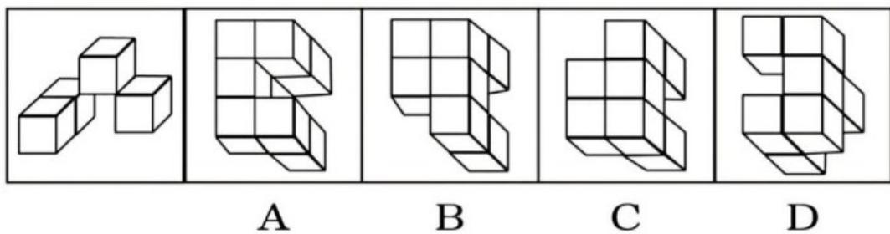
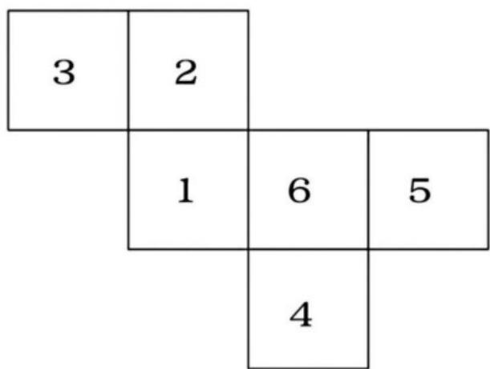
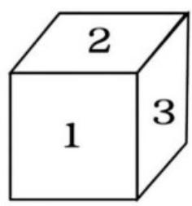
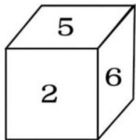
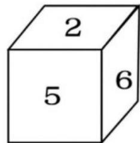
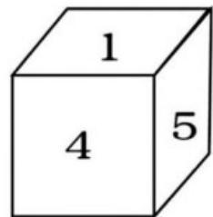
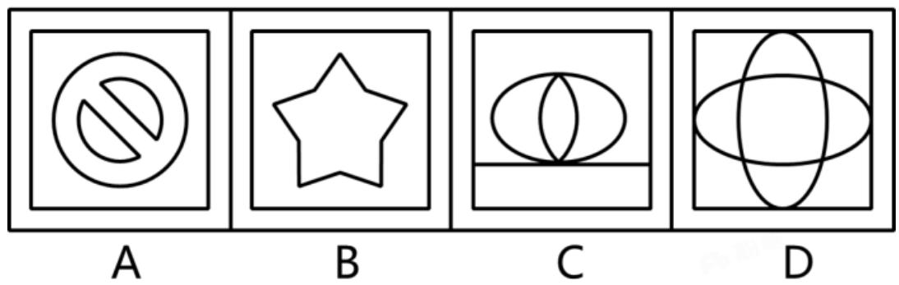
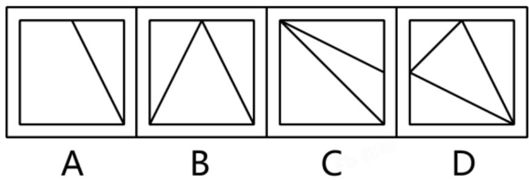
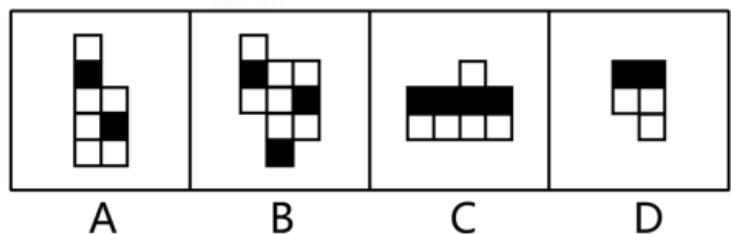
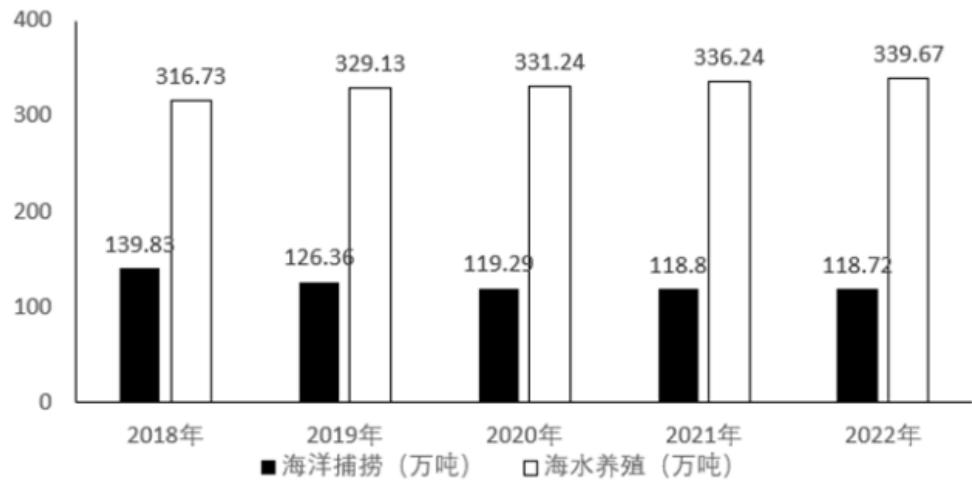

# 常识应用

根据题目要求，选择最恰当的答案。

1.  (判断题) 旗帜鲜明讲政治、保证党的团结和集中统一是党的生命, 也是我们党能成为百年大党、创造世纪伟业的关键所在。( )
2. （判断题）拥有马克思主义科学理论指导是我们党坚定信仰信念、把握历史主动的根本所在。（）

3. （判断题）全面建设社会主义现代化国家，最艰巨最繁重的任务仍然在镇街。（）

4. （判断题）生态环境是关系党的使命宗旨的重大政治问题，也是关系民生的重大社会问题。（）

5. （判断题）改革开放是党在新的历史条件下领导人民进行的新的伟大革命，是决定当代中国命运的关键抉择。（）

6. （判断题）市场在资源配置中起全部作用。（）

7. (判断题) 全面依法治国是国家治理的一场深刻革命, 关系党执政兴国, 关系人民幸福安康, 关系党和国家长治久安。( )

8. （判断题）坚定中国特色社会主义文化自信、道路自信、理论自信，说到底是要坚定制度自信。（）

9. （判断题）发展是党执政兴国的第一要务，是解决我国一切问题的基础和关键。（）

10. （判断题）构建人类命运共同体是世界各国人民前途所在。（）

11. (判断题) “中华文化认同超越地域乡土、血缘世系、宗教信仰等, 把内部差异极大的广土巨族整合成多元一体的中华民族。”这句话说明了中华文明具有突出的连续性。( )

12. （判断题）没有民主就没有社会主义，就没有社会主义的现代化，就没有中华民族伟大复兴。（）

13. (判断题) 共同富裕不是所有人都同时富裕, 但要求所有地区同时达到一个富裕水准。( )

14. （判断题）只有社会主义才能救中国，只有社会主义才能发展中国，只有坚持和发展中国特色社会主义才能实现中华民族伟大复兴。（）

15. （判断题）国务院依照宪法规定，决定战争和和平的问题，行使宪法规定的涉及国家安全的其他职权。（）

16. (判断题) 根据我国《民法典》, 民事主体从事民事活动, 应当遵循公平原则, 合理确定各方的权利和义务。 ( )

17. （判断题）根据《中华人民共和国反食品浪费法》，国家粮食和物资储备部门应当加强对食品生产经营者反食品浪费情况的监督，督促食品生产经营者落实反食品浪费措施。（）

18. （判断题）广东湛江红树林国家级自然保护区是我国红树林面积最大、种类较多的自然保护区。（）

19. （判断题）广东省海域辽阔，其海域面积超过陆地国土面积。（）

20. （判断题）《牡丹亭》是粤剧经典曲目之一。（）

21. （多选题）党的二十大报告指出，要促进区域协调发展。以下属于促进区域协调发展的措施的有（）。
A. 推动西部大开发形成新格局，推动东北全面振兴取得新突破，促进中部地区加快崛起，鼓励东部地区加快推进现代化
B. 支持革命老区、民族地区加快发展，加强边疆地区建设、推进兴边富民、稳边固边
C. 加快建设农业强国，扎实推动乡村产业、人才、文化、生态、组织振兴
D. 以城市群、都市圈为依托构建大中小城市协调发展格局、推进以县城为重要载体的城镇化建设

22. （多选题）习近平总书记强调，要牢牢把握高质量发展这个首要任务。因地制宜发展新质生产力。关于新质生产力，以下表述正确的有（）。
A. 发展新质生产力是推动高质量发展的内在要求和重要着力点
B. 新质生产力由技术革命性突破、生产要素创新性配置、产业深度转型升级而催生
C. 新质生产力的特点是创新，关键在质优
D. 新质生产力的本质是先进生产力

23. （多选题）党的二十大报告指出了中国式现代化的本质要求，以下属于中国式现代化的本质要求的有（）。
A. 坚持中国特色社会主义
B. 实现高质量发展
C. 发展全过程人民民主
D. 丰富人民精神

24. (多选题) 党的二十大报告指出, 坚持按劳分配为主体、多种分配方式并存, 构建初次分配、再分配、第三次分配协调配套的制度体系。关于分配制度体系, 下列选项正确的有 ( )。
A. 初次分配要坚持多劳多得，鼓励勤劳致富，着重保护劳动所得
B. 再分配起主导作用的是政府、更加强调公平的原则
C. 完善再分配制度的重点是促进机会公平，推动更多低收入人群迈入中等收入行列、扩大中等收入群体规模
D. 第三次分配的中坚力量是社会组织和社会力量

25. (多选题) 完备的法律规范体系, 是中国特色社会主义法治体系的前提, 是法治国家、法治政府、法治社会的制度基础, 以下属于完善法律规范体系基本要求的有 ( )。
A. 坚持立法先行，发挥立法在改革开放和经济社会发展中的引领和推动作用、加快完善法律、行政法规、地方性法规体系，为全面依法治国提供基本遵循
B. 科学立法、民主立法、依法立法、坚持上下有序、内外协调、科学规范、运行有效的原则，立改废释并举，实现从粗放立法向精细立法转变，提高立法质量和效率
C. 加强高素质法治专门队伍和法律服务队伍建设。提高法治工作队伍思想政治素质、业务工作能力、职业道德水准，为全面依法治国提供坚实的组织和人才保障
D. 深化司法体制综合配套改革，规范司法行为，提高司法公信力。努力让人民群众在每一个司法案件中感受到公平正义

26. （多选题）我国基础研究和原始创新不断加强，一些关键核心技术实现突破，战略性新兴产业发展壮大，目前已在（）等取重大成果。
A. 新能源技术
B. 载人航天
C. 卫星导航
D. 大飞机制造

27. (多选题) 改革开放以来, 粤港澳合作不断深化实化, 粤港澳大湾区经济实力、区域竞争力显著增强, 已具备建成国际一流湾区和世界级城市群的基础条件, 下列文件的出台有利于支持粤港澳大湾区合作发展的有 ( )。
A. 《粤港澳大湾区发展规划纲要》
B. 《横琴粤澳深度合作区建设总体方案》
C. 《全面深化前海深港现代服务业合作区改革开放方案》
D. 《广州南沙深化面向世界的粤港澳全面合作总体方案》

28. (多选题) 辛弃庆是南宋时期的文学家, 他的许多诗词都反映了对国事的深刻关怀, 表达了对时局的悲愤心情, 以下诗词主要表达了这种情感的有 ( )。
A. 渡江天马南来，几人真是经纶手？长安父老，新亭风景，可怜依旧
B. 夜半狂歌悲风起，听铮铮、阵马檐间铁。南共北，正分裂
C. 道男儿到死心如铁，看试手，补天裂
D. 唱彻《阳关》泪未干，功名馀事且加餐

29. （多选题）下列诗句描写的景色与季节对应正确的有（）。
A. 忽如一夜春风来，千树万树梨花开——春季
B. 更无柳絮因风起，惟有葵花向日倾——夏季
C. 山明水净夜来霜，数树深红出浅黄——秋季
D. 闻道梅花拆晓风，雪堆遍满四山中——冬季

30. （多选题）以下有关天然气的说法，准确的有（）。
A. 天然气和煤炭一样，都属于化石能源
B. 我国的天然气主要分布于中东部平原地区
C. 天然气以甲烷为主，燃烧时主要产生二氧化碳和水
D. 产生相等热量时, 天然气排放的二氧化碳比石油少

# 言语表达与理解：

每小题后的四个备选答案中只有一个最符合题意的答案。

31. 中国正在以中国式现代化全面推进强国建设、民族复兴伟业。我们追求的不是中国（）的现代化，而是期待同各国一道，共同实现现代化。
A. 独善其身
B. 独具匠心
C. 独当一面
D. 独行其是

32. 中华民族是爱好和平的民族，中国人民是爱好和平的人民。长期以来，无论遇到任何艰难险阻、风险挑战，中国人民不畏强暴、维护世界和平的决心意志从未改变、（）。
A. 根深蒂固
B. 绵延不断
C. 经久不息
D. 历久弥坚

33. 市场是产业科技创新最重要的孵化器、加速器、放大器，拥有规模庞大的市场，才能为各类新技术、新业态提供试验场，才能容纳多条技术路线竞争成长，让真正具备发展优势、符合产业升级方向的技术和产品（）。
A. 脱颖而出
B. 鹤立鸡群
C. 推陈出新
D. 方兴未艾

34. 新时代的国际传播要探索文明叙事，坚持（）中外，广交天下朋友。（）国际传播力量。
A. 互通，汇合
B. 互通，汇聚
C. 融通，凝聚
D. 融汇，凝结

35. 加强青少年爱国主义教育，必须牢牢坚守马克思主义这个魂脉和中华优秀传统文化这个根脉，（）青少年坚定远大理想和共同理想。不断（）爱国之情、报国之志。
A. 指导，弘扬
B. 指引，激励
C. 引领，发扬
D. 引导，激发

36. 秋冬之交，全球客商云集广东，从广交会到全球招商大会。“会”聚的是人气（ ）出的是全球客商对大湾区的信心，以及对广东市场化、法治化、国际化一流营商环境的（）。
A. 反射，认同
B. 反映，认识
C. 映衬，肯定
D. 折射，认可

37. 在保护中发展、在发展中保护。保护不是将文化遗产（ ），不是把它们锁在保险箱里秘不示人，最好的保护是让文化走进人们的日常生活。（ ）人们的精神世界。
A. 束之高阁，浸润
B. 放任自流，融入
C. 物尽其用，渗透
D. 置若罔闻，润泽

38. 从严监管校外培训机构，会一定程度遏制“全民培训”，缓解家长焦虑。但是（）不推进教育评价改革，不打破唯分数论、唯升学论，唯名院论，（）很难把学生从学业负担中解放出来，把家长从送孩培训的迷途上拉回来。
A. 即使，也
B. 只有，才
C. 如果，就
D. 除非，都

39. 要因地制宜地打造符合生态文明建设要求的文化产业，充分利用好地方红色文化、民俗文化、历史文化和生态文化，为乡村文化产业振兴注入“新动能”，实现乡村文化事业与文化产业协同发展，使广大乡村成为“（）乡村文化精品、（）特色文化资源、（）绿色生态文明风尚”的向往居所。
A. 发掘，弘扬，集聚
B. 荟萃，集聚，弘扬
C. 集聚，荟萃，发掘
D. 弘扬，发掘，荟萃

40. 回望我们党走过的百年，几经挫折几经考验、几经风雨几经坎坷。多少次绝处逢生、多少次（ ），历程波澜壮阔，成就（ ）。党和人民的百年奋斗，书写了中华民族几千年历史上最恢宏的（ ）。
A. 峰回路转，博古通今，简章
B. 柳暗花明，震古烁今，史诗
C. 苦尽甘来，惊天动地，画卷
D. 出奇制胜，举世瞩目，传奇

41. （填空题）。今天，创新增志气、斗志强骨气、发展添底气，“中国人民一定能，中国一定行”。时与势在我们一边，坚定战略自信、保持必胜信念，把国家和民族发展放在自己力量的基点上、把中国发展进步的命运牢牢掌握在自己手中，没有任何力量能够撼动我们伟大祖国的地位，没有任何力量能够阻挡中国人民和中华民族的前进步伐。
以下句子填入画横线处，最恰当的是（）。
A. 团结就是力量，奋斗开创未来
B. 人无精神不立，国无精神不强
C. 信心赛过黄金，自信才能自强
D. 天视自我民视，天听自我民听

42. 大国经济的重要特征，就是必须实现内部可循环，并且提供巨大国内市场提高供给能力，支撑并带动外循环。我国拥有14亿多人口的全球最大最有潜力市场，随着向高收入国家行列迈进，规模巨大的国内市场不断扩张。新形势下，构建以国内大循环为主体、国内国际双循环相互促进的新发展格局，是把握未来发展主动权的战略性布局和先手棋，是贯彻新发展理念、促进大国经济发展的重大举措。
这段文字旨在强调（ ）。
A. 构建新发展格局的重大意义
B. 把握未来主动权必须扩大国际市场
C. 强大的国内国际市场是高收入国家的特征
D. 提高供给能力是发展大国经济的重要抓手

43. 中国古代注重礼的教化，反对“不教而诛”。“礼禁未然之前，法施已然之后”，礼法并重，隆礼重法，才是治国之良策。礼教与刑罚共同为用，所谓“礼之所去，刑之所取；失礼则入刑，相为表里者也”。
这段文字主要讲了中国古代（ ）。
A. 德主刑辅、明德慎罚的慎刑思想
B. 民惟邦本、本固邦宁的民本理念
C. 天下无讼、以和为贵的价值追求
D. 出礼入刑、隆礼重法的治国策略

44. （填空题）。文明没有优劣之分，只有特色之别。一切文明成果都值得尊重，这是对待不同文明必须具有的宽广襟怀。历史表明，人类文明因包容才有交流互鉴的动力，只有超越文明优越才能在交流互鉴中实现文明发展进步、长盛不衰。
以下句子填入画横线处，最恰当的是（）。
A. “独学而无友, 则孤陋而寡闻”
B. “得众则得国，失众则失国”
C. “和实生物, 同则不继”
D. “单则易折，众则难摧”

45. 流行语不仅是一种词汇现象，更是一种社会现象。它就像我们生活中的一面镜子，投射了人们在一个时期内普遍关注的事物和问题，也传达着人们对不同事件和生活的态度。当然，仍有不少人对流行语充满了怀疑，认为一些词汇不知所云，污染了语言之河。其实，要相信语言之河有着相当的自净能力，对于那些真正具有创新性的流行语，我们应该持海纳百川的态度。
根据这段文字，作者对真正具有创新性的流行语的态度是（）。
A. 包容的
B. 审慎的
C. 怀疑的
D. 反对的

46. 将句子重新排序最恰当的是（ ）。
①在石刻中，碑刻的数量居多，不仅体现雕刻工艺、书法艺术，而且反映历史人物、事件、建筑、礼仪等方面内容。
②至隋唐时期，碑的形制更加规范，体现封建等级制度。
③此后，历朝历代在遵循已有规制的前提下，结合实际，对碑的形制或多或少都有新的规定。
④石刻文献，又称“石书”，在中国历史文献中，其地位仅次于写刻本的“纸书”。
⑤碑刻始于秦, 起初并无规定格式, 至汉朝开始有所规定, 除碑的高度外, 其构成发生变化, 出现 “螭首龟跌”。
A. ①⑤②③④
B. ④①⑤②③
C. ④⑤③②①
D. ①⑤③②④

47. 相较于5纳米制程芯片，3纳米制程芯片能在同样面积的芯片上集成更多品体管。这种更高的集成度可以提高芯片的计算性能，即相同功耗下，3纳米芯片的运算速度相较于5纳米芯片可以提高 $10\%$ 至 $15\%$ ，有利于手机处理更复杂的任务，给用户带来更好的体验；同时，它也可以使设备功耗更低，提高手机续航时间；另外，更小的芯片尺寸也有助于把手机空间和重量节省出来，搭载更多其他零部件。
对上述文段理解最为准确的是（ ）。
A. 纳米制程越小，设备的运算速度提升效果越显著
B. 与5纳米芯片相比，3纳米芯片能进一步提升设备性能
C. 手机功耗越低，计算性能越强
D. 3纳米制程的芯片是当前性能最强的芯片

48. 正确认识和把握经济发展形势，既要看当前之“形”，也要察长远之“势”既要算“眼前账”，更要算“长远账”。当前及今后一个时期，我国经济发展面临的环境仍然是战略机遇和风险挑战并存，但机遇大于挑战、有利条件强于不利因素，经济回升向好、长期向好的基本趋势没有改变。只要把握机遇、化危为机，有力有效应对这些风险挑战，就能够推动经济发展态势持续向好。
以下最能准确概括文段含义的是（ ）。
A. 勿以善小而不为
B. 行百里者半九十
C. 风物长宜放眼量
D. 知屋漏者在宇下

49. 将句子重新排序最恰当的是（ ）。
①这似乎是供一个氏族集会、议事、进行宗教活动的公共场所。
②人们或许不会想到，现代都市广场的渊源，竟可以追溯到遥远的过去。
③房屋建于广场四周，门都朝着广场，其格局体现了广场在社会生活的中心地位。
④20世纪70年代，考古工作者发现了比较完整、清晰的母系氏族村落基址，其中心是一个4000多平方米的广场。
⑤根据考古发现，中国早在原始社会就已经出现了广场的雏形。
⑥在当代城市，“广场”往往作为地标性的建筑存在。
A. ⑥②④①③⑤
B. ⑥②⑤④①③
C. ⑤④③①⑥②
D. ⑤⑥②④①③

50. 有机体的生命活动在24小时左右的周期内呈现规律变动，相关指标在一天中的规律性变化被称为昼夜节律。以往研究发现，节律现象不仅体现在体温和血压等生理机能上，还会影响个人的困倦感和情绪状态等主观感受，以及注意和抗干扰等神经行为功能。
根据这段文字，以下说法正确的是（ ）。
A. 人的注意力与个体的主观感受息息相关
B. 人的体温和血压不会随昼夜更替而变化
C. 人的困倦感仅与有机体的昼夜节律有关
D. 人的抗干扰能力会受到昼夜节律的影响

---

# 数量关系

在这部分试题中，每道题呈现一段表述数字关系的文字，要求你迅速、准确地计算出答案。

51. 30，32，42，60，86，（ ）。
A. 112
B. 120
C. 132
D. 144

52. 5，7，13，31，85，（ ）。
A. 217
B. 227
C. 237
D. 247

53. 1.3，4.1，2.4，5.2，3.5，（ ）。
A. 6.3
B. 6.4
C. 6.5
D. 6.6

54. $\frac{1}{\overline{7}}, \frac{1}{\overline{4}}, \frac{1}{\overline{3}},$ （ ）， $\frac{5}{11}, \frac{1}{2}$ 。
A. $\frac{2}{3}$
B. $\frac{2}{5}$
C. $\frac{3}{7}$
D. $\frac{7}{13}$

55. 1，0，2，1，3，1，2，2，5，（ ）。
A. -1
B. 0
C. 1
D. 2

56. 购买某商品可享满100元减30元的优惠。小李计算后发现，购买4件该商品的花费与购买3件的相同，则该商品的单价为（）元。
A. 30
B. 40
C. 50
D. 60

57. 某工厂生产一种机械设备，每台设备需要用5吨甲类钢材、10吨乙类钢材。由于改进了工艺，现在生产一台该设备可节约甲类钢材、乙类钢材各1吨。那么原计划生产20台设备的钢材现在能生产该设备（）台。
A. 22
B. 23
C. 24
D. 25

58. 杯中有 $280 \mathrm{ml}$ 的水, 加入浓度为 $60 \%$ 的酒精溶液后, 杯中溶液的酒精浓度为 $18 \%$ , 则加入的酒精溶液为 ( ) ml。
A. 90
B. 120
C. 150
D. 180

59. 李先生购买了一张10月12日7时出发的车票，因计划有变，他在10月10日21时办理退票。如果原票价为480元，则根据现行的梯次退票政策（如下表所示），他可以退得（）元。

| 退票时间 | 开车前15天（不含）以上 | 开车前48小时至15天以内 | 开车前24小时至48小时以内 | 开车前24小时以内 |
| :--- | :--- | :--- | :--- | :--- |
| 退票手续费占票价的百分比 | 0% | 5% | 10% | 20% |

A. 240
B. 384
C. 432
D. 456

60. 在荔枝成熟的季节，某果园雇人采摘荔枝。已知从第二天起，每天的采摘量比前一天少50千克；从第十天起，每天的采摘量都是前一天的一半。如果第十三天的采摘量为10千克，则果园第一天采摘了（）千克荔枝。
A. 540
B. 560
C. 580
D. 600

61. 甲、乙两艘巡逻艇同时从河流的某处出发，沿河道开展巡查，甲船逆流而上，乙船顺流而下。1小时后，甲、乙两艘船同时掉头，甲船比乙船早1小时返回出发点。已知甲船的静水速度是水流速度的5倍，那么乙船的静水速度是水流速度的（）倍。
A. 3
B. 4
C. 5
D. 6

62. 某单位共有250名员工，其中全体党员人数比女性非党员人数多 $68\%$ ，男性非党员不超过100名，则该单位可能有（）名党员。
A. 67
B. 75
C. 116
D. 126

63. 某单位组织植树活动，共有20名职工参加，并分成了3个2人小组、3个3人小组和1个5人小组。如果从所有组中随机选出3个组，则选出的3个小组人数之和为3的倍数的概率（）。
A. 不到 $15\%$
B. 在 $15\%$ 到 $25\%$ 之间
C. 在 $25\%$ 到 $35\%$ 之间
D. 超过 $35\%$

64. 某知识竞赛共有 60 人参加, 其中答对第一题的有 45 人, 答对第二题的有 36 人, 答对第三题的有 54 人, 答对第四题的有 48 人, 答对第五题的有 52 人。如果有 4 人一道题都没有答对, 则至少有 ( ) 人五道题都答对了。
A. 7
B. 9
C. 11
D. 13

65. 一个圆柱体形的水缸中装有水，水面距离底部5厘米，已知底面直径为60厘米。现在水中不堆叠地放入3个相同的正方体铁块后，水位上升了1厘米。则正方体铁块的棱长（）。
A. 不到10厘米
B. 在10到11厘米之间
C. 在11到12厘米之间
D. 超过 12 厘米

---

# 判断推理

本部分包括图形推理、定义判断、类比推理和逻辑判断四种类型的试题，在四个选项中选出一个最恰当的答案。

66. 将两个相同的左侧立体图形放置在桌面上（可叠放），从桌子正前方看到的图形轮廓最不可能是（）。

A. A
B. B
C. C
D. D

67. 左图所示立方体图形由4个立方体构成，下列选项经旋转后最有可能与该物体拼接成一个完整长方体的是（）。

A. A
B. B
C. C
D. D

68. 如图, 所给图形是某一立方体的展开图。若不考虑立方体表面数字的大小、方向, 下列选项中最有可能属于该立方体视图的是 ( )。

 (A)
 (B)
 (C)
 (D)

A. A
B. B
C. C
D. D

69. 下列选项中最符合所给图形规律的是（ ）。

A. A
B. B
 (A)
 (B)
 (C)
 (D)

C. C
D. D

70. 下列选项中最符合所给图形规律的是（ ）。

 (A/B/C/D)
A. A
B. B
C. C
D. D

71. 下列选项中最符合所给图形规律的是（ ）。

 (A/B/C/D)
A. A
B. B
C. C
D. D

72. 下列选项中最符合所给图形规律的是（ ）。

A. A
B. B
C. C
D. D

73. 下列选项中最符合所给图形规律的是（ ）。

 (A/B/C/D)
A. A
B. B
C. C
D. D

74. 下列选项中最符合所给图形规律的是（ ）。

A. A
B. B
C. C
D. D

75. 下列选项中最符合所给图形规律的是（ ）。

A. A
B. B
C. C
D. D

76. 笔墨：字画
A. 建材：楼宇
B. 实践：真理
C. 科学：知识
D. 电流：电脑

77. 盗窃：拘留
A. 斗殴：伤人
B. 超载：扣分
C. 开会：讨论
D. 宣传：报道

78. 老鹰：鸽子：天空
A. 乌鸦：榕树：树木
B. 海藻：海豚：海洋
C. 狮子：老虎：陆地
D. 玫瑰：月季：湖泊

79. 水落：石出
A. 藏头：露尾
B. 积劳：成疾
C. 海阔：天空
D. 狼奔：豕突

80. 太阳能对于（ ）相当于（ ）对于农民。
A. 阴天，霜冻
B. 热水器，收入
C. 汽车，新农村
D. 清洁能源，果农

81. 有研究表明，社区环境与居民的生活满意度息息相关，居民满意度的提升是政府的工作重点之一。因此，各地政府都应当在改善社区环境上加大资源投入。要使上述推论成立，需要补充的前提是（）。
A. 政府应当以尽可能少的资源投入获得尽可能大的效益
B. 多地政府已经投入了大量的资源用以改善社区的环境
C. 生活满意度的提升有助于提高居民对当地政府的认可度
D. 政府在改善社区环境上投入的资源越多，居民的生活满意度越高

82. 有调查显示，虽然新能源汽车的充电费用较低，但由于同一品牌的新能源汽车售价往往显著高于燃油汽车，因此在汽车的生命周期内，购买新能源汽车未必省钱。但现如今仍然有越来越多的人购买新能源汽车而不是传统的燃油汽车。
以下选项如果为真，最能解释上述现象的是（）。
A. 多地政府对新能源汽车生产企业给予了财政补贴政策
B. 新能源车主往往更关注新能源汽车环保、智能驾驶等优点
C. 夏季驾驶汽车时，如果长时间开启车内空调，新能源汽车更节能
D. 新能源汽车生产企业往往在外观设计上投入较多资源

83. 近年来，博物馆的参观人数不断攀升，一些博物馆借助现代科学技术，拉近了文物与参观者的距离，让观众特别是低龄观众能够更好地领略历史人文和自然科学的魅力。因此，有人认为，通过加大博物馆建设、激活博物馆多种功能来普及历史文化教育，具有广阔的发展空间。
下列选项中，最不能支持上述论断的是（ ）。
A. 近年来，全国博物馆数量增长迅速
B. 博物馆与学校之间的合作日益广泛
C. 市场需求决定了博物馆的发展前景
D. 数字技术使更多的人了解馆藏资源

84. 甲、乙、丙、丁4个人参加考核评比，他们作出了如下猜测：
甲：我一定不会得最后一名。
乙：我不是第一名，就是第二名。
丙：我一定是第一名。
丁：我的名次在乙和丙前面。
考核评比结果公布后发现，4个人中只有1个人预测错误，且4人名次不存在并列，则以下判断一定正确的是（）。
A. 甲获得第三名
B. 乙获得第一名
C. 丙不可能获得第四名
D. 丁不可能获得第四名

85. 传统月饼的糖和脂肪含量往往较高，人们吃多了容易发胖。在这一背景下，加入了代糖的“无糖”月饼应运而生。有人认为，吃月饼应当优先选择“无糖”月饼，这样能够避免摄入过多的糖分，更有利于身体健康。
下列选项如果为真，最能反驳以上观点的是（）。
A. 含糖量低于某一标准即可标注为“无糖”食品
B. 一些“无糖”月饼的脂肪含量高于传统月饼
C. “无糖”月饼中的代糖比普通糖对身体危害更大
D. 食用“无糖”月饼后人体血糖水平仍然会显著升高

86. 为了提高产品销量，某品牌咖啡店按照往年的经验做法，在非高峰期和非传统旺季期间进行半价促销活动，以吸引更多的顾客在“冷门”的消费时段消费，但在促销活动推出一段时间后，整体销量较往年期间明显减少。以下最能解释这一现象的是（）。
A. 由于促销期间订单量大，该咖啡店的服务质量有所下降
B. 今年该咖啡店周围新开了多家其他品牌的咖啡店
C. 该品牌咖啡知名度不够高，缺少固定的消费群体
D. 促销活动结束后, 该咖啡店按往年做法回调了价格

87. 一个谦虚的人不会炫耀他的才华，王教授从来没有炫耀过自己的才华，所以王教授是一个谦虚的人。
以下选项的逻辑结构与题干最为相似的是（）。
A. 收益越高风险越大，小刘的投资获得了高额回报，所以他承担了很大风险
B. 目标明确的人不会无所事事, 小李这段时间一直无所事事, 所以小李没有明确的目标
C. 爱国的人一定热爱祖国的历史文化, 小吴热爱祖国的历史文化, 所以小吴是一个爱国的人
D. 如果没有老师的建议，我还在纠结是否考研，现在我已经决定考研，所以老师的建议很重要

88. 甲、乙、丙3名运动员，其中2名男性，1名女性；1名是羽毛球运动员，1名是排球运动员，1名是长跑运动员。已知：
(1) 甲不是女性, 他与长跑运动员年龄不同;
(2) 羽毛球运动员的年龄比丙大；
(3) 乙比长跑运动员年龄小。
由此可以推断（ ）。
A. 排球运动员年龄最小
B. 甲不是羽毛球运动员
C. 长跑运动员不是女性
D. 男性运动员的平均年龄比女性运动员大

89. 语音意识是指有意识地探查和操纵口语语音单位和语音结构的能力，有研究表明该意识在儿童早期读写发展中有着重要的作用。某课题组将上百名小学生随机分成实验组和对照组。实验组以语音意识教学与常规听力练习相结合的方式开展英语教学，对照组则仅开展常规英语听力练习。10周后，实验组的听力测试成绩显著高于对照组。因此，应当在小学英语课程中推广语音意识教学。
要使上述结论成立，需要补充的前提包括（ ）。
A. 常规听力练习有助于提升语音意识教学的效果
B. 开展语音意识教学所花费的时间与普通教学相当
C. 实验结束后对照组学生对英语的兴趣低于实验组
D. 提升听力测试成绩是小学英语课程的教学目标之一

90. 并非所有植物都会开花，会开花的植物也并非都会结果，因此有的植物既不会开花也不会结果。
以下选项的逻辑结构与题干最为相似的是（）。
A. 并非所有的蛇都有毒, 并非所有的蛇毒都致命, 因此有的蛇无毒但致命
B. 有的国家没有军队, 有的国家没有统一的语言, 因此存在既没有军队也没有统一语言的国家
C. 擅长数学的人未必擅长外语, 擅长外语的人又未必擅长美术, 因此擅长数学的人未必擅长美术
D. 并非所有的住宅都属于高层住宅, 也并非所有的高层住宅都有电梯, 因此有的住宅并非高层住宅也没有电梯

---

# 资料分析

所给出的图、表、文字或综合性资料均有若干个问题要你回答。你应根据资料提供的信息进行分析、比较、计算和判断处理。

## (一)

2023年上半年，交通运输经济运行持续恢复，整体好转，人员流动大幅增加，货运量，港口货物吞吐量同比均实现较快增长，为推动经济回升向好提供了有力保障。2023年上半年，完成营业性货运量259.3亿吨，同比增长 $6.8\%$ ；完成营业性客运量43.2亿人，同比增长 $56.3\%$

2023年上半年营业性货运客运情况

| 方式 | 营业性货运量 (亿吨) | 同比增长率 | 营业性客运量 (亿人) | 同比增长率 |
| :--- | :--- | :--- | :--- | :--- |
| 公路 | 190.1 | 7.5% | 21.4 | 18.6% |
| 水路 | 44.2 | 7.7% | 1.2 | 146.8% |
| 铁路 | 24.9 | 0.6% | 17.7 | 124.9% |
| 民航货邮 | 327.6 (万吨) | 6.4% | 2.8 | 140.2% |

上半年，全国港口完成货物吞吐量81.9亿吨，同比增长 $8.0\%$ ，其中二季度完成货物吞吐量43.3亿吨，同比增长 $9.7\%$ 。分结构看，内贸吞吐量同比增长 $7.6\%$ ，外贸吞吐量同比增长 $8.9\%$ 。主要受煤炭等大宗物资进口带动，完成集装箱吞吐量1.5亿标箱，同比增长 $4.8\%$ 。

城市客运方面，上半年全国完成城市客运量454.2亿人，同比增长 $15.0\%$ 。分方式看，公共汽电车、城市轨道交通、巡游出租车、轮渡分别完成客运量198.7亿人、136.4亿人、118.7亿人和3872万人，同比分别增长 $4.6\%$ 、 $45.9\%$ 、 $6.8\%$ 和 $113.0\%$ 。

91. 2022年上半年，公路、水路、铁路、民航货邮4种方式中，完成营业性货运量最大的是（）。
A. 公路
B. 水路
C. 铁路
D. 民航货邮

92. 2023年上半年，完成营业性客运量最多的交通方式，其客运完成量比2022年上半年增加了约（）亿人。
A. 0.7
B. 1.6
C. 3.4
D. 9.8

93. 2022年上半年，全国完成城市客运量约是营业性客运量的（）倍。
A. 11.0
B. 12.1
C. 13.2
D. 14.3

94. 2023年上半年，以下城市客运方式中，对城市客运量同比增长贡献最大的是（）。
A. 公共汽电车
B. 城市轨道交通
C. 巡游出租车
D. 轮渡

95. 根据资料，下列说法不正确的是（ ）。
A. 2022年上半年，全国完成营业性货运量超240亿吨
B. 2022年一季度，全国完成货物吞吐量小于40亿吨
C. 2023年上半年，全国港口内贸吞吐量小于外贸吞吐量
D. 2023年上半年，全国集装箱吞吐量同比增长量超500万标箱

## (二)

2022年，全国海洋渔业增加值4343亿元，比上年增长 $3.1\%$ 。全国海水产品产量3459.53万吨，同比增长 $2.1\%$ 。2022年，广东省海洋渔业增加值为538亿元，同比增长 $0.9\%$ 。全省海水产品产量458.39万吨，同比增长 $0.7\%$ ，其中，海水养殖产量339.67万吨，同比增长 $1.0\%$ ；海洋捕捞产量118.72万吨，其中远洋捕捞产量6.3万吨。

2018-2022年广东省海洋捕捞和海水养殖情况

96. 2022年，全国海水产品产量同比增长（ ）。
A. 小于40万吨
B. 40万吨到60万吨
C. 60万吨到80万吨
D. 超过 80 万吨

97. 与2021年相比，2022年广东省渔业增加值占全国渔业增加值的比重约（）。
A. 增加0.3个百分比
B. 减少 0.3 个百分点
C. 增加 2.7 个百分点
D. 减少2.7个百分比

98. 与2018年相比，2022年广东省海洋捕捞产量减少约（）。
A. $11\%$
B. 15%
C. $19\%$
D. 23%

99. 2018年-2021年，广东省海水养殖产量占海水产品产量比重最高的是（）。
A. 2018
B. 2019
C. 2020
D. 2021

100. 根据资料，下列说法正确的是（）。
A. 与2018年相比，2022年广东省海水产品产量增长小于 $1\%$
B. 2021年，广东省海水养殖产量同比增长约 $3.5\%$
C. 2019年，广东省海水产品产量同比增加约1万吨
D. 2022年，广东省远洋捕捞产量占海洋捕捞产量的比重同比有所下降
