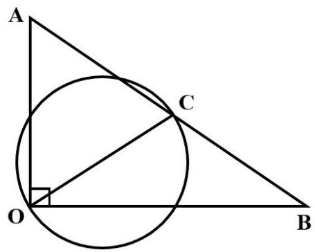
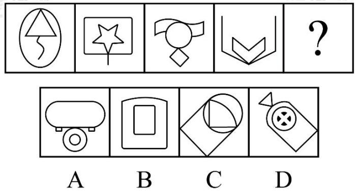
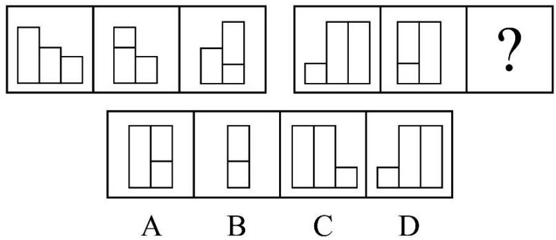
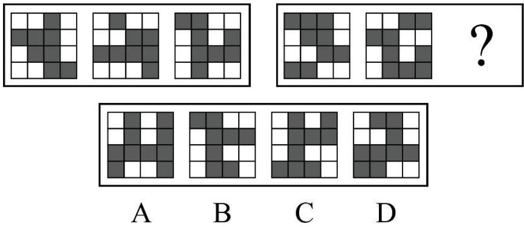
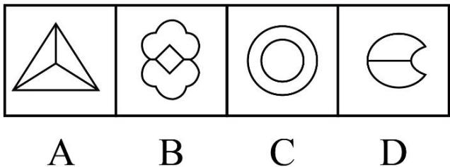
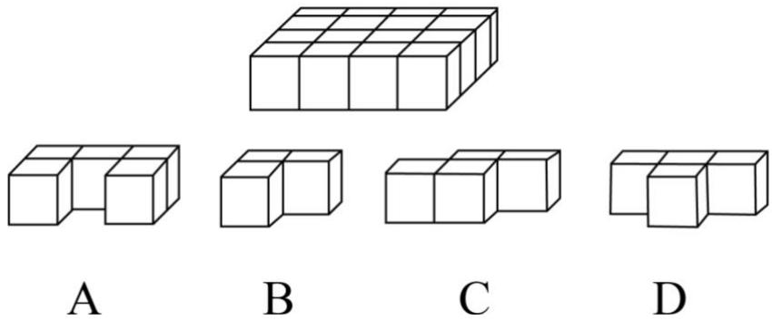
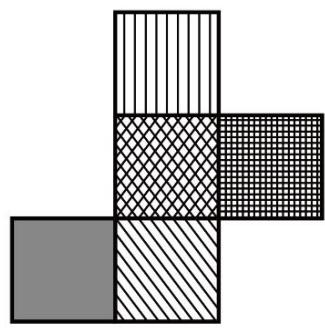
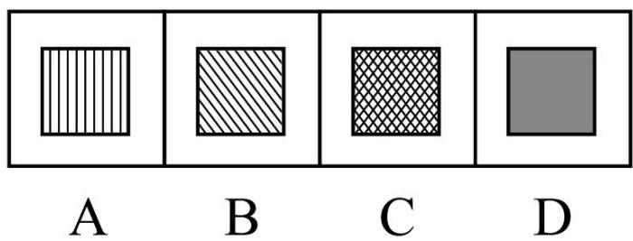
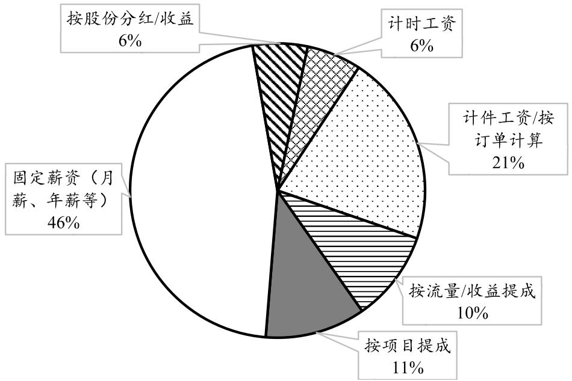

# 判断题
**共20题，请判断以下表述的正误，正确的选择A，错误的选择B，并在答题卡上将对应题号的字母涂黑。**

1. 中国共产党是用马克思主义武装起来的政党，马克思主义是中国共产党人理想信念的灵魂。（）

2. 党的领导直接关系中国式现代化的根本方向、前途命运、最终成败。 （）

3. 敢于斗争是我们党与生俱来的政治基因和百年淬炼的鲜明品格。 （）

4. 党的十八届三中全会是划时代的，开启了新时代全面深化改革、系统整体设计推进改革新征程，开创了我国改革开放全新局面。 （）

5. 改革开放、创新是中国式现代化的基础性、战略性支撑。（）

6. 高质量发展是创新成为第一动力，协调成为内生特点、绿色成为普遍形态、改革开放成为必由之路、共享成为根本目的的发展。 （）

7. 加快建成现代化产业体系，是推动高质量发展的必由之路。 （）

8. 全体人民共同富裕是中国式现代化的本质特征，区域协调发展是实现共同富裕的必然要求。（）

9. 推动民法典实施是全面依法治国的首要任务。 （）

10. 传承和弘扬中华优秀传统文化，要坚持创造性转化和创新性发展。 （）

11. 民主决策是我们党的传家宝，是做好各项工作的基本功。 （）

12. 保障国家粮食安全是新时代新征程“三农”工作的总抓手。 （）

13. “胡焕庸线”东南方以草原，戈壁沙漠，绿洲和雪域高原为主，西北方以平原、水网、低山丘陵和喀斯特地貌为主。 （）

14. 广东纵深推进新阶段粤港澳大湾区建设，“澳门十横琴”正在成为丰富“一国两制”实践的新示范、推动粤港澳大湾区建设的新高地、实现国家高水平对外开放的新平台。 （）

15. 随着人类文明的发展、生产力的进步，人口数量也不断增长，明朝时期人口突破3亿。 （）

16. 根据《中华人民共和国大气污染防治法》，国家对重点大气污染排放实行重点监管。（）

17. 《中华人民共和国粮食安全保障法》是我国第一部全面系统地规定粮食安全保障工作的专门法律。 （）

18. “贤”一般用于称呼长辈，如称对方为“贤家”。 （）

19. 亚太经济合作组织属于全球性国际组织，秘书处设在新加坡。 （）

20. 韩江是广东省第二大河，其名源自曾任潮州刺史的韩愈。 （）

---

# 多项选择题
**共10题。每题给出的备选项中，至少有2个选项符合题目要求，请将其选出，并在答题卡上将对应题号的字母涂黑，错选、多选、少选均不得分。**

21. 党的二十大报告中指出：“加强党的政治建设，严明政治纪律和政治规矩，落实各级党委（党组）主体责任，提高各级党组织和党员干部（ ）。
    A. 政治判断力
    B. 政治宣传力
    C. 政治领悟力
    D. 政治执行力

22. 党的二十届三中全会对进一步全面深化改革作出系统部署，提出深化文化体制机制改革的重大任务，为新时代新征程文化改革发展指明了前进方向。以下属于深化文化体制机制改革措施的有（）。
    A. 深化教育综合改革
    B. 健全网络综合治理体系
    C. 完善意识形态工作责任制
    D. 构建更有效力的国际传播体系

23. 商品经济是以交换为目的而进行生产的经济形式，是一定社会历史条件的产物，根据马克思主义政治经济学，以下关于商品经济的说法正确的有（）。
    A. 决定商品价值量的是生产商品的社会必要劳动时间
    B. 在商品经济中，商品的价格围绕商品的价值自发波动
    C. 货币是在长期交换过程中形成的固定充当一般等价物的商品
    D. 生产商品所需要的社会必要劳动时间随着劳动生产率的提高而增加

24. 人民群众是社会历史的主体，是历史的创造者。这是马克思主义基本的观点之一，关于人民群众，以下选项正确的有（）。
    A. 人民群众是社会精神财富的创造者
    B. 人民群众是社会变革的决定力量
    C. 时势造英雄，杰出人物的出现具有偶然性
    D. 人民群众创造历史的活动不受社会历史条件的制约

25. 中华传统美德中，我们始终强调整体利益、国家利益和民族利益的重要性，以下选项中体现“重视整体利益，强调责任奉献”这一中华传统美德的有（）。
    A. 凤夜在公
    B. 以公灭私，民其允怀
    C. 已欲立而立人，己欲达而达人
    D. 苟利国家生死以，岂因祸福避趋之

26. 2024年和平共处五项原则发表70周年，以下关于和平共处五项原则的表述正确的有（）。
    A. 和平共处五项原则已载入中国宪法
    B. 和平共处五项原则是中国独立自主和平外交政策的基石
    C. 构建人类命运共同体理念与和平共处五项原则一脉相承
    D. 中国倡导将和平共处五项原则确立为指导国家间关系的基本准则

27. 根据《中华人民共和国个人信息保护法》，以下属于敏感个人信息的有（）。
    A. 生物识别信息
    B. 医疗健康信息
    C. 金融账户信息
    D. 行踪轨迹信息

28. 国家厉行节约，反对消费，根据《中华人民共和国反食品浪费法》，为防止食物浪费，以下餐饮服务经营者的行为恰当的有（）。
    A. 向消费者提供小份餐等不同规格选择
    B. 对参与“光盘行动”的消费者给予奖励
    C. 鼓励消费者自助携带餐具，并不提供打包服务
    D. 对造成明显浪费的消费者收取处理厨余垃圾的相应费用

29. 2025年广东省政府工作报告指出，深入实施“百县千镇万村高质量发展工程”，奋力实现“三年初见成效”目标。以下属于深入实施“百县千镇万村高质量发展工程”的有（）。
    A. 健全强县促镇动力机制
    B. 加大力度强农惠农富农
    C. 促进区域联动融合发展
    D. 加快建设海洋强省

30. 2024年，广东海洋经济竞争力持续提升，耕海牧鱼，向海图强的还上新广东画卷徐徐铺展，下列属于2024年广东海洋经济发展取得的成就有（）。
    A. 水产种苗产量居全国首位
    B. 深水网箱养殖水体总量居全国第一
    C. 完成全国首宗海岸线占补指标交易
    D. 中山市建成全国最大的国家级海洋牧场

---

# 单项选择题
**共70题。每题只有1个答案是最恰当的，请将其选出，并在答题卡上将对应题号的字母涂黑。**

## 选词填空
**共10题。每道题给出一句（一段）话，但其中缺少一个或几个词，要求你从4个备选项中选出最合适的1项来填补空缺，使之符合句子所表达的意思。**

31. 近年来，醒狮、武术等代表中华文化的具象元素传播到世界各地，因此不少外国人对这些具象元素（ ），这体现了中华文明的独特魅力和强大感染力。
    A. 耳熟能详
    B. 如数家珍
    C. 滚瓜烂熟
    D. 媚娓而谈

32. 抓好改革落实，需要统筹近期目标和长远规划，既慢不得，也急不得，要以（）的心态，做久久为功的努力。
    A. 只争朝夕
    B. 筝路蓝缕
    C. 时不再来
    D. 破釜沉舟

33. 融通中外，需要秉持（）理念，寻找中华文化与其他国家文化的契合点，挖掘可感知的精神标，探索可沟通的表达方式，搭建可共享的话语空间，用国际化语言讲好中国故事，提升中国形象的亲和力。
    A. 互惠互利
    B. 本同末异
    C. 中西合璧
    D. 求同存异

34. （）说我们要在问题中不断突围、让目标不断达成，（）说我们与未来有了一个约定，要赴一场民族复兴之约、国家治理现代化之约，就没有什么困难不能战胜，而且也必定能战胜。
    A. 无论，还是
    B. 既然，那么
    C. 要么，要么
    D. 与其，不如

35. 中国“和”文化源远流长，（）“以和为贵”“兼爱非攻”等理念，和平、和睦、和谐的追求深深（）于中华民族的精神世界之中的盘脉之中，深融于中国人民的血脉之中。
    A. 推崇，贯彻
    B. 崇尚，植根
    C. 崇敬，融合
    D. 推举，扎根

36. 幕布亮起，一大朵水墨（）的向日葵徐徐绽开，随着光亮逐渐增强，向日葵的色彩明亮起来，孩子们渐渐（）在儿童电影《向日葵中队》的故事中。
    A. 描摹，沉迷
    B. 描画，徜徉
    C. 描绘，沉浸
    D. 刻画，陶醉

37. 从自动化的生产线，到自动驾驶汽车，从跨越山河的无人机，到远程联动的手术室，5G技术正全面（ ）各行各业，（ ）制造业高端化、智能化、绿色化发展。
    A. 进入，引导
    B. 渗入，引领
    C. 迈入，带领
    D. 融入，带动

38. 文旅短剧要兼顾年轻人的文化消费心理，为了吸引年轻人的眼球，（ ）地加入流行元素，能提升整部剧的时代感；反之，片面地追求（ ），便会消解短剧的文化韵味。
    A. 恰如其分，时髦
    B. 不失时机，时尚
    C. 恰到好处，时兴
    D. 不遗余力，潮流

39. 新时代以来，我们之所以能实现改革由局部探索、破冰突围到系统集成、全面深化的转变，一个重要原因就在于做到了“胆子要大、步子要稳”——“战略上（ ）”，敢于啃硬骨头，敢于涉险滩；“战术上（ ）”，统筹考虑、全面论证、科学决策。
    A. 运筹帷幄，奋发图强
    B. 勇往直前，稳扎稳打
    C. 高瞻远瞩，稳操胜券
    D. 力争上游，激流勇进

40. 放眼广袤田野，牛羊成群、秫熟稻香。农业丰收、乡村振兴，关键要有发展（ ）、产业（ ）、政策（ ）。
    A. 引路人，带头人，明白人
    B. 引导人，耕耘人，指引人
    C. 指引人，带头人，引导人
    D. 引路人，耕耘人，明白人

## 阅读理解
**共10题。每道题给出一段短文，短文后面有一个不完整的陈述，要求你从4个备选项中选出最符合题干要求的1项。**

41. ________。新中国成立以来，在推进工业化过程中孕育形成了“两弹一星”精神、载人航天精神、工匠精神等精神，这些都是我国工业发展过程中形成的宝贵精神财富。面对严峻复杂的形势，面对繁重艰巨的任务，要大力弘扬党和人民在各个历史时期团结奋斗形成的伟大精神，引导广大党员干部提振干事创业的精气神，传承优秀传承优良传统，增强历史主动，发扬斗争精神，提升斗争本领，踔厉奋发、勇毅前行，为全面建社会主义现代化强国作出新的更大贡献。
    以下句子填入画模线处，最恰当的是（ ）。
    A. 人无精神则不立, 国无精神则不强
    B. 伟大事业孕育伟大精神，伟大精神引领伟大事业
    C. 坚持以人民为中心，尊重人民主体地位和首创精神
    D. 党的伟大精神跨越时空、历久弥新，激励我们奋勇前进

42. 时代总在前退，变化必然发生。当高铁让千里咫尺，当网络让无远弗届，不少如活字印刷、珠算、川江号子这样的非遗项目，难免会渐渐远离日常生活的上下文。但换个角度看，无论是社会的流动、信息的流通还是技术的流通，都让非遗进入了一个更大的世界。唢呐不仅能吹出《百鸟朝凤》，也可以吹出摇滚的曲调；剪纸不仅能剪出窗花，也可以剪出视窗的纹样；而视频平台上，非遗的展示更是推陈出新。作为一种“文化遗产”，非遗也可以也应该成为一种公共文化资源，在保持自身特点的同时，嵌入更为宏大的文化结构之中。
    上述文段主要说的是（ ）。
    A. 技术流变赋予非遗新的时代意义
    B. 非遗发展面临的时代机遇与挑战
    C. 非遗焕发新的活力的时代必然性
    D. 非遗发展应实现传统与现代融合

43. 创新是社会发展的动力。所谓创新，就是创造新的观念或事物，道前人所未道、发前人所未发，一个社会的文化氛围是不是鼓励探索、倡导创新，极大影响着科技创新，也影响着社会发展进程。工业化的历程告诉我们，越是创新氛围浓厚的地方，就越容易形成产业革命的广阔舞台，越容易形成创新集群以及各类资源汇聚的中心。可以说，科技创新新活跃的国家和地区，都伴随创新文化的蓬勃发展。
    上述文段主要是讲了（ ）。
    A. 创新的内涵和价值
    B. 工业化的创新历史
    C. 创新文化的积极作用
    D. 科技和创新文化的关系

44. 将以下句子重新排列，顺序最恰当的是（ ）。
    ①《史记·历书》提到：“夏正以正月，殷正以十二月，周正以十一月。”
    ②此后，正月初一就成为中国人的传统新年，一直延续到今天。
    ③汉代健立之初沿用秦朝历法，到了汉武帝时期进行历法变革，于公元前104年颁行《太初历》，重新以农历正月为岁首。
    ④秦朝建立以后，又以农历十月为岁首。
    ⑤根据史书记载，我国汉代以前正月初一并不固定。
    A. ①④②⑤③
    B. ③⑤①②④
    C. ⑤①④③②
    D. ⑤③①④②

45. 将以下句子重新排列，顺序最恰当的是（ ）。
    ①近年来，我国银发经济发展很快，总体上呈现如下特点：市场规模巨大、消费人口规模超大、消费结构升级速度快、产业融合和行业细分趋势趋强。
    ②银发经济又称为老年经济、银色经济、乐龄经济等，是面向全体老年公民的生产、分配、流通和消费等一系列经济活动的总称。
    ③例如，老年康养相关专业技术人才紧缺，这主要是受到职业认知、员工待遇以及劳动强度等多重因素影响。
    ④虽然我国银发经济市场空间大、发展速度很快，但总体上我国银发经济尚处于“青春期”，即发展的初级阶，还存在不少问题亟待研究解决。
    ⑤1999年，我国60岁及以上人口占比达到 $10\%$ ，正式步入老龄化社会，老龄化问题在国内开始得到广泛关注。
    A. ①④③⑤②
    B. ②⑤①④③
    C. ②④③①⑤
    D. ⑤①②④③

46. 热电材料是指能够利用两端温差驱动材料内部的电荷移动，产生电压发电的功能材料，反过来，如果给热电材料通电，电荷移动会吸收或释放热量，他又能实现一端变冷而另一端变热，从而进行加热和制冷，也许未来，人们可以将热电材料制作成精美的腕带和色彩斑斓的热电涂料，利用体温或者汽车内外温差为手机等电子设备充电，又或者，利用热电材料制冷技术，让人们可以身穿温度可调的服装，在炎炎夏日享受“贴身降温”的快乐。
    上述材料主要介绍了热电材料的（ ）。
    A. 应用前景
    B. 概念定义
    C. 发展现状
    D. 内部结构

47. 老年人与青少年、中年人等群体在阅读内容、形式、时间等方便有着较大的差异，他们的阅读需求多元化，从人文社科到营养健康，从网络“冲浪”到手机阅报，设计的领域和场景较多，以数字阅读为例，不仅面向老年群体的产品较少，且有的服务页面夹杂广告，影响他们的数字阅读体验，满足老年人的阅读需求，并不是调大字体，调高音量那么简单，需要做好谋划设计，多角度，全方位开展阅读产品和服务的适老化改造。
    上述文段意在说明的是（ ）。
    A. 老年人在阅读内容, 形式等方面与其他群体差异很大
    B. 应针对老年人的阅读需求及特点调整阅读产品和服务
    C. 着力改造数字阅读产品，提升老年人的数字阅读体验
    D. 整治阅读产品中的软广植入，防止老年人上当受骗

48. 深化财税体制改革要坚持社会主义市场经济改革方向，完善体制机制和调节政策，充分发挥市场机制作用，更好激发各方面积极性，实现资源配置效率最优化和效益最大化，同时，要统筹促进规则公平，机会公平，结果公平，打破利益固化，阶层固化的藩篱，规范财富积累机制，加大税收，社会保障、转移支付等调节力度，更好地让广大人民群众共享改革发展成果。
    对上述文段概括最准确的是（ ）。
    A. 深化财税体制改革的目的是让广大人民群众共享改革发展成果
    B. 深化财税体制改革要做好统筹协调，实现资源优化配置
    C. 深化财税体制改革需要政府和市场协同发力
    D. 深化财税体制改革要兼顾效率与公平

49. 教师不仅要坚持正本清源，讲深辩证唯物主义和历史唯物主义的方法论，更要激浊扬清，及时批判错误言论，引导学生自觉运用马克思主义的立场、观点、方法来观察、分析、解决生活中的实际问题，真正体会马克思主义是“行在实处”，提升思想政治上的获得感。通过探讨明晰“怎么办”，帮助学生善用马克思主义的思想武器，真正做到“知其所以必然”。
    上述文段主要强调了教师在思想政治教育中应（ ）。
    A. 坚持正本清源，让学生“知其然”
    B. 重点关注学生在思想政治上的获得感
    C. 坚持激浊扬清，引导学生及时摒弃错误言论
    D. 引导学生自觉运用马克思主义解决实际问题

50. 随着信息化技术的迭代升级，我们未来的阅读，在时间、空间、信息传递方式与体验等各方面都将更加自由，为什么还需要这样一座“图书馆”呢？越是巨量的、即时性的、碎片化的信息越是难以构建完备的知识体系。因此，作为现代社会的知识资源储备中心，图书馆的核心价值并不在于时效性的信息服务，而在于相对科学完备、系统规范的知识服务，读者在图书馆里获取的，是一种更具历史纵深、更大时空更多凝聚人类思维动能的“深耕”服务。
    以下选项内容，上述文段没有提及的是（）。
    A. 信息时代图书馆存续的必要性
    B. 信息时代图书馆的核心价值
    C. 信息时代图书馆的功能定位
    D. 信息时代图书馆的发展困境

## 数字推理
**共5题。每道题给出一个数列，但其中缺少一项，要求你仔细观察这个数列中数字之间的关系，找出其中的规律，从4个备选项中选出最合理的1项来填补空缺。**

51. 6，9，18，33，54，（ ）
    A. 68
    B. 72
    C. 81
    D. 96

52. 5，7，17，31，65，（ ）
    A. 97
    B. 113
    C. 127
    D. 135

53. 0，32，16，-24，-28，10，（）
    A. 12
    B. 20
    C. 33
    D. 48

54. 3.1，5.4，9.7，12.13，20.16，（ ）
    A. 21.28
    B. 32.26
    C. 46.53
    D. 55.55

55. （ ）
    | 4 | 6 | 9 |
    |---|---|---|
    | 12| 9 | 2 |
    | 18| ? | 3 |
    A. 3
    B. 4
    C. 5
    D. 6

## 数学运算
**共10题。每道题给出表达数量关系的一段资料，要求你准确、迅速地计算出结果，从4个备选项中选出正确的1项。**

56. 某单位采购了大、中、小3种不同尺寸的文件袋，大号文件袋和中号文件袋共145个，小号文件袋的数量比大号文件多 $26\%$ ，且比中号文件袋的数量多，则大号文件袋的数量比中号文件袋多（）个。
    A. 45
    B. 55
    C. 65
    D. 75

57. 某地教育部门计划向当地各小学发放学习材料，如果每所小学分配6套材料，则剩余70套材料，如果每所小学分配8套材料，则缺40套材料，则当地共有（）所小学需要发放资料。
    A. 40
    B. 55
    C. 70
    D. 85

58. 水果零售商采购了一批苹果，包括特级果和一级果两种规格。原计划特级果比一级果多采购200公斤，但在清点分拣后发现，特级果中有 $10\%$ 是一级果，一级果中有 $20\%$ 是特级果，这批水果中实际有 $60\%$ 的特级果，则该零售商共采购苹果（）公斤。
    A. 600
    B. 800
    C. 1200
    D. 1400

59. 某款影音设备的定价为3.6万元，如打九折销售，则销售10台的利润与以原价销售7台的利润相同。如打八折销售，要使利润不低于10万元，至少要售出（）台。
    A. 19
    B. 20
    C. 21
    D. 22

60. 甲、乙两名工人合作完成一批零件的加工任务，当乙完成了200个零件的加工时，甲完成了总量的一半，当零件加工完成时，甲完成了总量的3/5，假如两人的工作效率始终保持不变，则这批零件共有（）。
    A. 500
    B. 600
    C. 640
    D. 800

61. 某部门组织全体员工参与甲乙两项考核，其中有9人未通过甲考核，有12人通过了乙考核。如果只通过了其中一项考核的员工有10人，通过了两项考核的员工有5人，则该部门员工总人数为（）。
    A. 17
    B. 20
    C. 23
    D. 26

62. 如图所示，AOB为一块直角三角形的花坛，C为AB的中点，在OC的中点安装有一台洒水器，其圆形洒水区域的直径即为OC，已知OA、OB的长度分别为6米、8米，则洒水器的洒水面积约（）平方米。（ $\pi$ 按3.14计算）

    
    A. 7.85
    B. 15.72
    C. 19.63
    D. 21.51

63. 单位食堂供应6道菜品，甲、乙、丙去食堂用餐，每人随机选择2道菜品，则他们选择的菜品完全不同的概率（）。
    A. 不到 $2\%$
    B. 在 $2\%$ 到 $3\%$ 之间
    C. 在 $3\%$ 到 $4\%$ 之间
    D. 超过 $4\%$

64. 甲地到乙地的路由一段下坡和一段上坡组成，张某从甲地出发，步行前往乙地，其下坡速度是上坡的2倍，如果40分钟后，他走完了 $60\%$ 的路程，又过了40分钟，他到达了乙地，则这段路中，下坡与上坡的路程之比可能为（）。
    A. $1 : 2$
    B. $2 : 3$
    C. $2 : 1$
    D. $3 : 2$

65. 工艺品厂从周一开始制作某种手工艺品，每个星期工作5天，每个工作日的产量都比前一个工作日多1件，第四周工厂生产了180件这种手工艺品，则在第（）个工作日，手工艺品的累计产量将首次达到1000件。
    A. 28
    B. 29
    C. 30
    D. 31

## 图形推理
**共10题。每道题给出图形，要求你认真观察，根据题干要求，从4个备选项中选出最合理的1项。**

66. 从所给的四个选项中，选择最合适的一个填在问号处，使之呈现一定的规律性。（）
    

67. 从所给的四个选项中，选择最合适的一个填在问号处，使之呈现一定的规律性。（）
    

68. 从所给的四个选项中，选择最合适的一个填在问号处，使之呈现一定的规律性。（）
    

69. 从所给的四个选项中，选择最合适的一个填在问号处，使之呈现一定的规律性。（）
    
    

70. 从所给的四个选项中，选择最合适的一个填在问号处，使之呈现一定的规律性。（）
    
    

71. 下列选项经旋转组合后，不可能组成所给图形的是（）。
    
    ① 
    ② 
    ③ 
    ④ 
    ⑤ 
    A. ①②③
    B. ①②④
    C. ①②⑤
    D. ②③④

72. 下列选项最不可能是左侧立体图形某一角度视图的是（）。
    
    A. 
    B. 
    C. 
    D. 

73. 从所给的四个选项中，选择最合适的一个填在问号处，使之呈现一定的规律性（ ）。
    
    A. 
    B. 
    C. 
    D. 

74. 下列选项中，若干个（ ）选项图形能组成所给的立体图形。
    

75. 如图所示，是一个无盖正方体的展开图形，那么该无盖正方体的底面是（）。
    
    

## 类比推理
**共5题。每道题给出一组相关的词成一个表述，要求你仔细观察，从4个备选项中找出与题干在逻辑关系上最为相似或贴近的1项。**

76. 月亮：盈缺（ ）
    A. 声音：抑扬
    B. 品格：是非
    C. 情绪：喜乐
    D. 信念：荣辱

77. 拦路虎：绊脚石（）
    A. 应声虫：墙头草
    B. 三脚猫：老狐狸
    C. 领头羊：火车头
    D. 黑天鹅：灰犀牛

78. 曲高和寡：下里巴人（ ）
    A. 今非昔比：日新月异
    B. 安如磐石：摇摇欲坠
    C. 差强人意：心满意足
    D. 南辕北辙：朝秦暮楚

79. 选择：抽签：随机（ ）
    A. 阅历：旅行：轻松
    B. 演奏：音乐：艺术
    C. 专利：发明：产权
    D. 表达：写作：主观

80. 氮气 对于 （ ） 相当于 （ ） 对于工具书
    A. 气体，词典
    B. 燃烧，查阅
    C. 氧气, 小说
    D. 氮原子, 字音

## 逻辑判断
**共10题。每道题给出一段陈述，这段陈述被假设是正确的，要求你仅根据这段陈述直接推理，从4个备选项中选出最合理的1项。**

81. 如果学生没参加过自然科学竞赛，或者对自然科学没有浓厚的兴趣，那么就不能成为科普志愿者。据此，可以推出的是（）
    A. 成为科普志愿者既要对自然科学有浓厚的兴趣，也要参加过自然科学竞赛
    B. 如果对自然科学有浓厚的兴趣，就能成为科普志愿者
    C. 如果参加过自然科学竞赛, 就能成为科普志愿者
    D. 学生小杨没有参加过自然科学竞赛，仍然能成为科普志愿者

82. 某学校食堂的甲、乙、丙3位厨师对本周最受欢迎的4种饮品——牛奶、豆浆、果汁、咖啡的销售量进行了预测。
    甲：豆浆销量第二，咖啡销量最高。
    乙：咖啡销量第二，果汁销量第三。
    丙：牛奶销量第二，果汁销量垫底。
    他们对实际销售数据统计后发现，各自都预测正确一半。
    据此推断，这4种饮品销售量从高到低的排序为（ ）。
    A. 咖啡、果汁、豆浆、牛奶
    B. 果汁、豆浆、牛奶、咖啡
    C. 咖啡、牛奶、果汁、豆浆
    D. 牛奶、豆浆、咖啡、果汁

83. 某单位4名员工小贾、小杨、小李、小陈住在以单位为中心的正东、正南、正西、正北四个方向。其中，小贾住在小李的西南方，小李住在小杨的东南方。
    根据以上陈述，可以推出的是（ ）。
    A. 小陈住在小杨的东南方
    B. 单位在小贾家的正北方
    C. 小李住在小陈的东北方
    D. 小陈住在单位的正东方

84. 有研究发现，当小白鼠的食物中增加了西蓝花、花椰菜等富含芳香烃受体的十字花科类蔬菜时，其肺部感染的症状得以减轻，对病原体的防御能力增强。因此，为增强身体抵抗力，可以推荐肺部感染者多吃十字花科类蔬菜。
    要使上述结论成立，必须补充的前提是（ ）。
    A. 小白鼠是生理免疫机制与人类非常类似
    B. 所有的十字花科类蔬菜都富含芳香烃受体
    C. 肺部感染患者迫切需要增强身体免疫力
    D. 只有十字花科类蔬菜含有芳香烃受体

85. 近年来，全国各地开展“留白增绿”行动，城市绿色空间不断拓展，一项社会学研究发现，在过去的十年中，城市中绿色空间的增加与居民的幸福感与居民的幸福感提升显著相关。研究者认为，绿色空间的增加为居民提供了更多的休闲和运动场所，是居民幸福感提升的原因之一。
    上述推论暗含的前提是（ ）。
    A. 拓展绿色空间能够有效改善城市生态环境
    B. 居民幸福感的提升是城市建设的核心目标
    C. 居民幸福感只受城市绿色空间规模的影响
    D. 参加体闲活动和运动能够提升居民幸福感

86. 在我国历史上，北魏时期的佛教造像艺术风格中，“秀骨清像”与“衰衣博带”并存，佛教造像的艺术特点一定程度反映了这一时期人们的审美偏好，由此可以推测，北魏时期人们的审美偏好是不一样的。
    以下最能够支持上述推论的是（ ）。
    A. 北魏时期大众审美偏好受到佛教造像艺术特点的影响
    B. 某一佛教造像不可能兼具“秀骨清像”和“褒衣博带”的风格
    C. “秀骨清像”与“褒衣博带”是两种迥然不同的佛教造像艺术风格
    D. 北魏时期，“秀骨清像”与“亵衣博带”的造像常共存于用一石窟中

87. 某企业是一家以海外营收为主的外贸企业，其最大的海外市场在S国。今年年初，该企业因多种原因退出了S国市场。据此有人预测，该企业今年的营收较去年会大幅下滑。
    以下选项中，最能指出上述推论存在逻辑漏洞的是（）。
    A. 默认了该企业往年的经营业绩都非常亮眼
    B. 忽视了该企业在其他市场营收增长的可能性
    C. 没有考虑该企业未来重返S国市场的可能性
    D. 没有对比同类外贸企业今年的业务经营状况

88. 调查显示，如果长期引用的饮料口感发生变化，人们往往会怀疑饮料存在品质问题，为此，某饮料品牌要求全国各地门店统一安装水处理系统，控制水的硬度以保持其产品稳定的口感，该品牌负责人对此表示，保持稳定的口感，能让顾客始终相信和享受品质如一的产品。
    以下最能反映其负责人推断中存在的逻辑漏洞的是（）。
    A. 默认了饮料的口感主要由水的硬度决定
    B. 忽视了人们更适应其长期居住地的水质
    C. 默认口感稳定能让顾客认为饮料不存在品质问题
    D. 忽视了水处理系统无法使各门店的水的硬度完全一致

89. 运动员不是在比赛就是在训练，只有训练才能提升竞技水平。因此，运动员要提升竞技水平，就不能参加比赛。
    以下选项与题干逻辑最为相似的是（ ）。
    A. 一棵苗木历经多年成长为参天大树，需要悉心照顾、做好施肥和浇水。为此，为了使这批苗木成长为一片茂密的树林，就不能只是施肥而不浇水
    B. 没有文学作品的生活，就等于没有意义，没有趣味的生活，可见，只要能够大量创作文学作品，人们就能过上精神富足、充实有趣的生活
    C. 安居才能乐业，人们要解决居住问题，如果不是选择租房，就会选择买房。所以，某市居民都能开开心心工作，可见该市居民都买了房或者租了房
    D. 实验动物要么是甲动物要么是乙动物。如果要把实验结果用于人类，就要用乙动物做实验。所以，要将实验结果用于人类，实验时就不能用甲动物

90. 只要奋力追赶，再遥远的梦想也总有实现的一天。所以，如果不奋力追赶，想又怎么可能实现。
    以下选项与题干逻辑最为相似的是（ ）。
    A. 人才是科技产业发展的重要支撑。所以，要想大力发展科技产业，必须着力培养科技人才
    B. 只有整体考量、系统谋划，才能驾驭全局。所以，推进全盘工作，离不开系统思维
    C. 理论一旦对接了实践，就赋有了生命。所以，离开实践的理论是没有生命力的
    D. 中国式现代化不是中国独善其身的现代化。所以，中国愿与世界各国共享机遇，互相成就

## 资料分析
**共10题。针对一段资料有5个问题。你需要根据资料所提供的信息进行分析、比较、计算，从4个备选项中选出符合题意的1项。**

**根据以下资料，回答91~95题：**

新业态劳动者中不同收入计算方式的占比情况

不同就业类型劳动者的工作及社会保险状况

| 项目 | | 新业态劳动者 | 传统正规就业者 | 传统灵活就业者 |
|---|---|---|---|---|
| 工作时间 | 每月工作天数 | 24.05 | 23.34 | 22.77 |
| | 每天工作小时数 | 8.41 | 8.54 | 8.94 |
| | 每周工作小时数 | 48.45 | 47.18 | 49.48 |
| 小时平均工资（元） | | 52.38 | 48.04 | 34.45 |
| 拥有各类保险的劳动者占比（%） | 养老保险 | 70.72 | 86.17 | 58.93 |
| | 医疗保险 | 87.84 | 94.99 | 86.20 |
| | 失业保险 | 49.06 | 71.87 | 13.41 |
| | 工伤保险 | 51.87 | 75.47 | 18.75 |

不同就业类型劳动者的户籍比例及人口流动模式（单位： $\%$ ）

| 分类 | | 新业态劳动者 | 传统正规就业者 | 传统灵活就业者 |
|---|---|---|---|---|
| 户籍 | 农业户口 | 63.45 | 47.89 | 76.95 |
| | 非农业户口 | 36.55 | 52.11 | 23.05 |
| 人口流动 | 本地 | 66.86 | 70.53 | 81.73 |
| | 本省跨县流动 | 15.07 | 15.68 | 9.96 |
| | 跨省流动 | 18.07 | 13.79 | 8.31 |

91. 新业态劳动者中，按流量/收益提成计算收入的和按项目提成计算收入的占总体的比重为（）。
    A. $10\%$
    B. $21\%$
    C. $27\%$
    D. $31\%$

92. 关于不同就业类型劳动者工作时间，以下表述正确的是（）。
    A. 新业态劳动者每月工作天数最多，但每周工作小时数最少
    B. 传统灵活就业者每月工作天数最少，但每周工作小时数最多
    C. 传统正规就业者每周工作小时数最少，每月休息的天数也最少
    D. 新业态劳动者每天工作小时数最多，传统灵活就业者每天工作小时数最少

93. 按照不同就业类型劳动者的小时平均工资计算，新业态劳动者的月收入大约比传统灵活就业者多（ ）。
    A. $20\%$
    B. $30\%$
    C. $40\%$
    D. $50\%$

94. 按拥有各类保险的劳动者占比排序，下列选项与3种就业类型劳动者的社会保险状况相符的是（）。
    A. 医疗保险 $>$ 养老保险 $>$ 工伤保险 $>$ 失业保险
    B. 医疗保险 $>$ 养老保险 $\rightharpoondown$ 失业保险 $\rightharpoonup$ 工伤保险
    C. 养老保险 $>$ 医疗保险 $>$ 工伤保险 $>$ 失业保险
    D. 养老保险 $>$ 医疗保险 $>$ 失业保险 $>$ 工伤保险

95. 根据材料，以下说法无法判断正误的是（）。
    A. 非农业户口的劳动者中，传统正规就业者占了多数
    B. 3种就业类型劳动者中，本省跨县流动的比例均最高
    C. 新业态劳动者跨省流动的比例高于其他两种就业类型劳动者
    D. 新业态劳动者和传统灵活就业者中，农业户口占比均超过非农业户口

**根据以下资料，回答96~100题：**

《2023年我国健康卫生事业发展统计公报》显示，我国卫生资源总量持续稳步增长，2023年末，全国医疗卫生机构总数1070785个，比上年增加37867个，其中医院38355个，比上年增加1379个，2023年末，全国卫生技术人员总数1248.8人，比上年增加83.0万人，其中医院卫生技术人员772.3万人。

根据公报，我国医疗服务提供量和效率同步提升，2023年，全医疗卫生机构总诊疗人次95.5亿，比上年增加11.3亿人次，居民平均到医疗卫生机构就诊6.8次，入院人次30187.3万，比上年增加5501.1万人次，2023年，乡镇卫生院诊疗人次13.1亿，比上年增加1.0亿人次，入院人次3992.1万，比上年增加753.0万人次，社区卫生服务中心诊疗人次8.3亿，入院人次480.4万，社区卫生服务站诊疗人次2.1亿，村卫生室诊疗人次14.0亿，比上年增加1.2亿人次。

公报还显示，2023年全国卫生总费用初步核算为90575.8亿元，其中政府卫生支出占 $26.7\%$ ，社会卫生支出占 $46.0\%$ ，个人卫生支出占 $27.3\%$ 。

96. 2023年，全国医疗卫生机构总数同比增加约（ ）个百分点。
    A. 2.1
    B. 2.7
    C. 3.1
    D. 3.7

97. 2023年，全国平均每家医院有卫生技术人员约（ ）人。
    A. 101
    B. 201
    C. 301
    D. 401

98. 2022~2023年，平均每年全国医疗卫生机构总诊人次（ ）。
    A. 不到80亿
    B. 在 80 亿~85 亿之间
    C. 在 85 亿~90 亿之间
    D. 在 90 亿~95 亿之间

99. 将①全国医疗卫生机构入院人次，②乡镇卫生院诊疗人次，③乡镇卫生院入院人次④村卫生室诊疗人次按2023年同比增速从高到低排序，以下顺序正确的是（）。
    A. (1)(2)(3)(4)
    B. ①④②③
    C. ③①④②
    D. ③②④①

100. 根据材料，以下说法错误的是（ ）。

    A. 2023年，全国卫生总费用中政府卫生支出超过3万亿元
    B. 2023年，村卫生室诊疗人次约是社区卫生服务站诊疗人次的6.7倍
    C. 2023 年末,全国卫生技术人员中有超过一半是医院卫生技术人员
    D. 2023年，乡镇卫生院入院人次比社区卫生服务中心入院人次多约3512万